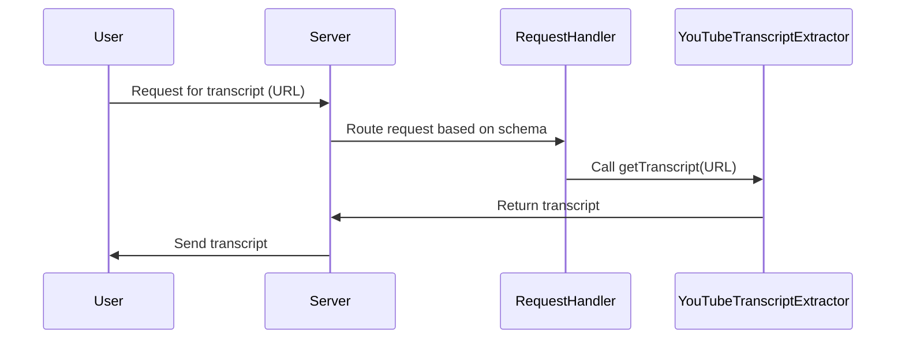

# Chapter 1: Server

Welcome to the first step in understanding how this YouTube transcript server works!  Imagine you're at a restaurant.  You (the outside world) want to order food (request a YouTube transcript).  The `Server` is like the server at that restaurant.  It takes your order, sends it to the kitchen (tools), and brings back your food (the transcript).

This chapter focuses on the `Server` class, the heart of our `mcp-server-youtube-transcript` project.

## What is a Server?

The `Server` class is responsible for:

*   **Receiving Requests:** It listens for requests from the outside world (like you wanting a transcript).
*   **Routing Requests:** It figures out what to do with the request (which tool to use).
*   **Executing Actions:** It calls the right tool to process the request (like getting the transcript).
*   **Returning Results:** It sends the result back to the requester (the transcript is delivered).
*   **Handling Errors:** If something goes wrong, it gracefully manages the error (tells you they're out of your favorite dish).
*   **Managing Connections:** It manages the connection through which requests are received (like the restaurant's front door).

Think of it as a central coordinator that keeps everything running smoothly. Without a server, there's no way to receive and process requests in a structured way.

## A Simple Analogy

Let's stick with the restaurant analogy:

*   **You (Client):**  You want the transcript of a YouTube video. You're the client making a request.
*   **Server:**  The waiter/waitress.  They take your order (YouTube URL), pass it to the kitchen, and bring you back the transcript.
*   **Kitchen (Tools):** The chefs and appliances. They use the URL to fetch the actual transcript. In our case, the [YouTubeTranscriptExtractor](04_youtubetranscriptextractor_.md) (explained later).
*   **The Transcript (Response):**  The actual text of the YouTube video.

## Using the Server

Here's a simplified view of how the `Server` handles a request to get a YouTube transcript:

1.  **Request:** You send a request to the server with the YouTube video URL.
2.  **Server Receives:** The `Server` receives the request.
3.  **Server Routes:** The `Server` determines that you're asking for the "get\_transcript" tool.
4.  **Tool Called:** The `Server` calls the `get_transcript` tool, passing the YouTube URL.
5.  **Transcript Extracted:** The `get_transcript` tool (using the [YouTubeTranscriptExtractor](04_youtubetranscriptextractor_.md)) gets the transcript.
6.  **Server Returns:** The `Server` sends the transcript back to you.

## Code Snippet: Creating and Starting the Server

This code shows how to create a `Server` instance and start it. Note that we are using a transport mechanism ([StdioServerTransport](05_stdioservertransport_.md)) to handle communication with the outside world. More on this in its own chapter!

```typescript
import { Server } from "@modelcontextprotocol/sdk/server/index.js";
import { StdioServerTransport } from "@modelcontextprotocol/sdk/server/stdio.js";

const server = new Server(
  {
    name: "mcp-servers-youtube-transcript",
    version: "0.1.0",
  },
  {
    capabilities: {
      tools: {},
    },
  }
);

const transport = new StdioServerTransport();
await server.connect(transport);
```

Explanation:

*   We import the `Server` class.
*   We create a new `Server` instance. We pass it information about the server itself (name and version) and its capabilities.
*   We instantiate `StdioServerTransport` (think of it as the way this Server talks to other programs).
*   We use `server.connect()` to start listening for requests using the defined transport.

## Code Snippet: Handling Requests

The `Server` needs to know *how* to handle different types of requests.  Here's how we tell it to use the `handleToolCall` function when it gets a `CallToolRequestSchema` request (explained in the next chapters):

```typescript
import { CallToolRequestSchema } from "@modelcontextprotocol/sdk/types.js";

// Inside the TranscriptServer class...
this.server.setRequestHandler(CallToolRequestSchema, async (request) =>
  this.handleToolCall(request.params.name, request.params.arguments ?? {})
);
```

Explanation:

*   We import `CallToolRequestSchema`. This is a definition that defines the structure of a request to call a tool.
*   We use `server.setRequestHandler()` to register a function to handle `CallToolRequestSchema` requests. When a matching request is received, the function is called.
*   The function calls `this.handleToolCall` (which we'll look at later) to actually execute the tool.

## Internal Implementation: A Simplified View

When the server receives a request, here's what happens at a high level:



1.  **User sends request:** A user sends a request for a transcript with the YouTube URL.
2.  **Server receives request:** The `Server` receives the request.
3.  **Request Routing:** The `Server` routes the request to the correct `RequestHandler` based on the request schema (e.g., `CallToolRequestSchema`).
4.  **Tool Call:** The RequestHandler determines which Tool is being called (e.g., get\_transcript), and calls upon the [YouTubeTranscriptExtractor](04_youtubetranscriptextractor_.md) with the YouTube URL.
5.  **Transcript returned:** The `YouTubeTranscriptExtractor` extracts the transcript and returns it to the `RequestHandler`.
6.  **Transcript sent to user:** The Server sends the extracted transcript back to the user.

## Code Snippet: Handling the Tool Call

Let's look at a simplified version of the `handleToolCall` function:

```typescript
  private async handleToolCall(name: string, args: any): Promise<{ toolResult: CallToolResult }> {
    switch (name) {
      case "get_transcript": {
        const { url: input, lang = "en" } = args;

        // Call the YouTubeTranscriptExtractor to get the transcript.
        const transcript = await this.extractor.getTranscript(input, lang);

        return {
          toolResult: {
            content: [{
              type: "text",
              text: transcript,
              metadata: {}
            }],
            isError: false
          }
        };
      }
      default:
        throw new Error(`Unknown tool: ${name}`);
    }
  }
```

Explanation:

*   This function takes the tool `name` (like "get\_transcript") and arguments (`args`).
*   The `switch` statement checks which tool is being called.
*   If it's "get\_transcript", it extracts the `url` and `lang` from the arguments.
*   It then calls the `this.extractor.getTranscript()` function (which is part of the [YouTubeTranscriptExtractor](04_youtubetranscriptextractor_.md)) to actually get the transcript.
*   Finally, it returns the transcript in a structured format.

## Error Handling

The `Server` also includes error handling.  If something goes wrong, it will log the error.

```typescript
  this.server.onerror = (error) => {
    console.error("[MCP Error]", error);
  };
```

This is a very basic example. More advanced error handling is explained in the [McpError](06_mcperror_.md) chapter.

## Conclusion

In this chapter, you learned about the `Server` class, its responsibilities, and how it handles requests. You saw how the `Server` acts as the central coordinator in our YouTube transcript extraction project, receiving requests, routing them to the appropriate tools, and returning the results.

Next, we'll dive into the concept of [Tool](02_tool_.md) and how they perform the actual work of extracting the transcripts.


---

Generated by [AI Codebase Knowledge Builder](https://github.com/The-Pocket/Tutorial-Codebase-Knowledge)