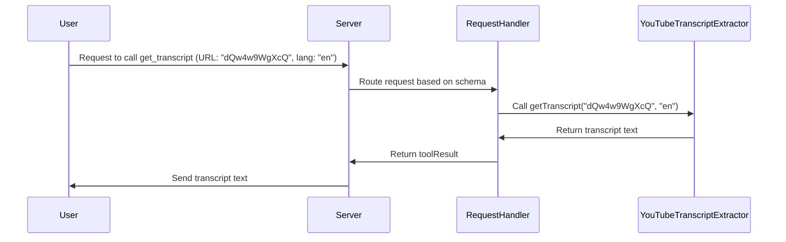

# Chapter 2: Tool

Welcome back! In the [Server](01_server_.md) chapter, we learned how the `Server` acts as a waiter in a restaurant, taking requests and managing the overall flow. But what about the *actual* work? That's where `Tool`s come in!

## What Problem Do Tools Solve?

Imagine our YouTube transcript server receives a request: "Hey, can you get me the transcript for this YouTube video URL?". The `Server` knows *how* to receive this request and who to pass it to, but it doesn't know *how* to actually get the transcript.

This is where the `Tool` concept comes in. A `Tool` represents a specific function or capability that the server offers. Think of it as a specialized worker inside the kitchen.

In our case, we have a `get_transcript` tool. Its *only* job is to take a YouTube video URL (or ID) and return the transcript. Without this tool, the server would be useless – it could receive requests, but couldn't *do* anything!

## What is a Tool?

A `Tool` is a bundle of information that tells the server:

1.  **What the tool's name is:** (e.g., `get_transcript`) This is how the server identifies the tool.
2.  **What the tool does:** (e.g., "Extract transcript from a YouTube video URL or ID") This is a human-readable description.
3.  **What input the tool expects:** (e.g., a YouTube URL) This is the *input schema*, which tells the server (and anyone using the server) what data the tool needs to function correctly.

Let's break down an example `Tool` definition in code:

```typescript
{
  name: "get_transcript",
  description: "Extract transcript from a YouTube video URL or ID",
  inputSchema: {
    type: "object",
    properties: {
      url: {
        type: "string",
        description: "YouTube video URL or ID"
      },
      lang: {
        type: "string",
        description: "Language code for transcript (e.g., 'ko', 'en')",
        default: "en"
      }
    },
    required: ["url", "lang"]
  }
}
```

Let's walk through this:

*   `name`: This is the name of the tool, "get\_transcript". The `Server` uses this name to identify this specific tool.
*   `description`: A short explanation of what the tool does.
*   `inputSchema`: This is the *most important* part for understanding how to *use* this tool.
    *   `type: "object"`:  This means the tool expects an object as input.
    *   `properties`: This defines the *properties* of that object (i.e., the things you need to provide). In our case, `url` and `lang`.
        *   `url`:  A YouTube video URL or ID. It's a `string`.
        *   `lang`: (Optional, because it has a `default` value)  The language code for the transcript (like "en" for English). Also a `string`.
    *   `required: ["url", "lang"]`: This tells us that the `url` and `lang` parameters are *required*.

## How Tools Solve Our Use Case

Remember our use case: "Get the transcript for this YouTube video URL?"

The `get_transcript` tool *directly* addresses this use case. The input schema tells us exactly what we need to provide: a YouTube URL (or ID) and a language code (though the language code is optional, defaulting to "en").

## Example: Calling the `get_transcript` Tool

Let's say we want to get the English transcript for the YouTube video with the ID "dQw4w9WgXcQ" (Never Gonna Give You Up!). We would call the `get_transcript` tool with the following input:

```json
{
  "url": "dQw4w9WgXcQ",
  "lang": "en"
}
```

The `get_transcript` tool would then process this input and return the transcript as a string of text.  The actual transcript is long, but here's a tiny snippet:

```
"We're no strangers to love You know the rules and so do I..."
```

(Of course, it would continue with the rest of the song!)

## How It Works Internally

Let's peek under the hood to see how the `Server` uses the `Tool` definition.



Here's what happens:

1.  **User sends request:** The user sends a request to the `Server` to call the "get\_transcript" tool, providing the URL and language.
2.  **Server routes request:** The `Server` receives this request and, using its routing logic (based on schemas that we'll explore in the next chapter), determines that the `get_transcript` tool needs to be called.
3.  **Tool execution:**  The Server then calls the [YouTubeTranscriptExtractor](04_youtubetranscriptextractor_.md) (which does the actual work of fetching the transcript from YouTube) with the provided URL and language.
4.  **Transcript returned:** The [YouTubeTranscriptExtractor](04_youtubetranscriptextractor_.md) returns the extracted transcript.
5.  **Result sent to user:** The Server packages the result and sends it back to the user.

Now, let's look at the code.  This snippet from `src/index.ts` shows how the `handleToolCall` function uses the `YouTubeTranscriptExtractor` to get the transcript:

```typescript
  private async handleToolCall(name: string, args: any): Promise<{ toolResult: CallToolResult }> {
    switch (name) {
      case "get_transcript": {
        const { url: input, lang = "en" } = args;

        // Call the YouTubeTranscriptExtractor to get the transcript.
        const transcript = await this.extractor.getTranscript(input, lang);

        return {
          toolResult: {
            content: [{
              type: "text",
              text: transcript,
              metadata: {}
            }],
            isError: false
          }
        };
      }
      default:
        throw new Error(`Unknown tool: ${name}`);
    }
  }
```

Explanation:

*   This function is part of the `TranscriptServer` class (seen in `src/index.ts`).
*   It takes the `name` of the tool to call and the arguments `args` to pass to the tool.
*   The `switch` statement checks if the `name` is "get\_transcript".
*   If it is, it extracts the `url` and `lang` from the arguments.
*   Finally, it calls `this.extractor.getTranscript(input, lang)` to get the transcript using our [YouTubeTranscriptExtractor](04_youtubetranscriptextractor_.md) (we will cover this in detail later!). It then returns the result in a format that the `Server` understands.

## Where Does the Tool Definition Come From?

The `TOOLS` constant in `src/index.ts` is where the `Tool` definitions live. This allows the `Server` to know what tools are available and how to use them. The server retrieves this information when requested (e.g. through `ListToolsRequestSchema`).

## Conclusion

In this chapter, we've learned about the `Tool` concept, how it defines the capabilities of our server, and how it helps us solve the use case of extracting YouTube transcripts. We saw how a `Tool` definition includes a name, description, and, most importantly, an input schema that tells us what data the tool expects. This information is vital for clients to know how to interact with the server correctly.

Now that we understand what `Tool`s are, let's move on to the next chapter, where we'll explore [CallToolRequestSchema & ListToolsRequestSchema](03_calltoolrequestschema___listtoolsrequestschema_.md) which defines the actual structure of the messages used to request the tools.


---

Generated by [AI Codebase Knowledge Builder](https://github.com/The-Pocket/Tutorial-Codebase-Knowledge)