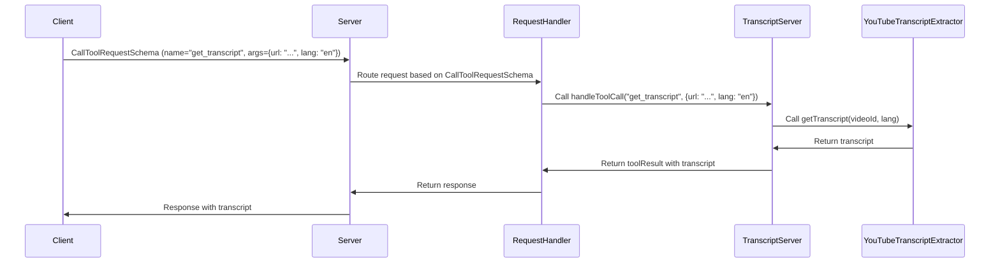

# Chapter 3: CallToolRequestSchema & ListToolsRequestSchema

In the previous chapter, [Tool](02_tool_.md), we learned what Tools are and how they define the capabilities of our YouTube transcript server. Now, how do we actually *tell* the server to *use* those tools? That's where `CallToolRequestSchema` and `ListToolsRequestSchema` come in!

Imagine you're back at our restaurant. You know what's on the menu (the available Tools), and you want to order something (call a Tool). These schemas are like:

*   **`ListToolsRequestSchema`**: Asking the waiter, "What's on the menu?"
*   **`CallToolRequestSchema`**: Saying, "I'd like the [Tool Name] with these [arguments], please."

These schemas define the *exact* structure of the requests that the server understands. They are essentially blueprints for how you communicate with the server.

## Why Do We Need Schemas?

Think about it: if you walked into a restaurant and mumbled something unintelligible, the waiter wouldn't know what you wanted!  Similarly, the server needs a clear, structured way to receive requests.

Schemas ensure that:

*   **Requests are valid:**  The server checks if the request follows the defined schema.  This prevents errors caused by malformed requests (like missing a required argument).
*   **Requests are consistent:** Everyone sends requests in the same format, making it easier for the server to process them.
*   **The server knows what to expect:**  The server knows exactly what information it will receive, which simplifies its internal logic.

## Key Concepts: Understanding the Schemas

Let's break down each schema in detail:

### 1. `ListToolsRequestSchema`

This schema defines the structure for a request asking the server to list all available tools. It's incredibly simple because you're just *asking* for information, not providing any input.

In our project, the code related to handling the list tools request looks like this:

```typescript
import { ListToolsRequestSchema } from "@modelcontextprotocol/sdk/types.js";

// Inside the TranscriptServer class...
this.server.setRequestHandler(ListToolsRequestSchema, async () => ({
  tools: TOOLS
}));
```

Explanation:

*   We import `ListToolsRequestSchema` from the `@modelcontextprotocol/sdk/types.js` package.
*   `this.server.setRequestHandler` tells the server what to do when it receives a request that matches the `ListToolsRequestSchema`.
*   The function `async () => ({ tools: TOOLS })` is executed when the request is received. It simply returns an object containing the `TOOLS` array, which, as we saw in the [Tool](02_tool_.md) chapter, defines all available tools.

A request that conforms to `ListToolsRequestSchema` would be (in JSON):

```json
{
  "method": "list_tools",
  "params": {}
}
```

The server, upon receiving this, would send back a response like this:

```json
{
  "tools": [
    {
      "name": "get_transcript",
      "description": "Extract transcript from a YouTube video URL or ID",
      "inputSchema": {
        "type": "object",
        "properties": {
          "url": {
            "type": "string",
            "description": "YouTube video URL or ID"
          },
          "lang": {
            "type": "string",
            "description": "Language code for transcript (e.g., 'ko', 'en')",
            "default": "en"
          }
        },
        "required": ["url", "lang"]
      }
    }
  ]
}
```

This response tells the client what tools are available and how to use them.

### 2. `CallToolRequestSchema`

This schema defines the structure for a request to *call* a specific tool.  It's more complex because you need to specify which tool to call and provide the necessary arguments.

The key components are:

*   **`name`**: The name of the tool you want to call (e.g., "get\_transcript").
*   **`arguments`**: An object containing the arguments required by the tool, as defined by its `inputSchema` (from the [Tool](02_tool_.md) chapter).

Back in `src/index.ts`, the code for handling `CallToolRequestSchema` looks like this:

```typescript
import { CallToolRequestSchema } from "@modelcontextprotocol/sdk/types.js";

// Inside the TranscriptServer class...
this.server.setRequestHandler(CallToolRequestSchema, async (request) =>
  this.handleToolCall(request.params.name, request.params.arguments ?? {})
);
```

Explanation:

*   We import `CallToolRequestSchema`.
*   `this.server.setRequestHandler` is used again, but this time to handle requests that match the `CallToolRequestSchema`.
*   The function that's executed when a matching request is received calls `this.handleToolCall` (we saw this function in the [Tool](02_tool_.md) chapter), passing the tool's name and arguments. The `?? {}` part ensures that if `request.params.arguments` is null or undefined, it defaults to an empty object.

Here's an example of a request that conforms to `CallToolRequestSchema` (in JSON) to call the "get\_transcript" tool:

```json
{
  "method": "call_tool",
  "params": {
    "name": "get_transcript",
    "arguments": {
      "url": "dQw4w9WgXcQ",
      "lang": "en"
    }
  }
}
```

Let's break this down:

*   `method`: Specifies what type of request it is. Here, it's "call\_tool".
*   `params`: Contains the parameters for the request.
    *   `name`:  The name of the tool to call: "get\_transcript".
    *   `arguments`: An object containing the arguments. In this case, we're providing the `url` and `lang` for the "get\_transcript" tool.

The server, after processing this, will call the "get\_transcript" tool with the provided URL and language, and return the transcript (or an error if something goes wrong).  The transcript would be returned within a `toolResult` object, formatted according to the MCP specification.

## How These Schemas Solve Our Use Case

Remember our core use case: "Get the transcript for a YouTube video?"

Here's how these schemas help us achieve that:

1.  **The client wants to know what tools are available:** The client sends a request that matches `ListToolsRequestSchema`.
2.  **The server responds with a list of available tools and their input schemas:** The client examines the list and finds the "get\_transcript" tool. It also sees that the tool requires a `url` and an optional `lang`.
3.  **The client constructs a request to call the "get\_transcript" tool:** The client creates a request that conforms to `CallToolRequestSchema`, including the tool's name ("get\_transcript") and the necessary arguments (the YouTube video URL and language code).
4.  **The server validates the request:** The server uses the `CallToolRequestSchema` to ensure that the request is valid and contains the correct information.
5.  **The server executes the tool and returns the result:** If the request is valid, the server calls the "get\_transcript" tool with the provided arguments and returns the extracted transcript.

## Internal Implementation: A Deeper Look

Let's trace what happens when the server receives a `CallToolRequestSchema` request.



1.  **Client sends request:** The client sends a `CallToolRequestSchema` request to the server, specifying the tool name ("get\_transcript") and the arguments (YouTube URL and language).
2.  **Server routes request:** The server receives the request and, using its routing logic, determines that this is a request to call a tool.
3.  **`handleToolCall` is called:** The `RequestHandler` calls the `handleToolCall` function within the `TranscriptServer` class.
4.  **`getTranscript` is called:** Inside `handleToolCall`, the `YouTubeTranscriptExtractor`'s `getTranscript` method is called with the video ID (extracted from the URL) and the language.
5.  **Transcript returned:** The `YouTubeTranscriptExtractor` extracts the transcript and returns it.
6.  **Result sent to client:** The `TranscriptServer` then packages the result (the transcript) into a `toolResult` object, the `RequestHandler` sends it to the `Server` which then  sends it back to the client in the appropriate format.

## Conclusion

In this chapter, we've explored `CallToolRequestSchema` and `ListToolsRequestSchema`, which are essential for defining how clients interact with our YouTube transcript server. You've learned how these schemas ensure that requests are valid, consistent, and understood by the server. They are the foundation for clear communication between the client and the server, enabling us to solve the use case of extracting YouTube transcripts effectively.

Next, we'll take a closer look at the [YouTubeTranscriptExtractor](04_youtubetranscriptextractor_.md), the component that does the real work of fetching the transcripts from YouTube.


---

Generated by [AI Codebase Knowledge Builder](https://github.com/The-Pocket/Tutorial-Codebase-Knowledge)