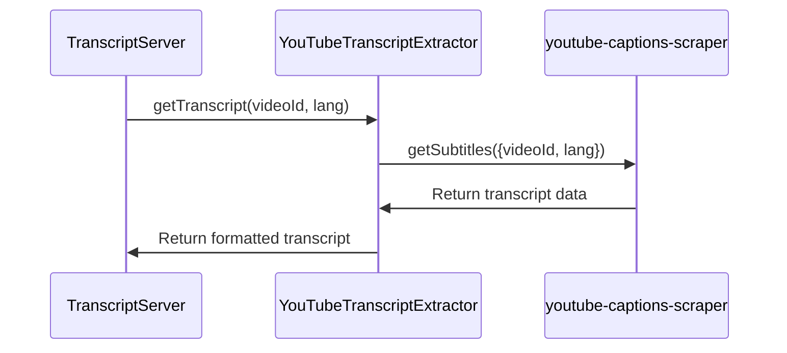

# Chapter 4: YouTubeTranscriptExtractor

In the previous chapter, [CallToolRequestSchema & ListToolsRequestSchema](03_calltoolrequestschema___listtoolsrequestschema_.md), we learned how to ask the server to do something. Now, let's look at *what* actually does the "doing"! This chapter is all about `YouTubeTranscriptExtractor`.

Imagine you're baking a cake. The [Server](01_server_.md) takes your order (chocolate cake!). The [Tool](02_tool_.md) knows the recipe. But who *actually* mixes the ingredients and bakes the cake? That's the `YouTubeTranscriptExtractor`!

## What Problem Does YouTubeTranscriptExtractor Solve?

Our main goal is to get the transcript of a YouTube video. The server receives the request, figures out which tool to use (the "get\_transcript" tool), but someone needs to *actually* fetch the transcript from YouTube and make it readable.

The `YouTubeTranscriptExtractor` is specifically designed to handle this task. It solves the problem of:

*   Taking a YouTube video URL or ID.
*   Communicating with YouTube's servers.
*   Retrieving the raw transcript data.
*   Cleaning and formatting the transcript into a readable string.

Without it, we'd have no way to turn a YouTube link into actual text!

## What is YouTubeTranscriptExtractor?

`YouTubeTranscriptExtractor` is a utility class. Think of it as a specialized helper. It contains all the logic related to extracting transcripts from YouTube.  It has a few key parts:

1.  **`extractYoutubeId(input: string)`**: This function takes a YouTube URL or video ID and extracts the video ID.  YouTube URLs come in many forms, and this makes sure we get the right piece of information.
2.  **`getTranscript(videoId: string, lang: string)`**: This is the main function! It takes the video ID and language code and fetches the transcript from YouTube.
3.  **`formatTranscript(transcript: TranscriptLine[])`**:  The raw transcript data from YouTube isn't always pretty. This function cleans it up and formats it into a readable string.

## How to Use YouTubeTranscriptExtractor

You usually don't directly use the `YouTubeTranscriptExtractor` yourself. The [Server](01_server_.md) and [Tool](02_tool_.md) handle all the communication and call the `YouTubeTranscriptExtractor` when needed.

However, let's imagine we *were* using it directly. Here's a simplified example:

```typescript
import { YouTubeTranscriptExtractor } from './path/to/your/file'; // Update the path

const extractor = new YouTubeTranscriptExtractor();

// Example YouTube video ID
const videoId = "dQw4w9WgXcQ"; // Never Gonna Give You Up!

// Get the English transcript
extractor.getTranscript(videoId, "en")
  .then(transcript => {
    console.log(transcript);
  })
  .catch(error => {
    console.error("Error getting transcript:", error);
  });
```

Explanation:

*   We import the `YouTubeTranscriptExtractor` class. **IMPORTANT**:  Replace `'./path/to/your/file'` with the correct path to the file where `YouTubeTranscriptExtractor` is defined in your project.  It should be in `src/index.ts`.
*   We create a new instance of `YouTubeTranscriptExtractor`.
*   We call the `getTranscript` method with the video ID and language code ("en" for English).
*   `getTranscript` returns a *Promise*, which means it will eventually give us the transcript (or an error). We use `.then()` to handle the successful case (printing the transcript to the console) and `.catch()` to handle any errors.

The output would be the transcript of the video, printed to your console.  It would look something like this (but much longer!):

```
We're no strangers to love You know the rules and so do I ...
```

## Internal Implementation

Let's peek under the hood to see how `YouTubeTranscriptExtractor` works.

### Step-by-Step Walkthrough

When `getTranscript` is called, here's what happens:



1.  The [TranscriptServer](01_server_.md) (acting as the waiter) calls the `YouTubeTranscriptExtractor`'s `getTranscript` function, providing the video ID and language.
2.  `YouTubeTranscriptExtractor` uses the `youtube-captions-scraper` library (which does the heavy lifting of talking to YouTube) to fetch the transcript data.
3.  The `youtube-captions-scraper` retrieves the raw transcript data from YouTube.
4.  `YouTubeTranscriptExtractor` formats this raw data into a readable string.
5.  Finally, `YouTubeTranscriptExtractor` returns the formatted transcript to the [TranscriptServer](01_server_.md).

### Code Deep Dive

Let's look at some of the code inside `YouTubeTranscriptExtractor` (from `src/index.ts`):

```typescript
  /**
   * Extracts YouTube video ID from various URL formats or direct ID input
   */
  extractYoutubeId(input: string): string {
    if (!input) {
      // Handle missing input
      throw new McpError(
        ErrorCode.InvalidParams,
        'YouTube URL or ID is required'
      );
    }

    // Handle URL formats (e.g. youtu.be, youtube.com)
    try {
      const url = new URL(input);
      if (url.hostname === 'youtu.be') {
        return url.pathname.slice(1);
      } else if (url.hostname.includes('youtube.com')) {
        const videoId = url.searchParams.get('v');
        if (!videoId) {
          throw new McpError(
            ErrorCode.InvalidParams,
            `Invalid YouTube URL: ${input}`
          );
        }
        return videoId;
      }
    } catch (error) {
      // Not a URL, check if it's a direct video ID
      if (!/^[a-zA-Z0-9_-]{11}$/.test(input)) {
        throw new McpError(
          ErrorCode.InvalidParams,
          `Invalid YouTube video ID: ${input}`
        );
      }
      return input;
    }

    throw new McpError(
      ErrorCode.InvalidParams,
      `Could not extract video ID from: ${input}`
    );
  }
```

Explanation:

*   This `extractYoutubeId` function is responsible for extracting the video ID from a URL (or ensuring an ID is valid).  It handles different YouTube URL formats.
*   The `try...catch` block attempts to parse the input as a URL.  If it fails (meaning it's likely a video ID), it moves on to the next check.
*   It uses regular expressions (`/^[a-zA-Z0-9_-]{11}$/`) to validate that the input is a valid YouTube video ID.

Another important part is the `getTranscript` function:

```typescript
  /**
   * Retrieves transcript for a given video ID and language
   */
  async getTranscript(videoId: string, lang: string): Promise<string> {
    try {
      const transcript = await getSubtitles({
        videoID: videoId,
        lang: lang,
      });

      return this.formatTranscript(transcript);
    } catch (error) {
      console.error('Failed to fetch transcript:', error);
      throw new McpError(
        ErrorCode.InternalError,
        `Failed to retrieve transcript: ${(error as Error).message}`
      );
    }
  }
```

Explanation:

*   This function takes the video ID and language code as input.
*   It uses the `getSubtitles` function from the `youtube-captions-scraper` library to fetch the raw transcript data.
*   It then calls `this.formatTranscript` to clean up and format the transcript.
*   The `try...catch` block handles potential errors during the transcript fetching process.

Finally, the formatTranscript function

```typescript
  /**
   * Formats transcript lines into readable text
   */
  private formatTranscript(transcript: TranscriptLine[]): string {
    return transcript
      .map(line => line.text.trim())
      .filter(text => text.length > 0)
      .join(' ');
  }
```

Explanation:

*   This function takes in raw `TranscriptLine[]` as input.
*   It uses the `map` function to trim the text from each line, this removes any extra spaces at the beginning or end of the text.
*   Then it uses the `filter` function to filter out lines that are empty.
*   Finally it uses the `join` function to join the remaining lines into a single string, separated by spaces.

## Conclusion

In this chapter, we've explored the `YouTubeTranscriptExtractor` class, the workhorse of our YouTube transcript server. You've learned how it takes a YouTube video URL or ID, fetches the transcript, and formats it into a readable string. You've also seen a glimpse of its internal implementation.

Next, we'll investigate the [StdioServerTransport](05_stdioservertransport_.md), which is responsible for handling the communication between the server and the outside world.


---

Generated by [AI Codebase Knowledge Builder](https://github.com/The-Pocket/Tutorial-Codebase-Knowledge)