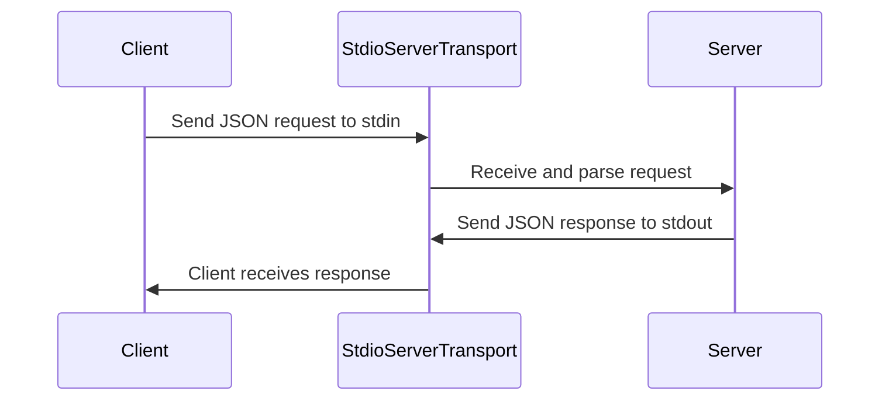

# Chapter 5: StdioServerTransport

In the previous chapter, [YouTubeTranscriptExtractor](04_youtubetranscriptextractor_.md), we learned how the server *actually* gets the YouTube transcript. But how does the server *talk* to the outside world to receive requests and send back the transcripts? That's where `StdioServerTransport` comes in!

Imagine our restaurant again. The [Server](01_server_.md) is the waiter, the [Tool](02_tool_.md) is the recipe, and the [YouTubeTranscriptExtractor](04_youtubetranscriptextractor_.md) is the chef. But how do you, the customer, *place your order* and receive your food (the transcript)? The `StdioServerTransport` is like the *front door* of the restaurant. It's the way the server interacts with you and the rest of the world.

## What Problem Does StdioServerTransport Solve?

The `StdioServerTransport` solves the problem of *communication*. It provides a way for the server to:

*   **Receive requests:** Listen for incoming requests for YouTube transcripts from other programs.
*   **Send responses:** Send the extracted transcripts back to those programs.

Think of it as the server's "ears" and "mouth." Without it, the server would be isolated and unable to interact with anything!

## What is StdioServerTransport?

`StdioServerTransport` is a specific type of *transport*. In simple terms, a transport is a way of sending data between two points.  "Stdio" stands for "standard input/output."  This means it uses the computer's standard input (stdin) to *receive* data and standard output (stdout) to *send* data.

*   **Standard Input (stdin):**  Think of this as the server *listening* for messages. Other programs can send requests to the server by writing to its stdin.
*   **Standard Output (stdout):** Think of this as the server *talking*.  The server sends responses (the transcripts) to other programs by writing to its stdout.

Why is using stdin/stdout so useful? Because almost *every* programming language and operating system can read from stdin and write to stdout! This makes `StdioServerTransport` very versatile and easy to use in different environments. It's like having a front door that any delivery service can use.

## How to Use StdioServerTransport

The good news is that you usually don't need to interact with `StdioServerTransport` directly. The server handles all the details for you. However, let's see how it's used in the code.

Here's the relevant code snippet from `src/index.ts` (also shown in the [Server](01_server_.md) chapter):

```typescript
import { StdioServerTransport } from "@modelcontextprotocol/sdk/server/stdio.js";

// ... (Server setup code) ...

const transport = new StdioServerTransport();
await server.connect(transport);
```

Explanation:

*   We import the `StdioServerTransport` class.
*   We create a new instance of `StdioServerTransport`.
*   We call `server.connect(transport)` to tell the server to start using the `StdioServerTransport` to listen for requests and send responses.

That's it! The `server.connect()` function takes care of the rest. Now the server is listening on stdin and ready to handle requests.

## Example: Sending a Request and Receiving a Response

While you don't interact with `StdioServerTransport` directly in code, let's imagine how you *could* use it from the command line.

Suppose you have a tool that can send JSON data to stdin and read JSON data from stdout.  You could send a `CallToolRequestSchema` request (from the [CallToolRequestSchema & ListToolsRequestSchema](03_calltoolrequestschema___listtoolsrequestschema_.md) chapter) like this:

```bash
echo '{"method": "call_tool", "params": {"name": "get_transcript", "arguments": {"url": "dQw4w9WgXcQ", "lang": "en"}}}' | your-tool
```

Explanation:

*   `echo`: This command prints the JSON request to standard output.
*   `'...'`: The JSON request itself, telling the server to call the "get\_transcript" tool with the YouTube URL and language.
*   `|`: This is the "pipe" operator. It takes the output of the `echo` command (the JSON request) and sends it as *input* to `your-tool`. `your-tool` in this example is a placeholder for the actual program you would use to interact with the `mcp-server-youtube-transcript` server.

The `mcp-server-youtube-transcript` server (running in the background) would receive this request on its stdin, process it, and then send the response (the transcript) to its stdout. `your-tool` would then read this response from stdout.

The response on stdout would look something like this (in JSON format):

```json
{
  "toolResult": {
    "content": [
      {
        "type": "text",
        "text": "We're no strangers to love You know the rules and so do I ...",
        "metadata": {
          "videoId": "dQw4w9WgXcQ",
          "language": "en",
          "timestamp": "2024-10-27T10:00:00.000Z",
          "charCount": 1000
        }
      }
    ],
    "isError": false
  }
}
```

(The actual transcript would be much longer, of course!)

## Internal Implementation

Let's take a look at how `StdioServerTransport` works internally.

### Step-by-Step Walkthrough

When the server is running and connected to the `StdioServerTransport`, here's what happens when a request comes in:



1.  **Client sends request:** The client (another program) sends a JSON-formatted request to the server's standard input (stdin).
2.  **`StdioServerTransport` receives request:** The `StdioServerTransport` listens on stdin and receives this request. It parses the JSON data and passes it to the [Server](01_server_.md).
3.  **Server processes request:** The [Server](01_server_.md) processes the request (routing it to the appropriate tool, as we learned in previous chapters).
4.  **Server sends response:** The [Server](01_server_.md) creates a JSON-formatted response (containing the transcript or an error) and sends it to the `StdioServerTransport`.
5.  **`StdioServerTransport` sends response:** The `StdioServerTransport` writes this JSON response to standard output (stdout).
6.  **Client receives response:** The client (the other program) reads the JSON response from stdout.

### Code Deep Dive

Let's look at some simplified code snippets from `@modelcontextprotocol/sdk/server/stdio.js`:

(This code is from the MCP SDK, not directly in our `mcp-server-youtube-transcript` project, but it's helpful to understand how `StdioServerTransport` works.)

The `StdioServerTransport` class handles reading from stdin and writing to stdout. While the exact implementation is more detailed, the core idea is this:

*   **Reading from stdin:** It continuously listens for data on stdin. When data arrives, it parses it as a JSON message.
*   **Writing to stdout:** When the server needs to send a response, the `StdioServerTransport` formats the response as JSON and writes it to stdout.

The actual code for reading from stdin involves using Node.js's `process.stdin` stream and setting up listeners to handle incoming data. Similarly, writing to stdout uses `process.stdout.write()`.

## Conclusion

In this chapter, you've learned about the `StdioServerTransport`, which acts as the communication channel between our YouTube transcript server and the outside world. You've seen how it uses standard input (stdin) to receive requests and standard output (stdout) to send responses. This makes our server highly versatile and easy to integrate with other programs.

Finally, we'll dive into the concept of [McpError](06_mcperror_.md), which shows us how the server handles and reports errors.


---

Generated by [AI Codebase Knowledge Builder](https://github.com/The-Pocket/Tutorial-Codebase-Knowledge)