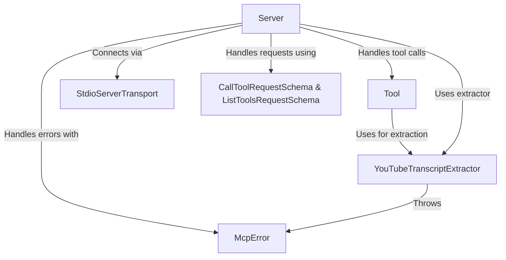

# Tutorial: mcp-server-youtube-transcript

This project is a **YouTube transcript server**. It *extracts* transcripts from YouTube videos given a URL or ID, and serves them to clients. The server uses the **Model Context Protocol (MCP)** to communicate, making it easy to integrate with other MCP-compatible tools.

**Source Repository:** [https://github.com/kimtaeyoon83/mcp-server-youtube-transcript](https://github.com/kimtaeyoon83/mcp-server-youtube-transcript)

## Chapters

1. [Server
](01_server_.md)
2. [Tool
](02_tool_.md)
3. [CallToolRequestSchema & ListToolsRequestSchema
](03_calltoolrequestschema___listtoolsrequestschema_.md)
4. [YouTubeTranscriptExtractor
](04_youtubetranscriptextractor_.md)
5. [StdioServerTransport
](05_stdioservertransport_.md)
6. [McpError
](06_mcperror_.md)

---

Generated by [AI Codebase Knowledge Builder](https://github.com/The-Pocket/Tutorial-Codebase-Knowledge)