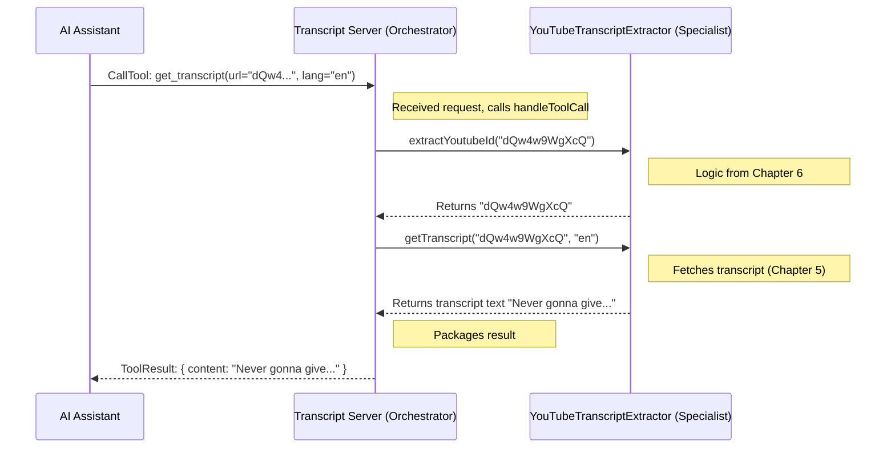

# Chapter 2: Transcript Server Orchestrator

In the [previous chapter](01_tool_capability_definition_.md), we learned how our server describes its abilities using a "Tool Capability Definition". It's like creating a menu (`get_transcript`) so others know what services we offer and what information they need to provide (`url`, `lang`).

But who *runs* the shop? Who listens for customer orders (requests), understands them, and makes sure the right work gets done? That's where the **Transcript Server Orchestrator** comes in!

## The Shop Manager: `TranscriptServer`

Think of our entire `mcp-server-youtube-transcript` program as a small, specialized shop that only does one thing: fetching YouTube transcripts. The `TranscriptServer` class is the *manager* of this shop.

What does a manager do?

1.  **Opens the Shop:** Starts everything up so it's ready for business.
2.  **Listens for Customers:** Waits for someone (another program or AI) to make a request.
3.  **Understands Requests:** Figures out what the customer wants ("List your services" or "Get me this transcript").
4.  **Delegates the Work:** Asks the specialist employee to do the actual job (like getting the transcript).
5.  **Gives the Result:** Hands the finished product (the transcript) back to the customer.

Our `TranscriptServer` class does exactly these things, but in terms of software:

1.  **Starts the Server:** Initializes the communication system (using the [MCP Server Framework](03_mcp_server_framework_.md)) so it can receive requests.
2.  **Listens for Requests:** Waits for incoming messages based on the Model Context Protocol (MCP).
3.  **Handles Requests:** Examines the request type. Is it asking for a list of tools? Or is it asking to *use* the `get_transcript` tool? We'll look closer at this in [MCP Request Handling](04_mcp_request_handling_.md).
4.  **Delegates to the Extractor:** If the request is to get a transcript, it tells the `YouTubeTranscriptExtractor` (our specialist) to go fetch it. The details of the extractor are covered in [Transcript Extraction Logic](05_transcript_extraction_logic_.md).
5.  **Sends the Response:** Packages the result (the list of tools or the actual transcript) and sends it back.

## The `TranscriptServer` Class Structure

Let's peek at the basic structure of our manager, the `TranscriptServer` class, in the code (`src/index.ts`). Don't worry about every detail yet!

```typescript
// src/index.ts (Simplified)

import { Server } from "@modelcontextprotocol/sdk/server/index.js";
// ... other imports

// The specialist worker class (details in later chapters)
class YouTubeTranscriptExtractor { /* ... */ }

// Our main orchestrator class
class TranscriptServer {
  private extractor: YouTubeTranscriptExtractor; // The specialist worker
  private server: Server; // The communication system object

  constructor() {
    // Create the specialist when the manager starts
    this.extractor = new YouTubeTranscriptExtractor();
    // Create the communication system object
    this.server = new Server(/* ... configuration ... */);

    // Tell the system HOW to handle different requests
    this.setupHandlers();
    // Set up basic error handling
    this.setupErrorHandling();
  }

  // ... methods to set up request handlers ...
  private setupHandlers(): void { /* ... see later ... */ }
  private setupErrorHandling(): void { /* ... */ }

  // Method to "open the shop"
  async start(): Promise<void> { /* ... */ }

  // Method to "close the shop"
  async stop(): Promise<void> { /* ... */ }

  // Method that decides what to do for a 'call tool' request
  private async handleToolCall(name: string, args: any): Promise<any> {
    /* ... see later ... */
  }
}
```

*   **`extractor: YouTubeTranscriptExtractor;`**: The manager keeps a reference to its specialist worker.
*   **`server: Server;`**: This represents the underlying communication framework provided by the `@modelcontextprotocol/sdk`. It handles the low-level sending and receiving of messages.
*   **`constructor()`**: This is like the manager's morning routine. When the `TranscriptServer` is created, it immediately creates its `extractor` helper and sets up the main `server` communication object. It also calls `setupHandlers()` to teach the `server` object what to do for different kinds of incoming messages.
*   **`start()`**: This method actually starts the communication server, making it ready to listen for requests. Think of it as flipping the "Open" sign on the shop door.
*   **`handleToolCall()`**: This specific method is responsible for dealing with requests that want to *use* one of the tools (like `get_transcript`).

## How it Handles a Transcript Request (Simplified)

Let's imagine a customer (an AI Assistant) wants a transcript for the video `dQw4w9WgXcQ` in English (`en`).

1.  The AI Assistant sends a "Call Tool" request: `name: "get_transcript"`, `arguments: { url: "dQw4w9WgXcQ", lang: "en" }`.
2.  The underlying MCP framework receives this request and gives it to our `TranscriptServer` because we set it up to handle these kinds of requests in `setupHandlers()`.
3.  The `TranscriptServer`'s `handleToolCall` method is triggered.
4.  Inside `handleToolCall`, it sees the `name` is `"get_transcript"`.
5.  It takes the `url` and `lang` from the arguments.
6.  It asks its specialist worker (`this.extractor`) to do the job: `this.extractor.getTranscript("dQw4w9WgXcQ", "en")`. (Note: It also uses the extractor to get the clean video ID first, see [Video ID Extraction](06_video_id_extraction_.md)).
7.  The `extractor` does its magic (fetches the transcript).
8.  The `extractor` gives the raw transcript text back to the `TranscriptServer`.
9.  The `TranscriptServer` packages this text into the correct response format.
10. The underlying MCP framework sends this response back to the AI Assistant.

Here's a diagram showing this flow:



## Looking Inside `handleToolCall`

Let's look at a simplified version of the code within `handleToolCall` that performs steps 4-9 above:

```typescript
// Inside the TranscriptServer class (src/index.ts) - Simplified

private async handleToolCall(name: string, args: any): Promise<{ toolResult: CallToolResult }> {
  switch (name) {
    case "get_transcript": { // Is the request for our transcript tool?
      // Get the URL and language from the arguments
      const { url: input, lang = "en" } = args;

      // --- Input Validation (Simplified) ---
      // (Make sure 'input' and 'lang' are provided and are strings)
      // (Details in Error Handling & Process Management)

      try {
        // --- Step 6a: Ask extractor to get clean Video ID ---
        const videoId = this.extractor.extractYoutubeId(input);
        console.error(`Processing transcript for video: ${videoId}`);

        // --- Step 6b: Ask extractor to fetch the transcript ---
        const transcript = await this.extractor.getTranscript(videoId, lang);
        console.error(`Successfully extracted transcript...`);

        // --- Steps 8 & 9: Prepare the successful result ---
        return {
          toolResult: {
            content: [{ type: "text", text: transcript }], // The actual transcript
            isError: false // Indicate success
            // ... metadata added here ...
          }
        };
      } catch (error) {
        // --- Handle potential errors (Chapter 7) ---
        console.error('Transcript extraction failed:', error);
        // Convert error to standard MCP error format and throw it
        throw new McpError(/* ... error details ... */);
      }
    }

    default:
      // If the tool name isn't "get_transcript", we don't know it
      throw new McpError(ErrorCode.MethodNotFound, `Unknown tool: ${name}`);
  }
}
```

This code shows the core logic: it checks the tool name, gets the arguments, uses the `this.extractor` to perform the core tasks ([Video ID Extraction](06_video_id_extraction_.md) and [Transcript Extraction Logic](05_transcript_extraction_logic_.md)), and then prepares the result. It also includes basic error handling (covered more in [Error Handling & Process Management](07_error_handling___process_management_.md)).

## Conclusion

In this chapter, we met the **Transcript Server Orchestrator** – the `TranscriptServer` class. It acts as the central manager for our transcript-fetching service.

We learned that its main jobs are:

*   Setting up and starting the server.
*   Listening for incoming requests using a communication protocol (MCP).
*   Understanding what kind of request it received (e.g., "list tools" or "call a tool").
*   Delegating the actual transcript fetching work to a specialist component (`YouTubeTranscriptExtractor`).
*   Packaging and sending the final response back.

The `TranscriptServer` doesn't fetch transcripts itself; it *orchestrates* the process, bringing together the communication framework and the specialized extraction logic.

Now that we understand the role of the orchestrator, let's dive deeper into the communication system it uses.

Next up: [MCP Server Framework](03_mcp_server_framework_.md)

---

Generated by [AI Codebase Knowledge Builder](https://github.com/The-Pocket/Tutorial-Codebase-Knowledge)