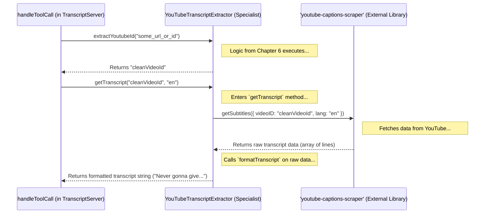

# Chapter 5: Transcript Extraction Logic

Welcome to Chapter 5! In [Chapter 4: MCP Request Handling](04_mcp_request_handling_.md), we saw how our `TranscriptServer` acts like a receptionist, receiving standardized MCP requests (like asking for a transcript) and routing them to the correct internal function (`handleToolCall`).

But once the `handleToolCall` function knows it needs to get a transcript, who actually does the heavy lifting? If our `TranscriptServer` is the manager (Chapter 2) and the MCP Framework is the communication system (Chapter 3), we now need to meet the specialist employee who knows *exactly* how to get YouTube transcripts.

This specialist is the `YouTubeTranscriptExtractor` class!

## The Transcript Specialist: `YouTubeTranscriptExtractor`

Imagine you want a smoothie. You have the ingredients (like fruit and yogurt), but you need a specific tool to turn them into a smoothie – a blender! The blender takes the raw ingredients, performs the specific action (blending), and gives you the final product.

The `YouTubeTranscriptExtractor` class is like that blender for YouTube transcripts. Its specific job is to:

1.  Take the "ingredients": a YouTube video identifier (URL or just the ID) and a desired language code (like 'en' for English).
2.  Perform the "blending" process:
    *   Figure out the clean, unique **Video ID** from whatever input it was given (we'll look closer at this in [Chapter 6: Video ID Extraction](06_video_id_extraction_.md)).
    *   Use a special external tool (a library called `youtube-captions-scraper`) to actually download the raw transcript data from YouTube.
    *   Clean up and format that raw data into a simple, readable text string.
3.  Produce the final "product": the clean transcript text.

This class hides all the messy details of talking to the external library and cleaning the data. The rest of our server (like the `handleToolCall` method) doesn't need to know *how* the transcript is fetched, just that it can ask the `YouTubeTranscriptExtractor` to do it.

## The Specialist's Toolkit (`YouTubeTranscriptExtractor` Structure)

Let's look at the basic structure of this specialist class found in `src/index.ts`.

```typescript
// Simplified structure from src/index.ts

// Import the external library we use to get captions
// @ts-ignore (Ignoring type errors for simplicity here)
import { getSubtitles } from 'youtube-captions-scraper';

// Define what a single line of the raw transcript looks like
interface TranscriptLine {
  text: string;   // The actual words
  start: number;  // When it starts (in seconds)
  dur: number;   // How long it lasts (in seconds)
}

class YouTubeTranscriptExtractor {

  /**
   * Figures out the 11-character YouTube video ID.
   * (Details in Chapter 6)
   */
  extractYoutubeId(input: string): string {
    // ... complex logic here ...
    // (We'll explore this in the next chapter!)
    console.log("Extracting video ID from:", input);
    // For now, imagine it returns the correct ID, e.g., "dQw4w9WgXcQ"
    let videoId = "dQw4w9WgXcQ"; // Placeholder for explanation
    return videoId;
  }

  /**
   * Gets the transcript using the video ID and language.
   * This is the core transcript-fetching logic!
   */
  async getTranscript(videoId: string, lang: string): Promise<string> {
    try {
      // STEP 1: Call the external library
      console.log(`Asking 'youtube-captions-scraper' for ${videoId} (${lang})...`);
      const rawTranscript: TranscriptLine[] = await getSubtitles({
        videoID: videoId, // Give it the ID
        lang: lang,       // Give it the language
      });
      console.log("...Got raw transcript data back!");

      // STEP 2: Format the raw data into clean text
      const formattedText = this.formatTranscript(rawTranscript);
      return formattedText;

    } catch (error) {
      // If anything goes wrong (e.g., video has no captions)
      console.error('Error fetching from youtube-captions-scraper:', error);
      // We need to handle this error properly (See Ch 7)
      throw new Error(`Failed to get transcript: ${(error as Error).message}`);
    }
  }

  /**
   * Cleans up the raw transcript data.
   */
  private formatTranscript(transcript: TranscriptLine[]): string {
    // Takes the list of lines and joins them into one string
    return transcript
      .map(line => line.text.trim()) // Get just the text from each line, remove extra spaces
      .filter(text => text.length > 0) // Ignore any empty lines
      .join(' '); // Join all the text lines together with a space in between
  }
}
```

Let's break down the important parts:

*   **`getSubtitles`**: This is the function we import from the external `youtube-captions-scraper` library. It's the actual tool that knows how to fetch transcript data from YouTube.
*   **`TranscriptLine`**: This defines the *shape* of the raw data we get back from `getSubtitles`. It's an array (a list) where each item is an object containing the `text` of a caption line, its `start` time, and its `dur`ation.
*   **`extractYoutubeId`**: As mentioned, this method's job is to get the clean video ID. We'll explore it fully in the next chapter.
*   **`getTranscript`**: This is the heart of the extractor.
    *   It takes the `videoId` (which it assumes is correct, thanks to `extractYoutubeId`) and the `lang` code.
    *   It calls `getSubtitles` with these details. This is an `async` operation because it involves network communication (talking to YouTube), so we use `await` to wait for the result.
    *   If successful, it receives the `rawTranscript` (an array of `TranscriptLine` objects).
    *   It then calls `this.formatTranscript` to clean up this raw data.
    *   It includes a `try...catch` block to handle potential problems, like the video not having captions in that language (more on errors in [Chapter 7: Error Handling & Process Management](07_error_handling___process_management_.md)).
*   **`formatTranscript`**: This helper method takes the raw array of transcript lines. Its job is simple: extract only the `text` part from each line and join them all together into a single, readable string, separated by spaces.

## How it Works: From Raw Data to Clean Text

Imagine `getSubtitles` gives us back this raw data (simplified):

```json
[
  { "text": "Never gonna", "start": 0.5, "dur": 1.2 },
  { "text": "give you up", "start": 1.8, "dur": 1.5 },
  { "text": "[Music]", "start": 3.3, "dur": 0.5 }, // Sometimes includes non-speech
  { "text": "Never gonna let", "start": 4.0, "dur": 1.4 }
]
```

Our `formatTranscript` method takes this array and does the following:

1.  **`map(line => line.text.trim())`**: Goes through each object and pulls out only the `text` value, trimming any extra whitespace. Result: `["Never gonna", "give you up", "[Music]", "Never gonna let"]`
2.  **`filter(text => text.length > 0)`**: Checks each text string. If it's empty, it removes it. (In this case, none are empty). Result: `["Never gonna", "give you up", "[Music]", "Never gonna let"]`
3.  **`join(' ')`**: Joins all the remaining text strings together into one big string, putting a single space between each original piece. Result: `"Never gonna give you up [Music] Never gonna let"`

This final string is what the `getTranscript` method returns.

## Connecting Back: How the Manager Uses the Specialist

Remember our `handleToolCall` method in the `TranscriptServer` (from [Chapter 2](02_transcript_server_orchestrator_.md) and [Chapter 4](04_mcp_request_handling_.md))? It's the piece of code that gets called when an MCP `CallTool` request for `get_transcript` arrives. *That* method uses our `YouTubeTranscriptExtractor` specialist.

Here's a reminder of how it fits together (simplified snippet from `handleToolCall`):

```typescript
// Inside TranscriptServer's handleToolCall method (Simplified)

// Assume 'this.extractor' is an instance of YouTubeTranscriptExtractor
// created in the TranscriptServer's constructor.

case "get_transcript": {
  const { url: input, lang = "en" } = args; // Get URL/ID and language

  try {
    // STEP 1: Ask the specialist to get the clean ID
    const videoId = this.extractor.extractYoutubeId(input); // Calls method discussed in Ch 6

    // STEP 2: Ask the specialist to get the formatted transcript
    const transcript = await this.extractor.getTranscript(videoId, lang); // Calls method discussed in THIS chapter

    // STEP 3: Return the result
    return {
      toolResult: {
        content: [{ type: "text", text: transcript }], // Put the clean text in the response
        isError: false
        // ... metadata ...
      }
    };
  } catch (error) {
    // Handle errors (Ch 7)
    // ...
  }
}
```

The `handleToolCall` method relies on `this.extractor` (our `YouTubeTranscriptExtractor` instance) to do the complex work. It first asks for the `videoId` and then asks for the actual `transcript`.

Here's a diagram showing this interaction:



This clearly shows how `handleToolCall` delegates the core tasks to the `YouTubeTranscriptExtractor`, which in turn uses the external library and its own formatting logic.

## Conclusion

In this chapter, we explored the **Transcript Extraction Logic**, encapsulated within the `YouTubeTranscriptExtractor` class.

We learned that:
*   It acts as a **specialist worker**, dedicated to fetching and processing YouTube transcripts.
*   It uses the external `youtube-captions-scraper` library to get raw transcript data.
*   It contains a `getTranscript` method that orchestrates calling the library and formatting the result.
*   It includes a `formatTranscript` helper method to convert the raw data (an array of lines) into a clean, single text string.
*   It's used by the `handleToolCall` method in `TranscriptServer` to perform the actual transcript retrieval when requested.

This class nicely isolates the specific details of transcript extraction, keeping the rest of the server code cleaner.

One key part of the extractor's job is figuring out the correct YouTube Video ID from various inputs (like full URLs or short links). How does it do that reliably? Let's dive into that specific piece of logic next!

Next up: [Chapter 6: Video ID Extraction](06_video_id_extraction_.md)

---

Generated by [AI Codebase Knowledge Builder](https://github.com/The-Pocket/Tutorial-Codebase-Knowledge)