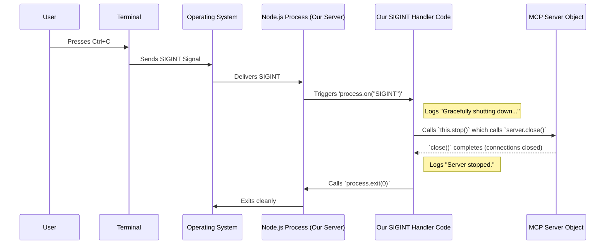

# Chapter 7: Error Handling & Process Management

Welcome to the final chapter! In [Chapter 6: Video ID Extraction](06_video_id_extraction_.md), we saw how our server cleverly pulls out the exact YouTube video ID from different kinds of user input, like full URLs or just the ID string. We also saw hints that things can go wrong - what if the user provides an invalid link, or no link at all? What happens if the requested transcript doesn't exist? And how do we properly turn the server off when we're done?

This chapter covers the essential **safety and shutdown systems** for our application. Think about a car: it needs brakes (`Error Handling`) and a way to turn the engine off cleanly (`Process Management`). Our server needs similar mechanisms to handle problems gracefully and shut down smoothly.

We'll look at three key pieces:
1.  **`McpError`**: Sending standardized error messages back when something goes wrong with a request.
2.  **`server.onerror`**: A central place to log errors that the server framework itself catches.
3.  **`SIGINT` Handler**: A way to cleanly shut down the server when you press Ctrl+C in the terminal.

## Why Do We Need This?

Imagine running our server and trying to get a transcript for `"not_a_youtube_link"`. Without error handling, the server might crash or get stuck. The program asking for the transcript (like an AI Assistant) wouldn't know what went wrong.

Good error handling means:
*   The server doesn't crash unexpectedly.
*   It can tell the user *what* went wrong in a clear, standard way.
*   We (the developers) can see logs of errors to help fix bugs.

Proper process management ensures that when we stop the server, it shuts down any open connections or processes cleanly, preventing data loss or other issues.

## 1. Standardized Problems: `McpError`

When something goes wrong *while processing a specific request* (like a `CallTool` request), we need a way to report that error back to the requester in a format they understand. The Model Context Protocol (MCP) provides a standard way to do this using `McpError`.

Think of it like error codes on a microwave. "E-01" might always mean "Door not closed." Similarly, MCP defines standard error codes.

In our code, when we detect a problem related to the user's request, we can *throw* an `McpError`.

**Example: Invalid Input in `extractYoutubeId`**

Remember in [Chapter 6: Video ID Extraction](06_video_id_extraction_.md), we checked if the input was valid? If not, we throw an `McpError`:

```typescript
// Inside YouTubeTranscriptExtractor class's extractYoutubeId method

if (!input) {
  // Throw a specific MCP error for bad parameters
  throw new McpError(
    ErrorCode.InvalidParams, // A standard MCP code for "Bad Input"
    'YouTube URL or ID is required' // A human-readable message
  );
}

// Check if input matches the 11-character ID pattern
if (!/^[a-zA-Z0-9_-]{11}$/.test(input)) {
  throw new McpError(
    ErrorCode.InvalidParams, // Again, indicating bad input
    `Invalid YouTube video ID: ${input}`
  );
}
```
*   `ErrorCode.InvalidParams`: This is a predefined code from the `@modelcontextprotocol/sdk` library. Using standard codes helps the calling application understand the *type* of error without needing to parse the message text. Other codes include `ErrorCode.MethodNotFound` (if the tool name is wrong) and `ErrorCode.InternalError` (for unexpected server problems).
*   The second argument is a clear message explaining the specific issue.

When our code throws an `McpError`, the [MCP Server Framework](03_mcp_server_framework_.md) catches it and automatically formats it into a standard MCP error response to send back to the client (the AI Assistant).

**Example: Handling errors in `handleToolCall`**

Our main request handler (`handleToolCall` from [Chapter 2: Transcript Server Orchestrator](02_transcript_server_orchestrator_.md)) also uses `McpError`:

```typescript
// Inside TranscriptServer's handleToolCall method (Simplified error part)

  try {
    // ... try to extract ID and get transcript ...
    const videoId = this.extractor.extractYoutubeId(input);
    const transcript = await this.extractor.getTranscript(videoId, lang);
    // ... return successful result ...
  } catch (error) {
    console.error('Transcript extraction failed:', error);

    // If the error is ALREADY an McpError (e.g., from extractYoutubeId),
    // just re-throw it for the framework to handle.
    if (error instanceof McpError) {
      throw error;
    }

    // If it's some other unexpected error (e.g., from the scraper library),
    // wrap it in a generic InternalError McpError.
    throw new McpError(
      ErrorCode.InternalError,
      `Failed to process transcript: ${(error as Error).message}`
    );
  }
```
This shows how we catch errors during the transcript process. If it's already a specific `McpError` (like the `InvalidParams` from `extractYoutubeId`), we let it pass through. If it's an unexpected error, we wrap it in a standard `ErrorCode.InternalError` so the client knows something went wrong internally on the server.

## 2. The Central Error Log: `server.onerror`

Sometimes, errors might happen within the MCP Server Framework itself, perhaps *before* it even gets to our specific `handleToolCall` function. Or, errors thrown by our handlers (like the `McpError`s above) are ultimately caught by the framework. We might want to log these errors somewhere for debugging.

The `Server` object from the SDK has a special property called `onerror`. We can assign a function to it, and that function will be called whenever the framework catches an MCP-related error.

```typescript
// Inside TranscriptServer class's constructor

  constructor() {
    // ... create extractor and server ...
    this.setupHandlers();
    // --> Set up the central error logger <--
    this.setupErrorHandling();
  }

  private setupErrorHandling(): void {
    // Assign our logging function to the server's onerror property
    this.server.onerror = (error) => {
      // Log the error to the server's console (stderr)
      console.error("[MCP Error]", error);
    };

    // ... (SIGINT handler setup comes next) ...
  }
```
This `setupErrorHandling` method is called in the constructor. It sets `this.server.onerror` to a simple function that just prints the error to the console, prefixed with `[MCP Error]`. This gives us a central place to see any errors the MCP framework reports.

Think of `server.onerror` as a dedicated security camera focused on the MCP communication layer, logging any incidents it sees.

## 3. The Off Switch: `SIGINT` Handler

Our server runs as a process in your terminal. How do you stop it? Usually, you press `Ctrl+C`. When you do that, the operating system sends a signal called `SIGINT` (Signal Interrupt) to the running process.

If we don't do anything special, the process might just terminate abruptly. But a clean shutdown is better. We want to tell our MCP `Server` object to close its connections gracefully before the whole program exits.

We can listen for the `SIGINT` signal and define what happens when it's received. This is also done in `setupErrorHandling`:

```typescript
// Inside TranscriptServer's setupErrorHandling method

  private setupErrorHandling(): void {
    // ... (onerror setup was above) ...

    // Listen for the SIGINT signal (usually Ctrl+C)
    process.on('SIGINT', async () => {
      console.error("\nGracefully shutting down server..."); // Log the shutdown attempt
      
      // Tell our MCP server instance to close connections
      await this.stop(); 
      
      console.error("Server stopped.");
      // Exit the Node.js process cleanly
      process.exit(0); 
    });
  }

  // The stop method, called by the SIGINT handler
  async stop(): Promise<void> {
    try {
      // Use the MCP Server's close method
      await this.server.close();
    } catch (error) {
      console.error('Error while stopping server:', error);
    }
  }
```
*   `process.on('SIGINT', ...)`: This tells Node.js: "When the SIGINT signal arrives, run this asynchronous function."
*   `console.error(...)`: We log messages to indicate a graceful shutdown is happening.
*   `await this.stop()`: We call our own `stop` method. Inside `stop`, we call `this.server.close()`, which is the function provided by the MCP framework to cleanly shut down its communication channels. We `await` this because closing might take a moment.
*   `process.exit(0)`: After the server has stopped, we tell the Node.js process to exit. The `0` indicates a successful exit (no errors).

This ensures that when you press Ctrl+C, the server attempts to close its connections properly before the program terminates.

Here's how the shutdown process works:



## Conclusion

In this chapter, we covered the crucial aspects of **Error Handling and Process Management** in our `mcp-server-youtube-transcript` project. We learned about:

*   Using **`McpError`** with standard `ErrorCode`s to report problems with specific requests back to the client in a standardized way.
*   Setting up **`server.onerror`** to log errors caught by the underlying MCP framework, helping with debugging.
*   Implementing a **`SIGINT` handler** (`process.on('SIGINT', ...)`) to catch Ctrl+C and ensure a graceful shutdown by calling `server.stop()` before exiting.

These mechanisms make our server more robust, informative when things go wrong, and well-behaved when it's time to stop.

---

**Tutorial Wrap-up**

Congratulations on completing this tutorial! We've journeyed through the entire `mcp-server-youtube-transcript` project, from defining its capabilities to handling errors:

1.  [Tool Capability Definition](01_tool_capability_definition_.md): How the server describes what it can do (`get_transcript`).
2.  [Transcript Server Orchestrator](02_transcript_server_orchestrator_.md): The main `TranscriptServer` class managing the overall process.
3.  [MCP Server Framework](03_mcp_server_framework_.md): Using the standard MCP library for communication.
4.  [MCP Request Handling](04_mcp_request_handling_.md): Routing incoming requests to the right internal code.
5.  [Transcript Extraction Logic](05_transcript_extraction_logic_.md): The specialist `YouTubeTranscriptExtractor` fetching and formatting transcripts.
6.  [Video ID Extraction](06_video_id_extraction_.md): Reliably getting the video ID from different user inputs.
7.  [Error Handling & Process Management](07_error_handling___process_management_.md): Making the server robust and ensuring clean shutdowns.

You now have a solid understanding of how a simple, focused MCP server like this works, combining external libraries, protocol handling, and specific application logic. You can use this knowledge to build your own tools or understand other applications using the Model Context Protocol!

---

Generated by [AI Codebase Knowledge Builder](https://github.com/The-Pocket/Tutorial-Codebase-Knowledge)