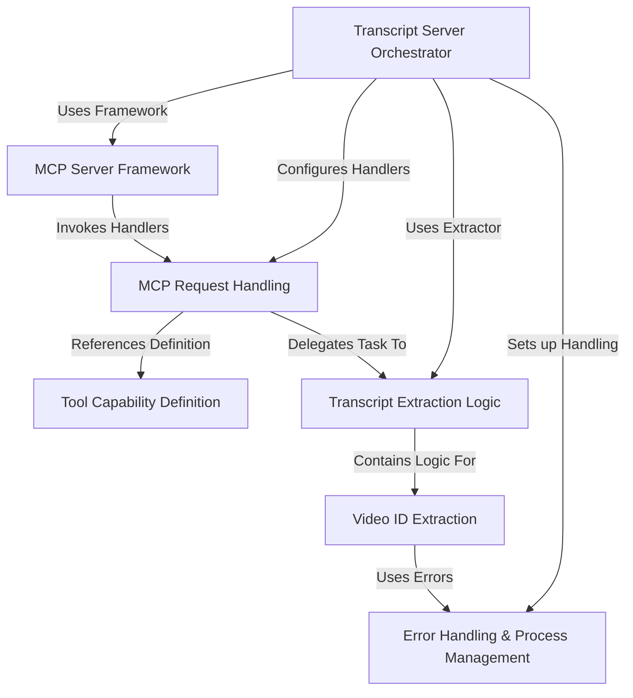

# Tutorial: mcp-server-youtube-transcript

This project creates a **server** that acts like a specialized tool for other applications, like AI models.
Its main job is to *extract the text transcript* from a YouTube video.
You give it a YouTube video URL or ID, and it uses the **Model Context Protocol (MCP)** framework to communicate and return the transcript text.

**Source Repository:** [https://github.com/kimtaeyoon83/mcp-server-youtube-transcript](https://github.com/kimtaeyoon83/mcp-server-youtube-transcript)

## Chapters

1. [Tool Capability Definition
](01_tool_capability_definition_.md)
2. [Transcript Server Orchestrator
](02_transcript_server_orchestrator_.md)
3. [MCP Server Framework
](03_mcp_server_framework_.md)
4. [MCP Request Handling
](04_mcp_request_handling_.md)
5. [Transcript Extraction Logic
](05_transcript_extraction_logic_.md)
6. [Video ID Extraction
](06_video_id_extraction_.md)
7. [Error Handling & Process Management
](07_error_handling___process_management_.md)

---

Generated by [AI Codebase Knowledge Builder](https://github.com/The-Pocket/Tutorial-Codebase-Knowledge)