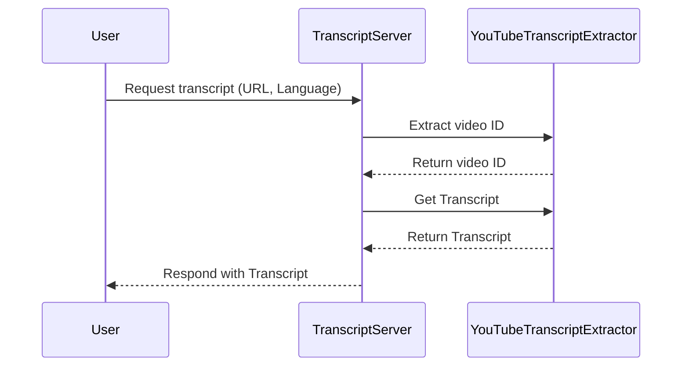

# Chapter 1: TranscriptServer

In this chapter, we'll introduce the `TranscriptServer`, a fundamental component of our project. The `TranscriptServer` plays the role of a restaurant server—it takes requests from clients and serves them the correct data, just like a server delivers the right dish to a customer. 

Imagine you come into a restaurant wanting to know what’s happening in your favorite YouTube video, but you wish you could get the transcript instead. That’s where the `TranscriptServer` comes in!

## What Is the TranscriptServer?

The `TranscriptServer` is designed to handle requests for extracting YouTube transcripts. It makes the process seamless, efficiently managing incoming requests while also handling potential errors—much like a good server anticipates customer needs!

### Key Concepts of TranscriptServer

1. **Request Handling**: It listens for incoming requests (like a server taking orders) and processes them to extract data.
2. **Error Management**: It handles errors gracefully, ensuring that users receive friendly feedback rather than server crashes.
3. **Service Tools**: It defines tools needed to perform specific tasks, like retrieving transcripts.

## Solving a Use Case

Let's break down how to use the `TranscriptServer` to retrieve a YouTube video transcript. Here’s a simple flow:

- **Input**: A user provides a YouTube URL or video ID and specifies a desired language for the transcript.
- **Output**: The server responds with the transcript of the video in the requested language.

### Example Use Case

Suppose you enter the following input:

- **URL**: `https://www.youtube.com/watch?v=dQw4w9WgXcQ`
- **Language**: `en`

The `TranscriptServer` fetches the transcript for that video and returns it to you. 

```typescript
// Example input to extract a transcript
const input = {
  url: "https://www.youtube.com/watch?v=dQw4w9WgXcQ",
  lang: "en"
};

// The server processes this request to provide a transcript back
```

You'd receive a response containing the video transcript, like this:

```plaintext
"Hello, and welcome to my video on programming..."
```

### How It Works Internally

1. The `TranscriptServer` receives the request for a transcript.
2. It extracts the video ID from the provided URL.
3. It calls another class `YouTubeTranscriptExtractor` to fetch the actual transcript.
4. Finally, it formats and returns the transcript.

Here's a simple sequence diagram to illustrate this:



### Diving Deeper into the Code

Let's explore how the `TranscriptServer` is structured internally. Its implementation involves several key components: setting up handlers, managing tools, and handling errors.

#### Setting Up the Server

In `src/index.ts`, the `TranscriptServer` class is defined as follows:

```typescript
class TranscriptServer {
  private extractor: YouTubeTranscriptExtractor;
  private server: Server;

  constructor() {
    this.extractor = new YouTubeTranscriptExtractor();
    this.server = new Server({
      name: "mcp-servers-youtube-transcript",
      version: "0.1.0",
    });
    this.setupHandlers();
    this.setupErrorHandling();
  }
}
```

- **What’s Happening?**
  - We create a new instance of `YouTubeTranscriptExtractor`, which is tasked with handling the actual transcript extraction.
  - We initialize the server with a name and version.
  - We set up request handlers to listen for incoming requests.

#### Handling Requests

The `setupHandlers` method sets up how the server responds to requests:

```typescript
private setupHandlers(): void {
  // Handle requests to list available tools
  this.server.setRequestHandler(ListToolsRequestSchema, async () => ({
    tools: TOOLS
  }));

  // Handle tool call requests
  this.server.setRequestHandler(CallToolRequestSchema, async (request) => 
    this.handleToolCall(request.params.name, request.params.arguments ?? {})
  );
}
```

- **What’s Happening?**
  - The server responds to requests that want to list available tools.
  - It listens for tool calls (like asking for a transcript) and passes the request to `handleToolCall`.

### Conclusion

In this chapter, we introduced the `TranscriptServer`, explained how it processes requests for YouTube transcripts, and walked through its internal structure and functionality. We learned how this server can deliver a friendly solution for users looking for subtitles.

In the next chapter, we’ll dive deeper into how the `YouTubeTranscriptExtractor` works to get the transcript using specific YouTube video URLs or IDs. Get ready for more exciting information in the [YouTubeTranscriptExtractor](02_youtubetranscriptextractor_.md)!

---

Generated by [AI Codebase Knowledge Builder](https://github.com/The-Pocket/Tutorial-Codebase-Knowledge)