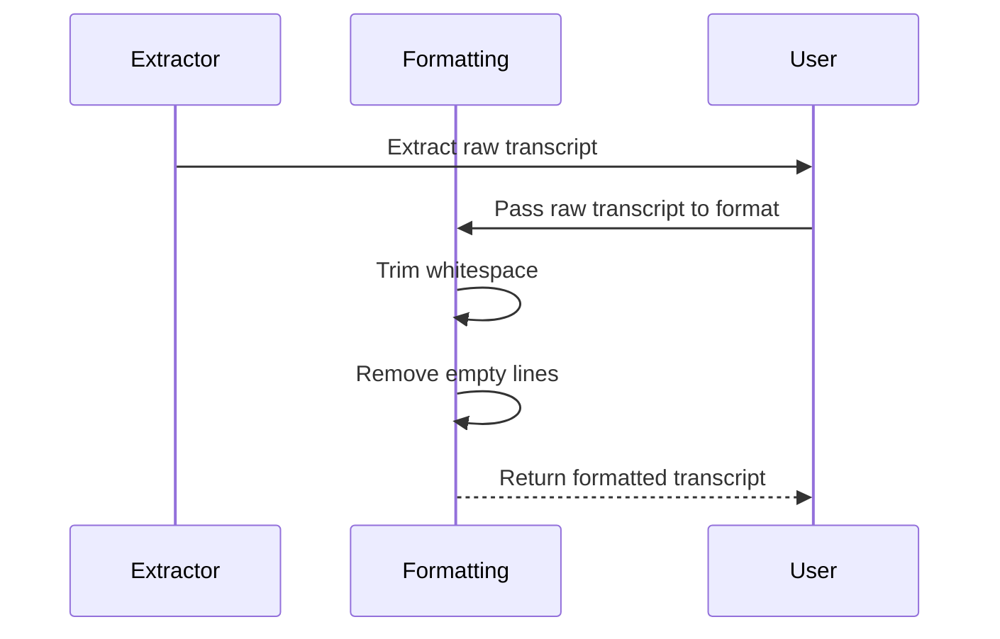

# Chapter 5: Format Transcript

Welcome back! In the previous chapter, we learned about [Tool Configuration](04_tool_configuration_.md) and how it helps us understand what tools are available for extracting transcripts from YouTube videos. Now, we’re diving into a crucial step of the transcription process: **Formatting the Transcript**.

## Why Format the Transcript?

Imagine you’ve just extracted a transcript from a YouTube video—it's like getting a rough draft of a book. Unfortunately, that draft might be a jumbled collection of sentences, making it hard to read and understand. Our task now is to tidy it up into a coherent and clean paragraph. This process ensures that the transcript is both useful and easy to read for anyone who wants to grasp the video content.

### Central Use Case

Let’s say you just extracted the following raw transcript from a video:

```plaintext
"Hello, and welcome to my video on programming. 
In today's video, we will cover data structures. 
Make sure to stick around for the end where I explain sorting algorithms."
```

Your goal is to format this text into a cleaner output, like this:

```plaintext
"Hello, and welcome to my video on programming. In today's video, we will cover data structures. Make sure to stick around for the end where I explain sorting algorithms."
```

### Key Concepts

Let’s break down the key concepts involved in formatting the transcript:

1. **Trimming Whitespace**: 
   - This means removing any unwanted spaces before or after sentences to ensure they look neat.
   
2. **Filtering Empty Lines**: 
   - If there are any empty lines or unnecessary breaks in the transcript, we remove those so the text flows well.
   
3. **Joining Sentences**: 
   - Finally, we piece together the cleaned sentences into one cohesive paragraph to enhance readability.

### How to Format the Transcript

Now, let’s see how to format the extracted transcript using code. Here’s an example function that accomplishes this:

```typescript
private formatTranscript(transcript: TranscriptLine[]): string {
  return transcript
    .map(line => line.text.trim()) // Trim whitespace from each line
    .filter(text => text.length > 0) // Remove any empty lines
    .join(' '); // Join lines into a single paragraph
}
```

In this function:
- We take the **transcript**, which is an array of lines.
- The `map` function helps trim any extra spaces around each line.
- The `filter` function ensures we only keep lines that have actual text.
- Finally, the `join` function combines the lines into one clean string with spaces in between.

### Internal Implementation Walkthrough

Now, let’s visualize what happens when we call the `formatTranscript` function:



#### Breakdown of the Steps:
1. The **Extractor** fetches the raw transcript from YouTube.
2. The **User** sends this raw transcript to the **Formatting** process.
3. Inside formatting, unnecessary whitespace is trimmed, and any empty lines are removed.
4. Finally, the cleaned and formatted transcript is returned to the user.

### Internal Code Walkthrough

Now, let’s look at the code behind the formatting process. This is found in the `YouTubeTranscriptExtractor` class within `src/index.ts`.

Here’s the relevant segment:

```typescript
class YouTubeTranscriptExtractor {
  private formatTranscript(transcript: TranscriptLine[]): string {
    return transcript
      .map(line => line.text.trim())
      .filter(text => text.length > 0)
      .join(' ');
  }
}
```
- We define the `formatTranscript` method within the `YouTubeTranscriptExtractor` class.
- The method receives the `transcript` and processes it using the steps we discussed: trimming whitespace, filtering out empty lines, and joining sentences into one paragraph.

### Conclusion

In this chapter, we learned how to format transcripts to make them clean and readable. This step is crucial for ensuring that users can easily understand the content extracted from YouTube videos. By trimming whitespace, filtering empty lines, and joining the lines together, we transform rough drafts into polished text.

Now that you’re equipped with these formatting skills, the next chapter will guide us through **Error Handling** to ensure our application remains robust in the face of challenges. Let's keep moving forward in the [Error Handling](06_error_handling_.md) chapter!

---

Generated by [AI Codebase Knowledge Builder](https://github.com/The-Pocket/Tutorial-Codebase-Knowledge)