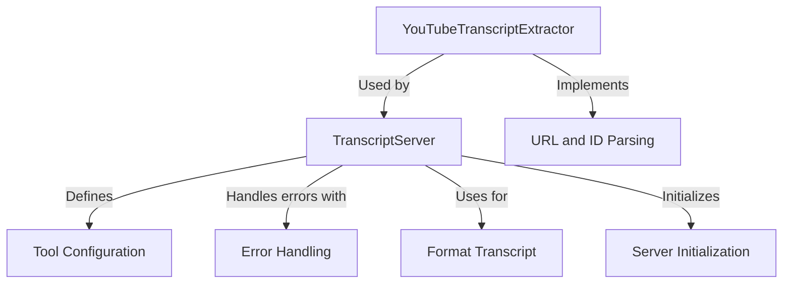

# Tutorial: mcp-server-youtube-transcript

The **mcp-server-youtube-transcript** project is designed to extract transcripts from YouTube videos easily. It acts as an *automated service*, taking in video URLs or IDs and returning readable text transcriptions in various languages. The application handles errors gracefully and provides a user-friendly interface for accessing video transcripts.

**Source Repository:** [https://github.com/kimtaeyoon83/mcp-server-youtube-transcript](https://github.com/kimtaeyoon83/mcp-server-youtube-transcript)

## Chapters

1. [TranscriptServer
](01_transcriptserver_.md)
2. [YouTubeTranscriptExtractor
](02_youtubetranscriptextractor_.md)
3. [URL and ID Parsing
](03_url_and_id_parsing_.md)
4. [Tool Configuration
](04_tool_configuration_.md)
5. [Format Transcript
](05_format_transcript_.md)
6. [Error Handling
](06_error_handling_.md)
7. [Server Initialization
](07_server_initialization_.md)

---

Generated by [AI Codebase Knowledge Builder](https://github.com/The-Pocket/Tutorial-Codebase-Knowledge)