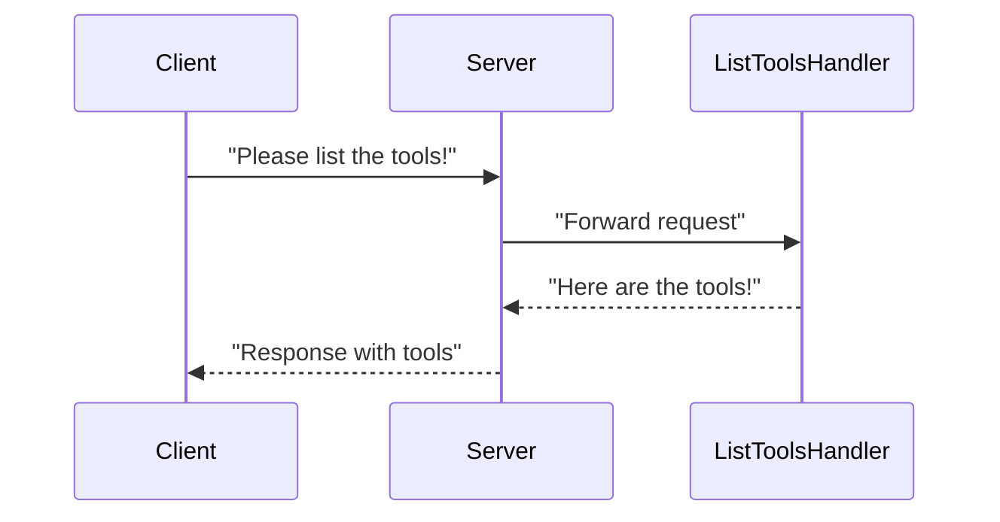
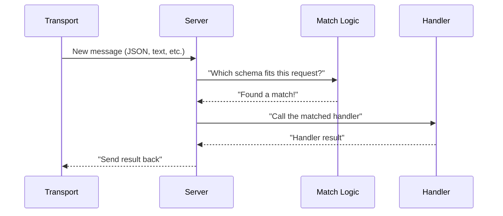

# Chapter 2: Server (from @modelcontextprotocol/sdk)

In the [TranscriptServer](01_transcriptserver_.md) chapter, we saw how requests to fetch YouTube transcripts are handled through a dedicated front desk. But… how do those requests even arrive at the front desk in the first place? Enter the **Server** from **@modelcontextprotocol/sdk**. Think of it as a “post office” that receives messages (requests) from the outside world and hands them to the right person (our transcript logic).

---

## Why Use the Server?

In many applications, you need a way to handle outside requests—like HTTP calls, command line input, or other messages. Instead of coding everything from scratch (listening on specific ports, decoding requests, etc.), the **Server** abstraction from MCP does that heavy lifting for us. It:

1. Waits for new requests (like a post office receiving letters).
2. Figures out which “handler” should process each request (like sorting letters into mailboxes).
3. Delivers responses back to the caller.

This approach frees you to focus on what your logic actually does, rather than on the mechanics of transporting data around.

---

## A Simple Use Case

Imagine you want people to “list available tools” in your app. You might have a button in a web UI or a command line prompt that says “List Tools.” Without the **Server**, you’d need to code:

• How to read the user’s request.  
• Where to send it (to your actual logic).  
• How to structure and send back the result.

By using **Server**, you write only the handler logic, and the rest (transporting and formatting) is handled for you.

---

## Key Concepts

1. **Server Initialization:** You create a “Server” object by giving it some basic info (e.g., a name and version).  
2. **Request Handlers:** You register “handlers” for different request types. Each handler is a function that knows how to respond to that type of request.  
3. **Transport:** The Server can use different methods of communication—such as standard input/output or network requests. (We’ll see more of this in [StdioServerTransport](03_stdioservertransport_.md).)

Here’s a small diagram of how requests flow:



1. The client (someone or something) sends a request.  
2. The **Server** sees what type of request it is and hands it off to the correct handler (like “L” for ListToolsHandler).  
3. The handler does the work and returns data.  
4. The **Server** sends that data back to the client.

---

## How to Use the Server

Ready to see some code? Below is a minimal example showing how to set up a **Server** that responds to a single request type called “hello.”

```ts
import { Server } from "@modelcontextprotocol/sdk/server/index.js";

const server = new Server(
  { name: "example-server", version: "1.0.0" },
  { capabilities: { tools: {} } }
);

// 1) Define a simple request schema (pretend it has 'type' and optional 'name')
const HelloRequestSchema = {
  type: "object",
  properties: {
    type: { const: "say_hello" },
    name: { type: "string" }
  },
  required: ["type"],
};

// 2) Register a handler that returns a greeting
server.setRequestHandler(HelloRequestSchema, async (req) => {
  const name = req.params.name ?? "World";
  return {
    greeting: `Hello, ${name}!`
  };
});
```

### Explanation

1. We create a **Server** with a name and version. “capabilities” is just an extra configuration object.  
2. We define a small schema to describe the type of request (“say_hello”).  
3. We register a request handler using `server.setRequestHandler()`. If a request matches the “say_hello” shape, we return a greeting.

> Note: In real life, you might have separate files for schemas, but here it’s all in one place to keep it simple.

---

## Under the Hood

Internally, the **Server** has logic to:

1. **Connect to a Transport** (like standard IO or a network socket).  
2. **Listen** continuously for incoming messages.  
3. **Parse & Match** each message against your registered schemas.  
4. **Execute** your handler function when there’s a match.  
5. **Return** the handler’s response back through the transport.

Here’s a conceptual peek at how the **Server** works when a new message arrives:



This is very much like sorting mail: once the Server sees a request, it checks the “delivery address” (request type) and calls the proper function.

---

## The Server in Our Project

In [TranscriptServer](01_transcriptserver_.md), we created a **Server** that knows how to respond to:

• “ListTools” (giving back a list of available tools)  
• “CallTool” (running a specific tool, like “get_transcript”)

Notice how all the transcript logic lives in the “TranscriptServer” class, but the actual request/response handling is done by the **Server** from @modelcontextprotocol/sdk.

For instance:

```ts
// Inside TranscriptServer constructor (simplified)
this.server = new Server(
  { name: "mcp-servers-youtube-transcript", version: "0.1.0" },
  { capabilities: { tools: {} } }
);

// Then we set up two request handlers:
this.server.setRequestHandler(ListToolsRequestSchema, async () => ({ tools: TOOLS }));
this.server.setRequestHandler(CallToolRequestSchema, async (request) => {
  // pass the request to a helper function
});
```

### What Happens Next?

• The user says “ListTools.”  
• The **Server** recognizes this request type and calls the matching handler.  
• The handler returns the array of tools.  
• The **Server** formats the response (JSON) and sends it back.

---

## Summary and Next Steps

Congratulations! You’ve discovered how the **Server** from **@modelcontextprotocol/sdk** plays the role of a post office, receiving messages and routing them to the correct handler. By freeing you from manual request routing, the **Server** helps keep your code organized and simple.

In the next chapter, we’ll see how to actually connect this **Server** to your console (standard input/output) using [StdioServerTransport](03_stdioservertransport_.md) so that you can run everything from a terminal. See you there!

---

Generated by [AI Codebase Knowledge Builder](https://github.com/The-Pocket/Tutorial-Codebase-Knowledge)