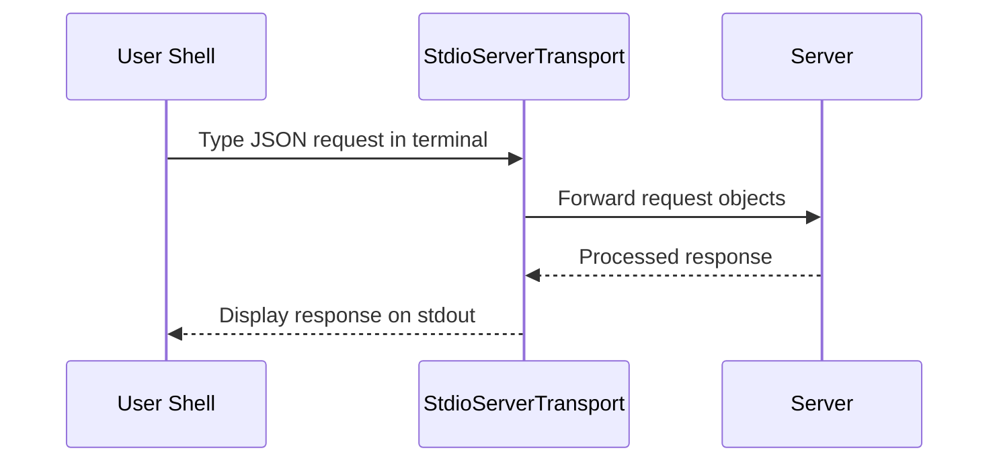

# Chapter 3: StdioServerTransport

In the previous chapter, we explored how the [Server (from @modelcontextprotocol/sdk)](02_server__from__modelcontextprotocol_sdk__.md) acts like a “post office” for forwarding requests to the correct destination. Now, let’s see how to actually connect this Server to your console using the “StdioServerTransport.”

## Why Use StdioServerTransport?

Picture working at your computer’s terminal and wanting to talk to your Server in real-time. Instead of making HTTP calls or special networking code, you can just use standard input (stdin) and standard output (stdout) as a text-based conversation channel. The “StdioServerTransport” is like a telephone line between the Server and your console:
- You type (or pipe) your requests into the terminal (stdin).  
- The Server sends responses back to you through stdout.  

This is especially helpful if you want a quick, behind-the-scenes tool without setting up a full web server.

---

## How It Works at a Glance

Imagine “StdioServerTransport” as a walkie-talkie connecting your shell to the Server. Here’s a simple rundown:



1. You type JSON-like commands in your terminal (or direct them via scripts).  
2. The “StdioServerTransport” reads your input and translates it into requests for the Server.  
3. Once the Server handles the request, it sends back a response.  
4. The transport prints that response to your terminal.

---

## Setting It Up

Below is a super-short code block showing how you’d create, attach, and run the “StdioServerTransport” with your Server:

```ts
import { Server } from "@modelcontextprotocol/sdk/server/index.js";
import { StdioServerTransport } from "@modelcontextprotocol/sdk/server/stdio.js";

const server = new Server({ name: "demo-server", version: "1.0.0" }, {});

// 1) Create an instance of our special transport
const transport = new StdioServerTransport();

// 2) Connect this transport to the server
await server.connect(transport);

// Now your server listens for stdin requests and answers via stdout!
```

### What’s Happening?

1. You import both the `Server` and `StdioServerTransport`.  
2. You create a server (just like we learned in the previous chapter).  
3. You make a “StdioServerTransport” instance.  
4. You attach them together with `server.connect(transport)`.  

After that, your terminal session is effectively connected to your Server. Any JSON or text requests you type can be understood by the Server—no HTTP needed!

---

## Example Interaction Flow

To get a feel for this, suppose your server handles a “say_hello” request. If you type something like:

```json
{
  "type": "say_hello",
  "params": {
    "name": "Alice"
  }
}
```

…then you might see the following output:

```json
{
  "greeting": "Hello, Alice!"
}
```

It’s all traveling through your standard console input and output—the “StdioServerTransport” handles the plumbing so you don’t have to.

---

## Under the Hood (Briefly)

Underneath, the “StdioServerTransport”:

1. Continuously reads lines from stdin.  
2. Tries to parse them as JSON messages.  
3. For each valid message, it calls the Server’s matching request handler.  
4. It prints the resulting response to stdout as JSON.  

It’s essentially just funneling your text-based conversation to the Server and back—like passing notes in class without leaving your seat.

---

## StdioServerTransport in Our Project

In our “mcp-server-youtube-transcript” project, you’ll see a snippet like this in the [main index file](../src/index.ts):

```ts
// (Inside the 'main' function or constructor)
const transport = new StdioServerTransport();
await this.server.connect(transport);
```

Running the compiled Node script in your terminal will then accept requests via stdin. When you send the Server a JSON request (like “ListTools”), it responds via stdout. You get an immediate interactive way to call the transcript fetching logic (or any other tool) from your console.

---

## Summary and Next Steps

With the “StdioServerTransport,” you’ve got a straightforward, text-based way to interact with your Server—no extra web servers or networking layers needed. You can pipe commands into stdin, see outputs in stdout, and integrate with command-line tools.

Next, we’ll look at how the Server identifies which tools are available by exploring the [Tool Definition (TOOLS array)](04_tool_definition__tools_array__.md). This teaches us how to provide structured info about each tool so the Server can let users know what’s possible. Let’s dive into it!

---

Generated by [AI Codebase Knowledge Builder](https://github.com/The-Pocket/Tutorial-Codebase-Knowledge)