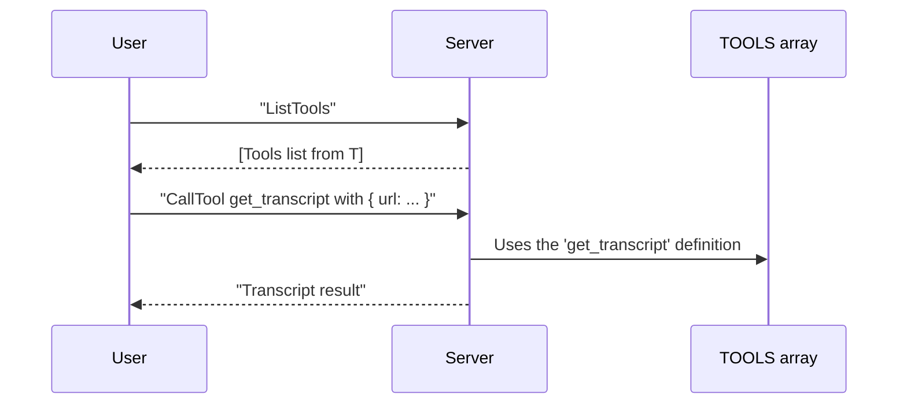
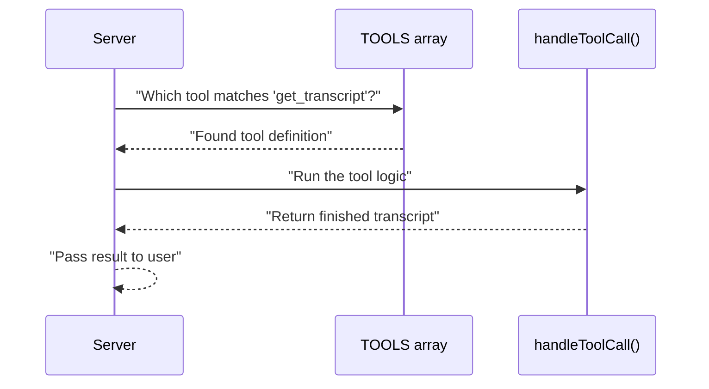

# Chapter 4: Tool Definition (TOOLS array)

In the [previous chapter](03_stdioservertransport_.md), you saw how our Server connects to the command line using the “StdioServerTransport.” Now, let’s look at how we describe which “dishes” our Server can serve—aka the “Tool Definition (TOOLS array).”

---

## Why Do We Need a TOOLS Array?

Imagine you walk into a restaurant with a menu card. You see different dishes, each with a short description, ingredients (required inputs), and what you’ll get when you order (the output).  
• This makes it easy to know what’s offered.  
• You can place an order with the correct parameters (“I’d like the pizza with extra cheese!”).  
• You know in advance what to expect as a result (your meal).  

In our project, the TOOLS array is just like that menu card for the Server. Each “Tool” describes:  
1. The tool name (e.g., "get_transcript").  
2. The tool’s purpose (description).  
3. The inputs (parameters) the tool needs.  
4. What the tool will produce as an output.  

When someone or something asks the Server “List all tools,” it simply returns this array, providing a structured snapshot of all available commands.

---

## Key Concepts

### 1. Tool Structure

A single “Tool” in the TOOLS array has:  
• name: A string ID (e.g., "get_transcript").  
• description: A human-friendly summary.  
• inputSchema: A JSON schema that tells you what arguments the tool expects.  

Below is a minimal snippet illustrating what a single tool entry might look like:

```ts
// A single tool definition (simplified)
{
  name: "get_transcript",
  description: "Fetch transcript from a YouTube video",
  inputSchema: {
    type: "object",
    properties: {
      url: { type: "string", description: "YouTube video URL or ID" },
      lang: { type: "string", description: "Language code", default: "en" }
    },
    required: ["url"]
  }
}
```
**Explanation**  
1. **name**: "get_transcript" – This is how we request it later.  
2. **description**: Explains its job.  
3. **inputSchema**: Describes which parameters are accepted. Here we expect a “url” and an optional “lang.”

### 2. The Complete TOOLS Array

Our project might have more than one tool. So we gather all tool definitions in a single array called `TOOLS`. When the user or client program says, “ListTools,” the Server replies with something like “Here are the tools available” and provides this array.

---

## Using the TOOLS Array in Practice

Let’s see a typical user flow:  
1. The user asks, “List all tools” (like reading the entire menu).  
2. The Server responds with all the tool definitions in the `TOOLS` array.  
3. The user picks one tool, such as “get_transcript,” checks what inputs are required, and provides them (e.g., the "url").  
4. The Server runs that tool’s logic (getting the transcript) and returns the result.

Let’s illustrate this with a simple sequence diagram:



**What happened?**  
1. You learn about all available “dishes” (tools).  
2. You place an order with correct params.  
3. You get your transcript (the final “meal”).

---

## A Brief Look at Our TOOLS Array

In the [main index file](../src/index.ts), we define our array (simplified here to show only the relevant part):

```ts
// src/index.ts (excerpt)
const TOOLS = [
  {
    name: "get_transcript",
    description: "Extract transcript from a YouTube video URL or ID",
    inputSchema: {
      type: "object",
      properties: {
        url: {
          type: "string",
          description: "YouTube video URL or ID"
        },
        lang: {
          type: "string",
          description: "Language code",
          default: "en"
        }
      },
      required: ["url", "lang"]
    }
  }
];
```

**Explanation**  
• `name`: "get_transcript" is the star of the show.  
• `description`: Tells you it’s for grabbing YouTube transcripts.  
• `inputSchema`: You must supply a "url", and you can optionally specify "lang."  

---

## Handling the TOOLS Array in the Server

Recall from [TranscriptServer](01_transcriptserver_.md) that we have a handler for “ListTools.” Here’s a simplified snippet showing how it returns the `TOOLS` array:

```ts
// Inside TranscriptServer
this.server.setRequestHandler(ListToolsRequestSchema, async () => ({
  tools: TOOLS // Our array
}));
```
**Explanation**  
1. When “ListTools” request checks in, the server responds with everything in `TOOLS`.  
2. Now the user (or another program) knows that “get_transcript” exists and how to call it.

---

## Under the Hood

When you define multiple tools, the Server references each one in the `TOOLS` array. Then, if a user calls “CallTool someToolName,” the Server knows exactly:  
• Which tool has that “name.”  
• The expected input shape so it can validate or throw an error if something’s missing.  
• How to run that tool’s logic (like “get_transcript”).

Here’s a conceptual flow:



---

## Summary

By organizing each tool’s info (name, description, input schema) in a single `TOOLS` array, we’re creating a neat, self-explanatory “menu” of capabilities:  

• It advertises what the Server can do.  
• It documents how to ask for each tool’s service.  
• It standardizes how to add new commands later.  

Now that you know how we define and list our tools, we can look at the star performer behind fetching transcripts: the [YouTubeTranscriptExtractor](05_youtubetranscriptextractor_.md). There, you’ll learn how the actual “get_transcript” logic does its magic with YouTube videos!

---

Generated by [AI Codebase Knowledge Builder](https://github.com/The-Pocket/Tutorial-Codebase-Knowledge)