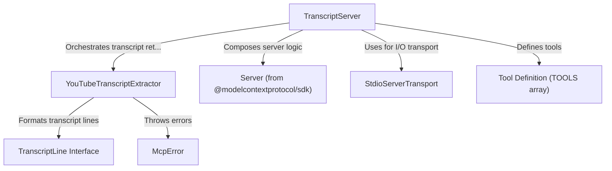

# Tutorial: mcp-server-youtube-transcript

This **project** is a *simple* server that fetches YouTube transcripts.  
It **coordinates** requests, extracts captions, and returns them as clean text.  
By *combining* the YouTube transcript library with MCP’s Server framework, it  
handles communications over standard I/O and provides error messages in a  
consistent format using custom exceptions.

**Source Repository:** [https://github.com/kimtaeyoon83/mcp-server-youtube-transcript](https://github.com/kimtaeyoon83/mcp-server-youtube-transcript)

## Chapters

1. [TranscriptServer
](01_transcriptserver_.md)
2. [Server (from @modelcontextprotocol/sdk)
](02_server__from__modelcontextprotocol_sdk__.md)
3. [StdioServerTransport
](03_stdioservertransport_.md)
4. [Tool Definition (TOOLS array)
](04_tool_definition__tools_array__.md)
5. [YouTubeTranscriptExtractor
](05_youtubetranscriptextractor_.md)
6. [TranscriptLine Interface
](06_transcriptline_interface_.md)
7. [McpError
](07_mcperror_.md)

---

Generated by [AI Codebase Knowledge Builder](https://github.com/The-Pocket/Tutorial-Codebase-Knowledge)