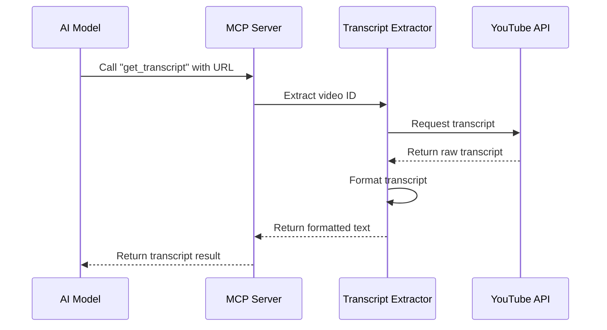

# Chapter 1: MCP Server Implementation

Welcome to the first chapter of our tutorial on building a YouTube transcript extractor using the Model Context Protocol (MCP)! In this chapter, we'll explore what MCP is and how to set up a basic server that follows this protocol.

## What Problem Does MCP Solve?

Imagine you're building an AI assistant that needs to access YouTube video transcripts. Without a standardized way to communicate, each AI model would need custom code to request and receive this data. That's where the Model Context Protocol comes in!

**MCP acts like a universal translator between AI models and external tools.** Just as phones follow protocols to connect calls regardless of manufacturer, MCP provides a standard way for AI models to request information from external tools.

## Understanding MCP Through Analogy

Think of MCP as a restaurant ordering system:
- The AI model is the customer who wants to order food (get YouTube transcripts)
- The MCP server is the waiter who takes the order
- Your YouTube transcript tool is the kitchen that prepares the meal

The MCP protocol defines how orders should be placed, received, and fulfilled, ensuring smooth communication between all parties.

## Key Components of an MCP Server

Let's break down the essential parts of our MCP server implementation:

1. **Server Object**: The central component that handles communication
2. **Transport Layer**: How messages travel between the AI model and our server
3. **Tools**: The capabilities our server offers (in our case, fetching YouTube transcripts)
4. **Request Handlers**: Functions that process incoming requests
5. **Error Handling**: Gracefully managing problems that arise

## Setting Up a Basic MCP Server

Let's start by creating the skeleton of our MCP server:

```javascript
import { Server } from "@modelcontextprotocol/sdk/server/index.js";
import { StdioServerTransport } from "@modelcontextprotocol/sdk/server/stdio.js";

class TranscriptServer {
  private server: Server;

  constructor() {
    // Initialize the server with metadata
    this.server = new Server(
      {
        name: "mcp-servers-youtube-transcript",
        version: "0.1.0",
      },
      {
        capabilities: {
          tools: {},
        },
      }
    );
  }
}
```

This code creates a new `TranscriptServer` class that initializes an MCP server. The server is configured with a name, version, and capabilities (in this case, we're saying it supports tools).

## Connecting the Server

For our server to communicate with AI models, we need to connect it to a transport layer. Let's add methods to start and stop our server:

```javascript
class TranscriptServer {
  // ... previous code ...

  /**
   * Starts the server
   */
  async start(): Promise<void> {
    const transport = new StdioServerTransport();
    await this.server.connect(transport);
  }

  /**
   * Stops the server
   */
  async stop(): Promise<void> {
    try {
      await this.server.close();
    } catch (error) {
      console.error('Error while stopping server:', error);
    }
  }
}
```

Here we're using `StdioServerTransport`, which enables communication through standard input/output streams. This is a simple way to connect our server, perfect for getting started.

## Defining Our Tool Capabilities

Now, let's define what our server can do. We'll create a tool that extracts transcripts from YouTube videos:

```javascript
const TOOLS: Tool[] = [
  {
    name: "get_transcript",
    description: "Extract transcript from a YouTube video URL or ID",
    inputSchema: {
      type: "object",
      properties: {
        url: {
          type: "string",
          description: "YouTube video URL or ID"
        },
        lang: {
          type: "string",
          description: "Language code for transcript (e.g., 'ko', 'en')",
          default: "en"
        }
      },
      required: ["url", "lang"]
    }
  }
];
```

This code defines a tool called `get_transcript` that accepts two parameters:
- `url`: The YouTube video URL or ID
- `lang`: The language code for the transcript (defaulting to English)

The `inputSchema` follows a standard JSON Schema format, which helps validate incoming requests and document what our tool expects.

## Setting Up Request Handlers

Now we need to tell our server how to respond to different types of requests. Let's add that functionality:

```javascript
private setupHandlers(): void {
  // List available tools
  this.server.setRequestHandler(ListToolsRequestSchema, async () => ({
    tools: TOOLS
  }));

  // Handle tool calls
  this.server.setRequestHandler(CallToolRequestSchema, async (request) => 
    this.handleToolCall(request.params.name, request.params.arguments ?? {})
  );
}
```

This code sets up two request handlers:
1. A handler that responds to requests for listing available tools
2. A handler that processes actual tool calls, delegating to a `handleToolCall` method that we'll implement later

## Putting It All Together

Let's add error handling and connect everything in our constructor:

```javascript
constructor() {
  this.extractor = new YouTubeTranscriptExtractor();
  this.server = new Server(
    {
      name: "mcp-servers-youtube-transcript",
      version: "0.1.0",
    },
    {
      capabilities: {
        tools: {},
      },
    }
  );

  this.setupHandlers();
  this.setupErrorHandling();
}

private setupErrorHandling(): void {
  this.server.onerror = (error) => {
    console.error("[MCP Error]", error);
  };

  process.on('SIGINT', async () => {
    await this.stop();
    process.exit(0);
  });
}
```

This completes our basic server setup with proper error handling and cleanup when the program is interrupted.

## How MCP Server Communication Works

Let's visualize the flow of a request through our MCP server:



When an AI model wants a YouTube transcript:
1. It sends a request to our MCP server
2. Our server processes the request and extracts the YouTube video ID
3. We fetch the transcript from YouTube
4. We format the transcript into clean text
5. We send the formatted transcript back to the AI model

## Running the Server

Finally, let's add a main function to start our server:

```javascript
async function main() {
  const server = new TranscriptServer();
  
  try {
    await server.start();
  } catch (error) {
    console.error("Server failed to start:", error);
    process.exit(1);
  }
}

main().catch((error) => {
  console.error("Fatal server error:", error);
  process.exit(1);
});
```

This code creates a new instance of our `TranscriptServer`, starts it, and handles any errors that might occur during startup or operation.

## Conclusion

In this chapter, we've learned about the Model Context Protocol and how to set up a basic MCP server that can communicate with AI models. We've defined a tool for extracting YouTube transcripts and configured our server to handle requests for this tool.

The MCP server implementation provides the foundation for our YouTube transcript extractor. It establishes a standardized interface that allows AI models to request YouTube transcript data in a consistent way.

In the next chapter, [TranscriptServer](02_transcriptserver_.md), we'll explore how to implement the core functionality of our transcript server, including handling specific requests and extracting transcript data.

---

Generated by [AI Codebase Knowledge Builder](https://github.com/The-Pocket/Tutorial-Codebase-Knowledge)