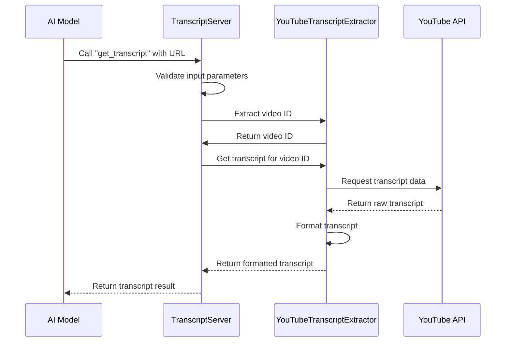

# Chapter 2: TranscriptServer

In [Chapter 1: MCP Server Implementation](01_mcp_server_implementation_.md), we learned about the Model Context Protocol and set up the basic framework for our server. Now, let's dive deeper into the central component of our application: the `TranscriptServer` class.

## What is TranscriptServer and Why Do We Need It?

Imagine you're running a restaurant. You need someone to coordinate everything: taking orders from customers, relaying them to the kitchen, making sure the food is prepared correctly, and delivering it back to the customers. In our YouTube transcript application, the `TranscriptServer` plays this essential coordination role.

The `TranscriptServer` is the main class that:
- Receives requests from AI models
- Routes these requests to the appropriate tools
- Handles any errors that might occur
- Returns the results back to the AI models

## Understanding TranscriptServer Through Components

Let's break down the `TranscriptServer` into its key components:

1. **Server Instance**: The core MCP server that handles communication
2. **Transcript Extractor**: The tool that fetches and processes YouTube transcripts
3. **Request Handlers**: Functions that process specific types of requests
4. **Error Handling**: System for managing errors gracefully

## Creating the TranscriptServer Class

Let's start by examining the basic structure of our `TranscriptServer` class:

```javascript
class TranscriptServer {
  private extractor: YouTubeTranscriptExtractor;
  private server: Server;

  constructor() {
    this.extractor = new YouTubeTranscriptExtractor();
    this.server = new Server(
      {
        name: "mcp-servers-youtube-transcript",
        version: "0.1.0",
      },
      {
        capabilities: {
          tools: {},
        },
      }
    );

    this.setupHandlers();
    this.setupErrorHandling();
  }
}
```

In this code, we:
1. Create two private properties: `extractor` (our tool for getting transcripts) and `server` (the MCP server instance)
2. Initialize the transcript extractor
3. Set up the MCP server with a name, version, and capabilities
4. Call two methods to set up request handlers and error handling

## Setting Up Request Handlers

Now let's look at how the `TranscriptServer` handles different types of requests:

```javascript
private setupHandlers(): void {
  // List available tools
  this.server.setRequestHandler(ListToolsRequestSchema, async () => ({
    tools: TOOLS
  }));

  // Handle tool calls
  this.server.setRequestHandler(CallToolRequestSchema, async (request) => 
    this.handleToolCall(request.params.name, request.params.arguments ?? {})
  );
}
```

This method configures the server to respond to two types of requests:
1. **List Tools Request**: When an AI model asks "What tools do you have?", we respond with our list of tools
2. **Call Tool Request**: When an AI model says "I want to use a specific tool", we handle that with our `handleToolCall` method

Think of these handlers like staff in our restaurant: one person who tells customers what's on the menu, and another who takes their specific orders.

## Error Handling in TranscriptServer

Errors can happen at any point in our application. Let's see how `TranscriptServer` manages them:

```javascript
private setupErrorHandling(): void {
  this.server.onerror = (error) => {
    console.error("[MCP Error]", error);
  };

  process.on('SIGINT', async () => {
    await this.stop();
    process.exit(0);
  });
}
```

This method sets up two types of error handling:
1. A general error handler that logs any MCP-related errors
2. A process handler that gracefully shuts down the server when the user presses Ctrl+C (SIGINT signal)

It's like having a manager in our restaurant who knows how to handle complaints and how to close up shop properly at the end of the day.

## The Core Logic: Handling Tool Calls

Now let's examine how `TranscriptServer` processes tool requests:

```javascript
private async handleToolCall(name: string, args: any): 
  Promise<{ toolResult: CallToolResult }> {
  switch (name) {
    case "get_transcript": {
      const { url: input, lang = "en" } = args;
      
      if (!input || typeof input !== 'string') {
        throw new McpError(
          ErrorCode.InvalidParams,
          'URL parameter is required and must be a string'
        );
      }
      
      // Extract video ID and get transcript
      const videoId = this.extractor.extractYoutubeId(input);
      const transcript = await this.extractor.getTranscript(videoId, lang);
      
      return {
        toolResult: {
          content: [{
            type: "text",
            text: transcript,
            metadata: { videoId, language: lang }
          }],
          isError: false
        }
      };
    }

    default:
      throw new McpError(
        ErrorCode.MethodNotFound,
        `Unknown tool: ${name}`
      );
  }
}
```

This is the heart of our application! When a request comes in, this method:
1. Checks which tool is being requested (currently we only have "get_transcript")
2. Validates the input parameters
3. Extracts the YouTube video ID using our [YouTubeTranscriptExtractor](03_youtubetranscriptextractor_.md)
4. Fetches the transcript
5. Returns the transcript in a standardized format

Think of this as our chef in the restaurant, who takes the order ticket, validates it, prepares the food, and plates it for serving.

## Starting and Stopping the Server

Finally, let's look at how the `TranscriptServer` starts and stops:

```javascript
async start(): Promise<void> {
  const transport = new StdioServerTransport();
  await this.server.connect(transport);
}

async stop(): Promise<void> {
  try {
    await this.server.close();
  } catch (error) {
    console.error('Error while stopping server:', error);
  }
}
```

The `start` method:
1. Creates a transport layer (StdioServerTransport) that allows our server to communicate
2. Connects our server to this transport

The `stop` method:
1. Tries to cleanly close the server connection
2. Catches and logs any errors that occur during shutdown

It's like opening the restaurant for business in the morning and closing it at night.

## Following a Request Through TranscriptServer

Let's visualize what happens when a request flows through our `TranscriptServer`:



When an AI model wants a YouTube transcript:
1. It sends a request to our `TranscriptServer`
2. The server validates the request parameters
3. It uses the `YouTubeTranscriptExtractor` to extract the video ID
4. It requests the transcript from the extractor
5. The extractor fetches the raw transcript from YouTube
6. The extractor formats the transcript into clean text
7. The server returns the formatted transcript to the AI model

## Putting It All Together

Now let's see how our application ties everything together with a main function:

```javascript
async function main() {
  const server = new TranscriptServer();
  
  try {
    await server.start();
    console.log("Transcript server started successfully");
  } catch (error) {
    console.error("Server failed to start:", error);
    process.exit(1);
  }
}

main().catch((error) => {
  console.error("Fatal server error:", error);
  process.exit(1);
});
```

This code:
1. Creates a new instance of our `TranscriptServer`
2. Tries to start the server
3. Logs a success message if it starts correctly
4. Logs an error and exits if something goes wrong during startup or operation

## Conclusion

In this chapter, we've explored the `TranscriptServer` class, the central coordinator of our YouTube transcript extraction application. This class brings together all the components we need to receive requests from AI models, process them, and return the requested transcripts.

The `TranscriptServer` acts like a restaurant manager, coordinating between customers (AI models), wait staff (request handlers), and the kitchen (transcript extraction tools) to deliver a seamless experience.

In the next chapter, [YouTubeTranscriptExtractor](03_youtubetranscriptextractor_.md), we'll dive deeper into how we actually extract and process transcripts from YouTube videos, which is the core functionality that makes our application useful.

---

Generated by [AI Codebase Knowledge Builder](https://github.com/The-Pocket/Tutorial-Codebase-Knowledge)