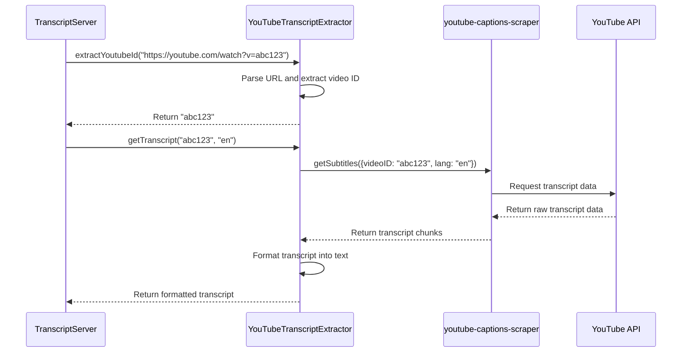

# Chapter 3: YouTubeTranscriptExtractor

In [Chapter 2: TranscriptServer](02_transcriptserver_.md), we explored how our server coordinates all operations. Now, let's dive into the real workhorse of our application: the `YouTubeTranscriptExtractor`.

## Why Do We Need a Transcript Extractor?

Imagine you want to read what was said in a YouTube video without watching it. Maybe you're looking for a specific piece of information, or you prefer reading to watching. That's exactly what our `YouTubeTranscriptExtractor` helps with!

This component takes a YouTube URL (or video ID) and converts all the spoken words in that video into readable text. Think of it like having a friend who watches videos for you and writes down everything that was said.

## The YouTubeTranscriptExtractor's Main Jobs

Our transcript extractor has three main responsibilities:

1. **Extract the YouTube video ID** from different URL formats
2. **Fetch the transcript data** from YouTube
3. **Format the transcript** into clean, readable text

Let's explore each of these tasks in detail.

## Extracting YouTube Video IDs

YouTube videos can be shared in many formats:
- Full URLs like `https://www.youtube.com/watch?v=dQw4w9WgXcQ`
- Short URLs like `https://youtu.be/dQw4w9WgXcQ`
- Or just the video ID alone: `dQw4w9WgXcQ`

Our extractor needs to handle all these formats. Let's look at the code for this:

```javascript
extractYoutubeId(input: string): string {
  if (!input) {
    throw new McpError(
      ErrorCode.InvalidParams,
      'YouTube URL or ID is required'
    );
  }

  // Handle URL formats
  try {
    const url = new URL(input);
    if (url.hostname === 'youtu.be') {
      return url.pathname.slice(1);
    } else if (url.hostname.includes('youtube.com')) {
      const videoId = url.searchParams.get('v');
      if (!videoId) {
        throw new McpError(
          ErrorCode.InvalidParams,
          `Invalid YouTube URL: ${input}`
        );
      }
      return videoId;
    }
  } catch (error) {
    // Not a URL, check if it's a direct video ID
    if (!/^[a-zA-Z0-9_-]{11}$/.test(input)) {
      throw new McpError(
        ErrorCode.InvalidParams,
        `Invalid YouTube video ID: ${input}`
      );
    }
    return input;
  }
}
```

This method does several things:
1. It first checks if an input was provided at all
2. It tries to parse the input as a URL
3. If it's a URL, it extracts the video ID based on the URL format
4. If it's not a URL, it checks if the input itself is a valid video ID
5. If all checks fail, it throws an error

For example, if we pass `https://www.youtube.com/watch?v=abc123xyz45`, the function will return `abc123xyz45`.

## Fetching Transcript Data

Once we have the video ID, we need to fetch the actual transcript from YouTube. Here's how we do it:

```javascript
async getTranscript(videoId: string, lang: string): Promise<string> {
  try {
    const transcript = await getSubtitles({
      videoID: videoId,
      lang: lang,
    });

    return this.formatTranscript(transcript);
  } catch (error) {
    console.error('Failed to fetch transcript:', error);
    throw new McpError(
      ErrorCode.InternalError,
      `Failed to retrieve transcript: ${(error as Error).message}`
    );
  }
}
```

This method:
1. Uses a third-party library called `youtube-captions-scraper` to fetch subtitles
2. Passes the video ID and language code to the library
3. Formats the transcript into readable text
4. Handles any errors that might occur during the process

For example, if we call `getTranscript("abc123xyz45", "en")`, it will fetch the English transcript for that video and return it as a formatted string.

## Formatting the Transcript

The raw transcript data from YouTube comes in chunks, with each chunk containing text and timing information. We need to format this into a clean, readable string:

```javascript
private formatTranscript(transcript: TranscriptLine[]): string {
  return transcript
    .map(line => line.text.trim())
    .filter(text => text.length > 0)
    .join(' ');
}
```

This method:
1. Takes each line of the transcript and trims any extra spaces
2. Filters out any empty lines
3. Joins all the lines into a single string with spaces between them

For example, if we get this raw transcript:
```
[
  { text: "Hello, ", start: 0.1, dur: 0.5 },
  { text: "welcome to", start: 0.6, dur: 0.8 },
  { text: "our tutorial!", start: 1.4, dur: 1.2 }
]
```

The formatted output would be: `"Hello, welcome to our tutorial!"`

## Putting It All Together

Now let's see how all these pieces work together in the `YouTubeTranscriptExtractor` class:

```javascript
class YouTubeTranscriptExtractor {
  extractYoutubeId(input: string): string {
    // Implementation details (as seen above)
  }

  async getTranscript(videoId: string, lang: string): Promise<string> {
    // Implementation details (as seen above)
  }

  private formatTranscript(transcript: TranscriptLine[]): string {
    // Implementation details (as seen above)
  }
}
```

This class brings together all the functionality we need to:
1. Take a YouTube URL or ID
2. Extract the video ID
3. Fetch the transcript
4. Format it into readable text

## How It Works Behind the Scenes

Let's walk through what happens when someone asks for a YouTube transcript:



Here's what happens step by step:
1. The `TranscriptServer` passes a YouTube URL to the extractor
2. The extractor parses the URL and extracts the video ID
3. The server then asks for the transcript using this ID
4. The extractor uses a third-party library to fetch raw transcript data
5. The library communicates with YouTube's API
6. YouTube returns the raw transcript data
7. The extractor formats the data into readable text
8. The formatted transcript is returned to the server

## Common Use Cases

Let's look at a few common scenarios where you might use the `YouTubeTranscriptExtractor`:

### Getting a Transcript from a Full YouTube URL

```javascript
const extractor = new YouTubeTranscriptExtractor();
const videoId = extractor.extractYoutubeId('https://www.youtube.com/watch?v=dQw4w9WgXcQ');
// videoId will be "dQw4w9WgXcQ"

const transcript = await extractor.getTranscript(videoId, 'en');
// transcript will be the formatted text of the video
```

### Getting a Transcript from a Short YouTube URL

```javascript
const extractor = new YouTubeTranscriptExtractor();
const videoId = extractor.extractYoutubeId('https://youtu.be/dQw4w9WgXcQ');
// videoId will be "dQw4w9WgXcQ"

const transcript = await extractor.getTranscript(videoId, 'en');
// transcript will be the formatted text of the video
```

### Getting a Transcript in a Different Language

```javascript
const extractor = new YouTubeTranscriptExtractor();
const videoId = extractor.extractYoutubeId('dQw4w9WgXcQ');
// videoId will be "dQw4w9WgXcQ"

const transcript = await extractor.getTranscript(videoId, 'es');
// transcript will be the Spanish formatted text of the video (if available)
```

## Error Handling

Our `YouTubeTranscriptExtractor` also handles various error cases:

1. **Invalid Input**: If no URL or ID is provided, or if it's not a valid YouTube URL or ID
2. **Unavailable Transcript**: If the video doesn't have a transcript or captions
3. **Language Not Available**: If the requested language isn't available for that video
4. **Network Issues**: If there's a problem connecting to YouTube's servers

For each of these cases, the extractor throws a specific error that includes helpful information about what went wrong.

## Conclusion

In this chapter, we've explored the `YouTubeTranscriptExtractor`, which is the core component that fetches and processes YouTube transcripts. We've learned how it extracts video IDs from various URL formats, fetches transcript data from YouTube, and formats it into readable text.

The `YouTubeTranscriptExtractor` is like a translator that converts spoken words in videos into text that can be easily read and processed. It handles all the complexities of dealing with different URL formats and communicating with YouTube's API.

In the next chapter, [YouTube ID Extraction](04_youtube_id_extraction_.md), we'll dive deeper into the specific techniques used to extract YouTube video IDs from various URL formats, which is a critical first step in the transcript extraction process.

---

Generated by [AI Codebase Knowledge Builder](https://github.com/The-Pocket/Tutorial-Codebase-Knowledge)