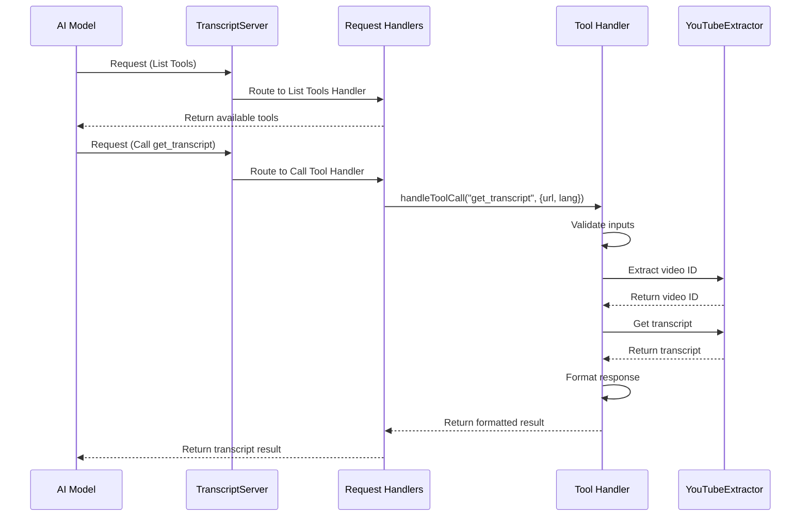

# Chapter 5: Request Handlers

In [Chapter 4: YouTube ID Extraction](04_youtube_id_extraction_.md), we learned how to identify and extract YouTube video IDs from various URL formats. Now, let's explore how our application processes and responds to requests using Request Handlers.

## What Are Request Handlers and Why Do We Need Them?

Imagine you walk into a company's office building with a question. At the reception desk, someone listens to your request and directs you to the right department. Each department has specialists who know how to handle specific types of inquiries.

In our YouTube transcript application, **request handlers** work just like that reception desk and those department specialists. They:

1. Receive incoming requests from AI models
2. Determine what type of request it is
3. Route the request to the appropriate specialized handler
4. Ensure the response is properly formatted and returned

Without request handlers, our application wouldn't know how to process different types of requests or what to do with them!

## Types of Requests Our Application Handles

Our application handles two main types of requests:

1. **List Tools Request**: When an AI model asks "What tools do you offer?"
2. **Call Tool Request**: When an AI model says "I want to use a specific tool"

Let's look at how we handle each of these requests.

## Setting Up Request Handlers

The core of our request handling system is set up in the `setupHandlers` method:

```javascript
private setupHandlers(): void {
  // List available tools
  this.server.setRequestHandler(ListToolsRequestSchema, async () => ({
    tools: TOOLS
  }));

  // Handle tool calls
  this.server.setRequestHandler(CallToolRequestSchema, async (request) => 
    this.handleToolCall(request.params.name, request.params.arguments ?? {})
  );
}
```

This simple method does two important things:

1. It registers a handler for "list tools" requests that returns our list of available tools
2. It registers a handler for "call tool" requests that delegates to a more specialized method called `handleToolCall`

Think of this as setting up two different reception desks - one for people who want to know what services are available, and another for people who already know what service they want.

## Handling Tool Listing Requests

The first handler is quite simple:

```javascript
this.server.setRequestHandler(ListToolsRequestSchema, async () => ({
  tools: TOOLS
}));
```

This handler:
1. Waits for requests that match the `ListToolsRequestSchema` (requests asking "what tools do you have?")
2. Responds with our pre-defined list of tools (`TOOLS` constant)

It's like when someone asks a receptionist "What services does your company offer?" and they hand over a brochure listing all available services.

## Handling Tool Call Requests

The second handler is more complex because it needs to process actual tool usage:

```javascript
this.server.setRequestHandler(CallToolRequestSchema, async (request) => 
  this.handleToolCall(request.params.name, request.params.arguments ?? {})
);
```

This handler:
1. Waits for requests that match the `CallToolRequestSchema` (requests saying "I want to use this specific tool")
2. Extracts the tool name and arguments from the request
3. Passes them to a specialized method called `handleToolCall`

It's like when a customer tells the receptionist "I need help with my account," and the receptionist says, "Let me connect you with our account services department."

## The Tool Call Specialist: handleToolCall Method

Now let's look at the specialized method that handles actual tool calls:

```javascript
private async handleToolCall(name: string, args: any): 
  Promise<{ toolResult: CallToolResult }> {
  switch (name) {
    case "get_transcript": {
      const { url: input, lang = "en" } = args;
      
      if (!input || typeof input !== 'string') {
        throw new McpError(
          ErrorCode.InvalidParams,
          'URL parameter is required and must be a string'
        );
      }
      
      // Extract video ID and get transcript
      const videoId = this.extractor.extractYoutubeId(input);
      const transcript = await this.extractor.getTranscript(videoId, lang);
      
      return {
        toolResult: {
          content: [{
            type: "text",
            text: transcript,
            metadata: { videoId, language: lang }
          }],
          isError: false
        }
      };
    }

    default:
      throw new McpError(
        ErrorCode.MethodNotFound,
        `Unknown tool: ${name}`
      );
  }
}
```

This method is where the real work happens:

1. It uses a `switch` statement to handle different tools (currently we only have one: `get_transcript`)
2. For the transcript tool, it:
   - Extracts the URL/ID and language from the arguments
   - Validates that the input is provided and is a string
   - Uses the [YouTubeTranscriptExtractor](03_youtubetranscriptextractor_.md) to get the video ID and transcript
   - Returns the transcript in a properly formatted response
3. If an unknown tool is requested, it throws an error

It's like when you reach the account services department and the specialist there helps solve your specific account problem.

## Validation in Request Handlers

Notice how our `handleToolCall` method includes validation:

```javascript
if (!input || typeof input !== 'string') {
  throw new McpError(
    ErrorCode.InvalidParams,
    'URL parameter is required and must be a string'
  );
}
```

This code checks if:
1. The input exists (not null or undefined)
2. The input is a string (not a number or object)

If either check fails, it throws an error with a helpful message. This is like a specialist asking for your account number and informing you if you provide an invalid format.

## Formatting Responses

After processing a request, our handler needs to format the response correctly:

```javascript
return {
  toolResult: {
    content: [{
      type: "text",
      text: transcript,
      metadata: { videoId, language: lang }
    }],
    isError: false
  }
};
```

This formatted response:
1. Includes the transcript text
2. Specifies the content type as "text"
3. Adds helpful metadata (video ID and language)
4. Indicates that no error occurred

It's like how a company specialist might provide you with a printed report, labeled with your account details and formatted in a standard company template.

## Request Handling Flow

Let's visualize what happens when a request flows through our handlers:



This diagram shows two scenarios:
1. An AI model asking for a list of available tools
2. An AI model requesting a transcript for a specific video

Notice how the request passes through several components, each handling a specific part of the process.

## Error Handling in Request Handlers

Our request handlers also need to handle errors gracefully:

```javascript
try {
  const videoId = this.extractor.extractYoutubeId(input);
  const transcript = await this.extractor.getTranscript(videoId, lang);
  // Format and return result
} catch (error) {
  if (error instanceof McpError) {
    throw error;
  }
  
  throw new McpError(
    ErrorCode.InternalError,
    `Failed to process transcript: ${(error as Error).message}`
  );
}
```

This error handling code:
1. Tries to extract the video ID and get the transcript
2. If an error occurs, it checks if it's already an MCP error
3. If it's not, it wraps it in an MCP error with a helpful message

It's like how a company specialist might say "I'm sorry, but we couldn't process your request because..." and provide a clear explanation of what went wrong.

## Integration with the Complete Application

Now that we understand request handlers, let's see how they fit into our complete application:

```javascript
class TranscriptServer {
  // ... other properties and methods ...

  constructor() {
    this.extractor = new YouTubeTranscriptExtractor();
    this.server = new Server({...}, {...});

    // Set up request handlers and error handling
    this.setupHandlers();
    this.setupErrorHandling();
  }

  // ... request handler methods ...

  async start(): Promise<void> {
    const transport = new StdioServerTransport();
    await this.server.connect(transport);
  }
}
```

When our application starts:
1. It creates a new `TranscriptServer`
2. The constructor initializes the [YouTubeTranscriptExtractor](03_youtubetranscriptextractor_.md) and MCP server
3. It sets up the request handlers we've learned about
4. When `start()` is called, it connects to a transport layer and begins listening for requests

This shows how request handlers are an essential part of the application, enabling it to communicate with AI models.

## Examples of Request Handling

Let's look at some examples of how request handlers process different types of requests:

### Example 1: Listing Available Tools

**Request from AI model:**
```json
{
  "method": "list_tools",
  "params": {}
}
```

**Response from our handler:**
```json
{
  "tools": [
    {
      "name": "get_transcript",
      "description": "Extract transcript from a YouTube video URL or ID",
      "inputSchema": {
        "type": "object",
        "properties": {
          "url": {
            "type": "string",
            "description": "YouTube video URL or ID"
          },
          "lang": {
            "type": "string",
            "description": "Language code for transcript (e.g., 'ko', 'en')",
            "default": "en"
          }
        },
        "required": ["url", "lang"]
      }
    }
  ]
}
```

### Example 2: Getting a Transcript

**Request from AI model:**
```json
{
  "method": "call_tool",
  "params": {
    "name": "get_transcript",
    "arguments": {
      "url": "https://www.youtube.com/watch?v=dQw4w9WgXcQ",
      "lang": "en"
    }
  }
}
```

**Response from our handler:**
```json
{
  "toolResult": {
    "content": [
      {
        "type": "text",
        "text": "We're no strangers to love You know the rules and so do I...",
        "metadata": {
          "videoId": "dQw4w9WgXcQ",
          "language": "en"
        }
      }
    ],
    "isError": false
  }
}
```

## Conclusion

In this chapter, we've explored request handlers - the components that receive, route, and process requests in our YouTube transcript application. We've learned how they validate inputs, coordinate with other components like the [YouTubeTranscriptExtractor](03_youtubetranscriptextractor_.md), and format responses.

Request handlers act like department specialists in a company, each responsible for handling a specific type of request. They ensure that when an AI model asks for information or services, the request is properly processed and a well-formatted response is returned.

In the next chapter, [Error Handling System](06_error_handling_system_.md), we'll explore how our application deals with errors and exceptions that might occur during the request handling process, ensuring a robust and user-friendly experience.

---

Generated by [AI Codebase Knowledge Builder](https://github.com/The-Pocket/Tutorial-Codebase-Knowledge)