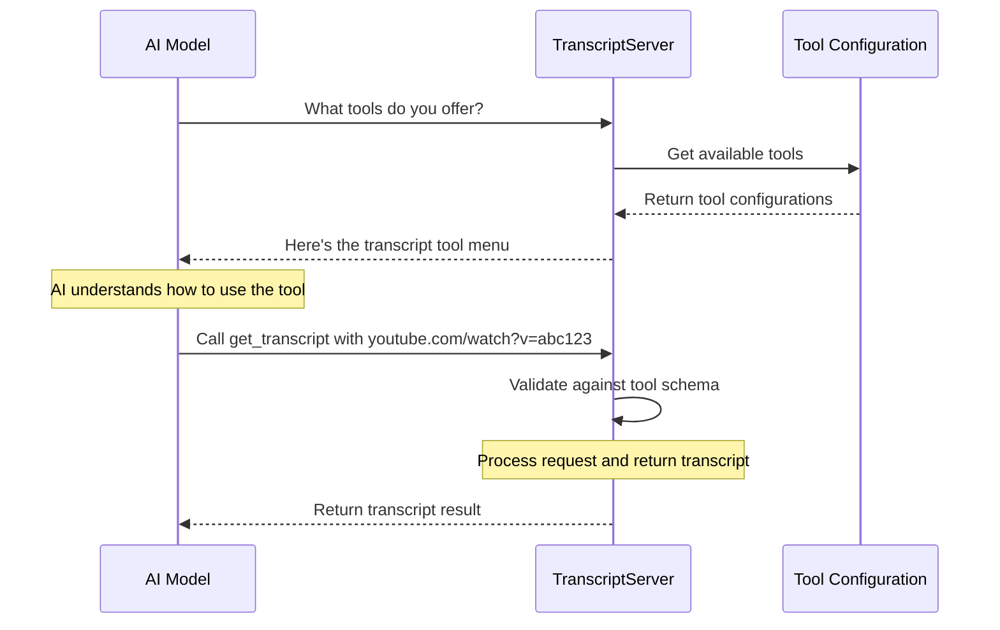

# Chapter 7: Tool Configuration

In [Chapter 6: Error Handling System](06_error_handling_system_.md), we learned how our application gracefully manages errors. Now, let's explore an essential component that defines what our server can do: Tool Configuration.

## What is Tool Configuration and Why Does It Matter?

Imagine you're visiting a restaurant for the first time. How do you know what food you can order? You look at the menu! The menu tells you what dishes are available, what ingredients are in each dish, and even which ones are spicy or vegetarian.

In our YouTube transcript application, **Tool Configuration** serves exactly the same purpose as that restaurant menu. It tells AI models what "dishes" (capabilities) our server offers, what "ingredients" (parameters) they need to provide, and what "dietary restrictions" (constraints) apply.

Without this menu, AI models wouldn't know:
- What tools our server provides
- What information they need to provide to use these tools
- What format the results will be in

## Understanding Tool Configuration Through a Restaurant Analogy

Let's explore this restaurant menu analogy a bit more:

| Restaurant Menu | Tool Configuration |
|-----------------|-------------------|
| List of dishes | List of available tools |
| Dish descriptions | Tool descriptions |
| Required ingredients | Required parameters |
| Optional add-ons | Optional parameters |
| Price | Resource limitations |
| Preparation time | Expected response time |

When a customer (AI model) knows what's on the menu (tool configuration), they can make informed requests without wasting time asking for dishes that aren't available.

## Our YouTube Transcript Tool Configuration

Let's look at how we define the tool configuration for our YouTube transcript extractor:

```javascript
const TOOLS: Tool[] = [
  {
    name: "get_transcript",
    description: "Extract transcript from a YouTube video URL or ID",
    inputSchema: {
      type: "object",
      properties: {
        url: {
          type: "string",
          description: "YouTube video URL or ID"
        },
        lang: {
          type: "string",
          description: "Language code for transcript (e.g., 'ko', 'en')",
          default: "en"
        }
      },
      required: ["url"]
    }
  }
];
```

This configuration is like our restaurant menu. It tells AI models that:

1. We offer a tool called `get_transcript`
2. This tool extracts transcripts from YouTube videos
3. To use it, you need to provide a YouTube URL or ID (required)
4. You can also specify a language code (optional, defaults to English)

## Breaking Down the Tool Configuration

Let's examine each part of our tool configuration:

### 1. Tool Name and Description

```javascript
name: "get_transcript",
description: "Extract transcript from a YouTube video URL or ID",
```

This is like the name and description of a dish on a menu. It tells AI models:
- The name they should use when requesting the tool
- A brief description of what the tool does

### 2. Input Schema

```javascript
inputSchema: {
  type: "object",
  properties: {
    // Properties defined here
  },
  required: ["url"]
}
```

This defines the shape of the data the tool expects, using a standard format called JSON Schema. It's like the list of ingredients required for a dish, telling the AI model exactly what information to provide.

### 3. Properties (Parameters)

```javascript
properties: {
  url: {
    type: "string",
    description: "YouTube video URL or ID"
  },
  lang: {
    type: "string",
    description: "Language code for transcript (e.g., 'ko', 'en')",
    default: "en"
  }
}
```

This section defines each parameter the tool accepts:
- `url`: A string containing the YouTube URL or ID
- `lang`: A string representing the language code (with a default value of "en")

Each property has a type and description, helping AI models understand what to provide.

### 4. Required Fields

```javascript
required: ["url"]
```

This tells AI models which parameters are mandatory. In our case, only the `url` is required - the `lang` parameter is optional and will default to "en" if not provided.

## How Tool Configuration is Used in Our Application

Our tool configuration is used in two main ways:

1. To tell AI models what tools are available
2. To validate incoming requests

Let's see how we implement both:

```javascript
private setupHandlers(): void {
  // List available tools
  this.server.setRequestHandler(ListToolsRequestSchema, async () => ({
    tools: TOOLS
  }));

  // Handle tool calls
  this.server.setRequestHandler(CallToolRequestSchema, async (request) => 
    this.handleToolCall(request.params.name, request.params.arguments ?? {})
  );
}
```

When an AI model asks "What tools do you offer?", our server responds with the `TOOLS` configuration. The AI model can then use this information to formulate proper requests.

## Tool Discovery Process

Let's visualize how an AI model discovers and uses our tools:



In this flow:
1. The AI model first asks what tools are available
2. Our server returns the tool configuration
3. The AI model understands how to use the tool from the configuration
4. It makes a proper request with the required parameters
5. Our server validates the request against the tool configuration
6. If valid, our server processes the request and returns the result

## Validating Requests Against Tool Configuration

When our server receives a request, it validates it against the tool configuration to ensure it has all required parameters in the correct format:

```javascript
private async handleToolCall(name: string, args: any): 
  Promise<{ toolResult: CallToolResult }> {
  switch (name) {
    case "get_transcript": {
      const { url: input, lang = "en" } = args;
      
      if (!input || typeof input !== 'string') {
        throw new McpError(
          ErrorCode.InvalidParams,
          'URL parameter is required and must be a string'
        );
      }
      
      // Rest of the implementation...
    }
  }
}
```

This validation ensures that:
1. The required `url` parameter is provided
2. The parameter is a string (as specified in the schema)
3. If the `lang` parameter is provided, it uses it; otherwise, it defaults to "en"

It's like a chef checking that all required ingredients are available before starting to cook.

## Best Practices for Tool Configuration

Based on our implementation, here are some best practices for creating effective tool configurations:

1. **Clear Names and Descriptions**: Make the purpose of each tool immediately obvious
2. **Detailed Parameter Descriptions**: Explain exactly what each parameter should contain
3. **Sensible Defaults**: Provide default values for optional parameters
4. **Examples in Descriptions**: Include examples in parameter descriptions
5. **Minimal Required Parameters**: Only make parameters required if they're truly necessary
6. **Consistent Naming**: Use consistent naming patterns across all tools

## Adding a New Tool to Your Configuration

Let's say we wanted to add a new tool that provides video metadata instead of just the transcript. Here's how we could extend our configuration:

```javascript
const TOOLS: Tool[] = [
  {
    name: "get_transcript",
    description: "Extract transcript from a YouTube video URL or ID",
    inputSchema: {
      // Current schema...
    }
  },
  {
    name: "get_video_info",
    description: "Get metadata about a YouTube video",
    inputSchema: {
      type: "object",
      properties: {
        url: {
          type: "string",
          description: "YouTube video URL or ID"
        }
      },
      required: ["url"]
    }
  }
];
```

With this addition:
1. AI models would now see two tools available when they ask for the menu
2. They could choose which tool to use based on their needs
3. Each tool would have its own validation and handling logic

## How AI Models Use Tool Configuration

When an AI model interacts with our server, it follows a process like this:

1. **Discovery**: The AI asks what tools are available
2. **Understanding**: It reads the tool configurations to understand capabilities
3. **Selection**: It selects the appropriate tool for its task
4. **Request Formation**: It constructs a request with the required parameters
5. **Response Processing**: It processes the response based on expected format

For example, an AI might think: "I need to get a transcript from this YouTube video. The tool configuration says I need to provide a URL parameter and can optionally specify a language. Let me construct a request with these parameters."

## Real-World Benefits of Good Tool Configuration

Well-designed tool configurations provide several benefits:

1. **Reduced Errors**: AI models make fewer mistakes in requests
2. **Self-Documentation**: The configuration itself documents what the tool does
3. **Discoverability**: AI models can find and use tools without human guidance
4. **Consistency**: All tools follow the same pattern, making them easier to use
5. **Evolution**: New capabilities can be added without breaking existing ones

## Conclusion

In this chapter, we've explored Tool Configuration, the "menu" that tells AI models what our server can do and how to use its capabilities. Just as a restaurant menu helps customers order dishes they'll enjoy, our tool configuration helps AI models make effective requests to our YouTube transcript server.

By carefully defining our tools, their parameters, and requirements, we enable AI models to discover and use our server's capabilities without confusion or errors. This standardized approach to defining tools is a key part of what makes the Model Context Protocol effective for AI-tool communication.

Throughout this tutorial series, we've built a complete YouTube transcript extraction service following the Model Context Protocol. We've learned about [MCP Server Implementation](01_mcp_server_implementation_.md), [TranscriptServer](02_transcriptserver_.md), [YouTubeTranscriptExtractor](03_youtubetranscriptextractor_.md), [YouTube ID Extraction](04_youtube_id_extraction_.md), [Request Handlers](05_request_handlers_.md), [Error Handling System](06_error_handling_system_.md), and now Tool Configuration.

By combining all these components, we've created a robust service that AI models can discover and use to extract transcripts from YouTube videos, enhancing their capabilities and providing value to users.

---

Generated by [AI Codebase Knowledge Builder](https://github.com/The-Pocket/Tutorial-Codebase-Knowledge)