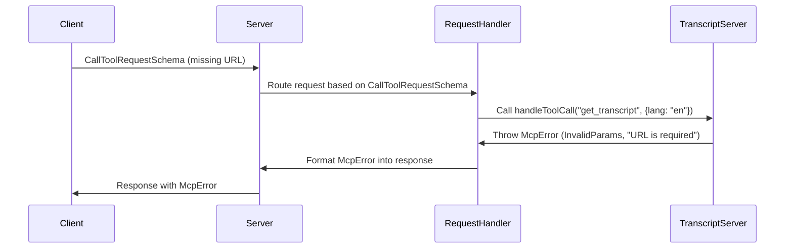

# Chapter 6: McpError

In the previous chapter, [StdioServerTransport](05_stdioservertransport_.md), we learned how the server communicates with the outside world. But what happens when something goes *wrong*? How does the server tell the client that there was a problem, and what kind of problem was it? That's where `McpError` comes in!

Imagine you're at our restaurant, and you order a specific dish.  But the waiter comes back and says, "Sorry, we're out of that dish!" That's an error. But imagine if the waiter just said, "Something went wrong." You wouldn't know *what* went wrong! `McpError` is like the waiter telling you specifically *why* they can't fulfill your order.

## What Problem Does McpError Solve?

`McpError` solves the problem of clear and informative error reporting. It provides a standardized way for the server to:

*   **Indicate that an error occurred:**  Let the client know that something went wrong during the processing of their request.
*   **Provide specific error codes:**  Tell the client *what* kind of error it was (e.g., "Invalid input", "Tool not found", "Internal server error").
*   **Include a human-readable message:**  Give the client a description of the error that they can understand (e.g., "The YouTube URL is invalid", "The requested tool 'xyz' does not exist", "Failed to fetch transcript from YouTube").

Without `McpError`, the server would only be able to send generic error messages, making it difficult for clients to understand what went wrong and how to fix it. It's like getting a vague "Something went wrong" message instead of a helpful error message.

## What is McpError?

`McpError` is a custom error class that is built based on the Error class in JavaScript. It's a *special* kind of error message that follows a specific format that the [Server](01_server_.md) and clients understand.

It has two main parts:

1.  **Error Code:** A code (like `ErrorCode.InvalidParams`) that represents the *type* of error. This is like the restaurant having a list of standard error codes, so everyone knows what "out of stock" means.
2.  **Message:** A human-readable message that describes the error in more detail.  This is like the waiter explaining, "Sorry, we're out of that dish because the delivery truck didn't arrive today."

Think of it as a structured way to provide more context than a plain error.

## Key Concept: ErrorCode

`ErrorCode` is an *enum* (enumeration). An enum is just a list of named constants. It defines the possible types of errors that can occur in our server. Here are some common error codes from `@modelcontextprotocol/sdk/types.js`:

*   `ErrorCode.InvalidParams`:  The input parameters provided by the client are invalid (e.g., missing a required argument, providing the wrong data type).
*   `ErrorCode.MethodNotFound`: The requested tool or method does not exist.
*   `ErrorCode.InternalError`: Something went wrong on the server side while processing the request (e.g., failed to connect to YouTube, an unexpected error occurred).

By using these predefined error codes, the client can easily identify the type of error and take appropriate action.

## How to Use McpError

Let's see how `McpError` is used in our code. Here's an example from `src/index.ts` (specifically, in the `handleToolCall` function):

```typescript
if (!input || typeof input !== 'string') {
  throw new McpError(
    ErrorCode.InvalidParams,
    'URL parameter is required and must be a string'
  );
}
```

Explanation:

*   This code checks if the `input` (the YouTube URL) is missing or is not a string.
*   If either of these conditions is true, it creates a new `McpError` object.
*   The `McpError` is created with the `ErrorCode.InvalidParams` code, indicating that the input parameters are invalid.
*   The message "URL parameter is required and must be a string" provides a more detailed explanation of the error.
*   `throw` statement sends `McpError` to the [Server](01_server_.md), and the server sends it to the user.

## Example: Sending a Request That Causes an McpError

Let's say we send a `CallToolRequestSchema` request (from the [CallToolRequestSchema & ListToolsRequestSchema](03_calltoolrequestschema___listtoolsrequestschema_.md) chapter) to call the "get\_transcript" tool, but we forget to include the `url` parameter:

```json
{
  "method": "call_tool",
  "params": {
    "name": "get_transcript",
    "arguments": {
      "lang": "en"
    }
  }
}
```

The server would receive this request, and the `handleToolCall` function would detect that the `url` parameter is missing.  It would then throw an `McpError` as shown above.

The server would then send back a response containing the `McpError`, something like this (in JSON format):

```json
{
  "error": {
    "code": "invalid_params",
    "message": "URL parameter is required and must be a string"
  }
}
```

Explanation:

*   The `error` field indicates that an error occurred.
*   The `code` field contains the error code (`invalid_params`).
*   The `message` field contains the human-readable error message.

This tells the client *exactly* what went wrong: they forgot to provide the YouTube URL!

## Internal Implementation

When an `McpError` is thrown, here's what happens:



1.  **Client sends invalid request:** The client sends a `CallToolRequestSchema` request with missing parameters.
2.  **Server routes request:** The server receives the request and routes it to the `handleToolCall` function in the [TranscriptServer](01_server_.md).
3.  **`McpError` is thrown:** The `handleToolCall` function detects the missing parameter and throws an `McpError`.
4.  **Error is formatted and sent:** The [Server](01_server_.md) catches the `McpError`, formats it into a JSON response with the error code and message, and sends it back to the client.

In `src/index.ts`, the `setupErrorHandling` method registers a handler that logs the errors:

```typescript
  private setupErrorHandling(): void {
    this.server.onerror = (error) => {
      console.error("[MCP Error]", error);
    };
  }
```
When the server receives the `McpError`, it calls this error handler, which logs the error message to the console.

## Conclusion

In this chapter, we've explored the `McpError` class, which is crucial for providing clear and informative error messages in our YouTube transcript server. You've learned how it helps clients understand what went wrong and how to fix it.

That concludes our exploration of the `mcp-server-youtube-transcript` project!  You've now seen the core components, from the [Server](01_server_.md) that handles requests to the [YouTubeTranscriptExtractor](04_youtubetranscriptextractor_.md) that fetches transcripts, the [StdioServerTransport](05_stdioservertransport_.md) that handles communication, the [Tool](02_tool_.md) which defines operations and finally how `McpError` helps to handle errors!


---

Generated by [AI Codebase Knowledge Builder](https://github.com/The-Pocket/Tutorial-Codebase-Knowledge)