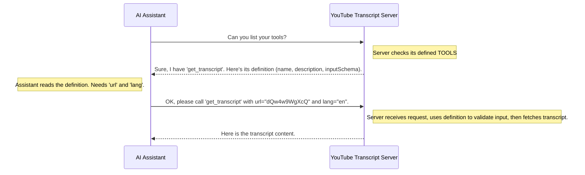

# Chapter 1: Tool Capability Definition

Welcome to the `mcp-server-youtube-transcript` project! This tutorial will guide you through understanding how this server works, piece by piece. We'll start with the very basics.

Imagine you have a helpful robot assistant (like an AI model). You want it to fetch YouTube video transcripts for you. But how does the robot know *that* our server can do this? And how does it know *exactly* what information to give our server (like the video link)?

This is where the "Tool Capability Definition" comes in! It's like a very clear instruction manual or a menu for a specific service our server offers.

## What is a Tool Capability Definition?

Think about ordering food at a restaurant. The menu tells you:

1.  **The Name** of the dish (e.g., "Cheeseburger").
2.  A **Description** of what it is (e.g., "A beef patty with cheese on a bun").
3.  What **Options** or ingredients you need to specify (e.g., "Cooked medium-rare? Add bacon?").

A Tool Capability Definition does the same thing for a software function. It tells any external system (like an AI) everything it needs to know to use a specific feature of our server.

For our YouTube transcript server, the main feature (or "tool") is getting a transcript. So, we need to define:

1.  **Name:** A simple name for the tool, like `get_transcript`.
2.  **Description:** What the tool does, like "Extract transcript from a YouTube video URL or ID".
3.  **Input Schema:** Precisely what information the tool needs to work. This is defined using a standard format called JSON Schema. It specifies:
    *   What pieces of information (parameters) are needed (like `url` and `lang`).
    *   What *type* each piece of information should be (e.g., `url` must be text, which we call a `string`).
    *   A description for each parameter.
    *   If a parameter has a default value (like defaulting to English if no language is specified).
    *   Which parameters are absolutely required.

## Our `get_transcript` Tool Definition

Let's look at how we define our transcript-fetching tool in the code (`src/index.ts`). Don't worry about understanding all the code around it yet, just focus on this specific part:

```typescript
// Define tool configurations
const TOOLS: Tool[] = [
  {
    name: "get_transcript",
    description: "Extract transcript from a YouTube video URL or ID",
    inputSchema: {
      type: "object", // Means we expect a group of named inputs
      properties: {
        // Defines the 'url' input
        url: {
          type: "string",
          description: "YouTube video URL or ID"
        },
        // Defines the 'lang' input
        lang: {
          type: "string",
          description: "Language code for transcript (e.g., 'ko', 'en')",
          default: "en" // If not provided, it defaults to English ('en')
        }
      },
      // Tells which inputs are absolutely required
      required: ["url", "lang"]
    }
  }
  // We could add more tools here later!
];
```

Let's break down this definition for `get_transcript`:

*   `name: "get_transcript"`: This is the identifier. When something wants to use this tool, it will refer to it by this name.
*   `description: "Extract transcript..."`: A human-readable explanation of what the tool does.
*   `inputSchema:`: This defines the expected input.
    *   `type: "object"`: It expects a collection of key-value pairs.
    *   `properties:`: This lists the specific inputs (parameters) the tool accepts.
        *   `url`: It expects an input named `url`, which should be text (`type: "string"`). The description clarifies it can be a full URL or just the video ID.
        *   `lang`: It expects an input named `lang`, also text (`type: "string"`). It specifies the desired transcript language (like 'en' for English, 'ko' for Korean). Crucially, it has a `default: "en"`, meaning if the user doesn't specify a language, the server will assume English.
    *   `required: ["url", "lang"]`: This states that *both* `url` and `lang` inputs *must* be provided when calling the tool. Even though `lang` has a default, the definition requires it to be explicitly present in the structure given to the tool (the system using the tool might fill in the default if the end-user didn't specify it).

## Why is this Definition Important?

This definition acts as a contract. It allows our server to clearly communicate its capabilities to the outside world, especially to automated systems like AI models.

Imagine an AI assistant wanting to use our server. It can first ask our server, "What tools do you offer?". Our server can then send back this exact definition for `get_transcript`. The AI assistant can read this definition and understand:

1.  "Ah, there's a tool called `get_transcript`."
2.  "It gets YouTube transcripts."
3.  "To use it, I *must* provide a `url` (which is a string) and a `lang` (also a string, defaulting to 'en')."

This allows the AI to correctly format its request to our server *without* needing a human to intervene. It's the foundation for automated communication.

## How It Works (A Sneak Peek)

We'll dive deeper into the server mechanics later, but here's a simplified view of how this definition is used:



This structured definition makes the interaction predictable and reliable. The actual process involves specific request types defined by the Model Context Protocol (MCP), which we'll explore in chapters like [MCP Server Framework](03_mcp_server_framework_.md) and [MCP Request Handling](04_mcp_request_handling_.md).

## Conclusion

In this chapter, we learned about the concept of a **Tool Capability Definition**. It's like a formal instruction manual or API documentation for a single function (`get_transcript`) that our server provides. It clearly specifies the tool's name, description, and exactly what input parameters (`url`, `lang`) it needs, including their types and if they are required.

This definition is crucial because it allows other programs or AI models to automatically discover and correctly use the server's functionality.

Now that we understand how we *describe* what our server can do, let's move on to see how the different parts of the server are organized and work together.

Next up: [Transcript Server Orchestrator](02_transcript_server_orchestrator_.md)

---

Generated by [AI Codebase Knowledge Builder](https://github.com/The-Pocket/Tutorial-Codebase-Knowledge)