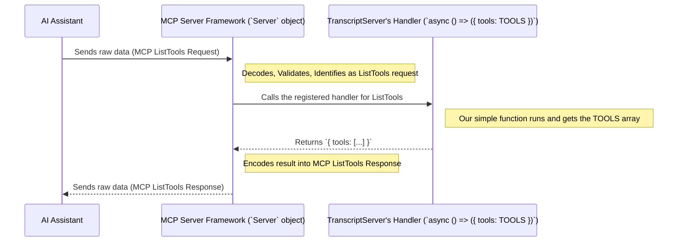

# Chapter 3: MCP Server Framework

In the [previous chapter](02_transcript_server_orchestrator_.md), we learned about the `TranscriptServer` class, our shop manager that orchestrates the process of fetching transcripts. We saw that it listens for requests and delegates the actual work. But *how* does it listen? How does it understand the language of requests and responses spoken by AI assistants or other programs?

Imagine our `TranscriptServer` manager needs to communicate with customers (other software). Does the manager need to invent a whole new language, set up phone lines, learn how to encode and decode messages every single time? That would be a lot of extra work, prone to errors, and different for every customer!

This is where the **MCP Server Framework** comes in.

## Standardized Communication: The Model Context Protocol (MCP)

Just like there are standard ways to make phone calls (using phone numbers and established networks) or send mail (using addresses and postal services), there's a standard way for AI models and tools (like our transcript server) to talk to each other. This standard is called the **Model Context Protocol (MCP)**.

MCP defines the exact format for messages like:
*   "What tools do you have?" (ListTools request)
*   "Here are the tools I have." (ListTools response)
*   "Please use this tool with these inputs." (CallTool request)
*   "Here's the result of using the tool." (CallTool response)

Using a standard protocol means everyone speaks the same language, making communication reliable and predictable.

## The `@modelcontextprotocol/sdk`'s `Server` Class

Our project uses a helper library called `@modelcontextprotocol/sdk`. This library provides a ready-made component, the `Server` class, that understands and handles all the nitty-gritty details of the MCP standard.

Think of the `Server` class like the standardized plumbing and electrical wiring in a building. When you build a room (our `TranscriptServer`), you don't need to invent how electricity flows or how water pipes connect. You just use the existing, standard outlets and faucets.

The `Server` class from the SDK provides this standard infrastructure for communication. It takes care of:

1.  **Listening for Connections:** Waiting for another program to connect.
2.  **Receiving Raw Data:** Getting the actual bytes of data that represent a request.
3.  **Decoding the Message:** Understanding the incoming data and figuring out if it's an MCP message (like a ListTools or CallTool request).
4.  **Validating the Message:** Checking if the request follows the MCP rules.
5.  **Routing the Request:** Calling the *specific piece of code* inside our `TranscriptServer` that we told it to use for *that specific type* of request. (We'll see how we tell it in a moment).
6.  **Receiving the Result:** Getting the result (like the list of tools or the transcript) back from our code.
7.  **Encoding the Response:** Packaging the result into the correct MCP response format.
8.  **Sending the Response:** Sending the formatted response back to the program that made the request.

Our `TranscriptServer` doesn't need to worry about *any* of these steps! It just needs to use the `Server` class provided by the SDK.

## How Our `TranscriptServer` Uses the Framework

In Chapter 2, we saw that the `TranscriptServer` has a property called `server`:

```typescript
// Inside src/index.ts - TranscriptServer class

import { Server } from "@modelcontextprotocol/sdk/server/index.js";
// ... other imports ...

class TranscriptServer {
  // ... extractor property ...
  private server: Server; // << This holds the MCP framework object

  constructor() {
    // ... create extractor ...

    // Create the MCP Server framework instance!
    this.server = new Server(
      {
        name: "mcp-servers-youtube-transcript", // Server's name
        version: "0.1.0", // Server's version
      },
      {
        capabilities: { // Advertise what kind of capabilities we have
          tools: {}, // Indicate we support 'tool' related requests
        },
      }
    );

    // Tell the framework *how* to handle specific requests
    this.setupHandlers();
    // ... setup error handling ...
  }
  // ... other methods like setupHandlers, start, handleToolCall ...
}
```

Inside the `constructor` (the setup routine for our `TranscriptServer`), we create a new `Server` object. We give it some basic information about our server (like its name and version) and tell it that we support "tools".

This `this.server` object is now our connection to the standardized MCP communication world.

## Connecting Our Logic to the Framework: `setupHandlers`

Okay, the framework handles receiving requests, but how does it know *what code inside our `TranscriptServer`* to run when a specific request comes in?

This is done in the `setupHandlers` method, which we also saw briefly in Chapter 2. Let's look at it again:

```typescript
// Inside src/index.ts - TranscriptServer class

// Import schemas that define MCP request types
import {
  ListToolsRequestSchema,
  CallToolRequestSchema
} from "@modelcontextprotocol/sdk/types.js";

class TranscriptServer {
  // ... constructor, server property ...

  private setupHandlers(): void {
    // --- Handler for "ListTools" requests ---
    this.server.setRequestHandler(
      ListToolsRequestSchema, // WHEN a ListTools request arrives...
      async () => ({ tools: TOOLS }) // ... run this function! Return our TOOLS array.
    );

    // --- Handler for "CallTool" requests ---
    this.server.setRequestHandler(
      CallToolRequestSchema, // WHEN a CallTool request arrives...
      async (request) => // ... run this function (our handleToolCall)!
        this.handleToolCall(request.params.name, request.params.arguments ?? {})
    );
  }

  // The actual logic for handling a tool call (from Chapter 2)
  private async handleToolCall(name: string, args: any): Promise<any> {
    // ... switch statement for 'get_transcript' ...
  }

  // The tool definition (from Chapter 1)
  // TOOLS = [ { name: "get_transcript", ... } ]
}
```

Here's the key part: `this.server.setRequestHandler(...)`.

*   We call this method on our `server` framework object.
*   The first argument (`ListToolsRequestSchema` or `CallToolRequestSchema`) tells the framework *which type* of MCP request this handler is for. These `...Schema` objects precisely define the structure of those requests according to the MCP standard.
*   The second argument is the function *we* want the framework to run when it receives a matching request.
    *   For `ListToolsRequestSchema`, we provide a short function that simply returns our `TOOLS` array (defined in [Chapter 1](01_tool_capability_definition_.md)).
    *   For `CallToolRequestSchema`, we provide a function that calls our own `this.handleToolCall` method (defined in [Chapter 2](02_transcript_server_orchestrator_.md)).

This is how we "plug in" our specific logic (like listing tools or handling the `get_transcript` call) into the standard framework. The framework handles the communication details, and when a valid request arrives, it calls the correct function we provided.

## What Happens Under the Hood (Simplified)

Let's visualize the flow when an AI Assistant asks for the list of tools:



The `Server` framework acts as a sophisticated dispatcher. It receives the mail (request), reads the address (request type), and delivers it to the correct recipient (our handler function). Then it takes the reply from our function and sends it back through the postal service (MCP).

## Conclusion

In this chapter, we learned about the **MCP Server Framework**, provided by the `Server` class from the `@modelcontextprotocol/sdk`.

*   It provides the standard infrastructure for communicating using the **Model Context Protocol (MCP)**.
*   It handles the low-level details of receiving, decoding, routing, encoding, and sending messages, like the standardized wiring and plumbing in a building.
*   Our `TranscriptServer` creates an instance of this `Server` class.
*   Using `server.setRequestHandler`, we tell the framework *which* of our functions to call for specific MCP requests (like `ListTools` or `CallTool`).

This framework allows our `TranscriptServer` (the orchestrator from [Chapter 2](02_transcript_server_orchestrator_.md)) to focus on its core job – managing transcript requests – without needing to worry about the complexities of the underlying communication protocol.

Now that we understand the framework, let's look more closely at how our specific handlers process the details within those MCP requests.

Next up: [MCP Request Handling](04_mcp_request_handling_.md)

---

Generated by [AI Codebase Knowledge Builder](https://github.com/The-Pocket/Tutorial-Codebase-Knowledge)