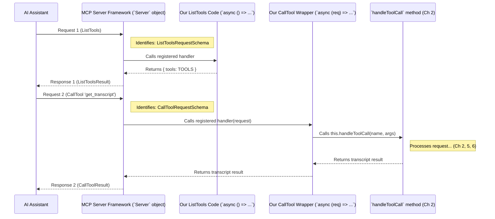

# Chapter 4: MCP Request Handling

In the [previous chapter](03_mcp_server_framework_.md), we learned about the MCP Server Framework – the standardized communication system (`Server` class) that handles sending and receiving messages for our `TranscriptServer`. We saw how it acts like the building's plumbing and wiring, taking care of the low-level communication details.

We also saw a function called `setupHandlers` where we used `server.setRequestHandler` to tell the framework about our code. But what exactly does that do? How does the framework know *which specific door* to knock on inside our `TranscriptServer` when a message arrives?

That's the job of **MCP Request Handling**!

## The Shop's Receptionist

Imagine our transcript shop again. The MCP Framework is like the main entrance and the phone lines – it handles incoming calls and visitors. But once someone calls or walks in, they need to be directed to the right place.

If someone calls and asks, "What services do you offer?", they need to be connected to someone who can list the services (our `TOOLS` definition).
If someone calls and says, "I want to order a transcript for video X," they need to be connected to the department that actually handles transcript orders (our `handleToolCall` function).

MCP Request Handling is like the **receptionist** inside our `TranscriptServer`. It's the mechanism that looks at an incoming request (already decoded by the Framework) and directs it to the *exact* function within our code that knows how to handle that specific type of request.

## Connecting Requests to Functions: `server.setRequestHandler`

The magic happens using the `server.setRequestHandler` method we saw in the [MCP Server Framework](03_mcp_server_framework_.md) chapter. Let's look at that `setupHandlers` function again, paying close attention to how we use `setRequestHandler`:

```typescript
// Inside src/index.ts - TranscriptServer class

// Import schemas defining MCP request types
import {
  ListToolsRequestSchema,
  CallToolRequestSchema
} from "@modelcontextprotocol/sdk/types.js";

class TranscriptServer {
  // ... constructor, server property, handleToolCall method ...

  private setupHandlers(): void {
    // --- Handler for "ListTools" requests ---
    this.server.setRequestHandler(
      ListToolsRequestSchema, // IF the request matches this type...
      async () => ({ tools: TOOLS }) // ... THEN run THIS function.
    );

    // --- Handler for "CallTool" requests ---
    this.server.setRequestHandler(
      CallToolRequestSchema, // IF the request matches this type...
      async (request) => // ... THEN run THIS function.
        this.handleToolCall(request.params.name, request.params.arguments ?? {})
    );
  }

  // The tool definition (from Chapter 1)
  // TOOLS = [ { name: "get_transcript", ... } ]

  // The actual logic for handling a tool call (from Chapter 2)
  // private async handleToolCall(name: string, args: any): Promise<any> { ... }
}
```

Think of `server.setRequestHandler` as giving instructions to the receptionist (the Framework):

1.  **`setRequestHandler(ListToolsRequestSchema, ...)`**: "Mr./Ms. Framework, if you receive a request that looks exactly like a `ListToolsRequestSchema` (asking 'what tools do you have?'), please execute *this specific function* right here: `async () => ({ tools: TOOLS })`."
    *   This little function's only job is to return our `TOOLS` array, which we defined back in [Chapter 1: Tool Capability Definition](01_tool_capability_definition_.md).

2.  **`setRequestHandler(CallToolRequestSchema, ...)`**: "And Mr./Ms. Framework, if you receive a request that looks like a `CallToolRequestSchema` (asking 'please run this tool with these arguments'), please execute *this other function*: `async (request) => this.handleToolCall(...)`."
    *   This function takes the incoming `request`, extracts the tool `name` and `arguments` from its parameters (`request.params`), and passes them to our main `handleToolCall` method (which we learned about in [Chapter 2: Transcript Server Orchestrator](02_transcript_server_orchestrator_.md)).

So, `setRequestHandler` is the crucial link. It **maps** a specific MCP request type (like `ListToolsRequestSchema`) to a specific piece of our code (a handler function).

## How it Works Step-by-Step

Let's trace what happens when two different types of requests arrive, using our receptionist analogy:

**Scenario 1: Request for the List of Tools**

1.  **Incoming Call:** An AI Assistant sends a message asking, "What tools do you offer?" (Formatted as an MCP `ListTools` request).
2.  **Framework Receives:** The MCP Server Framework (`this.server`) receives the raw message, decodes it, and identifies it as a `ListToolsRequestSchema` type.
3.  **Receptionist Checks Instructions:** The Framework checks the instructions it was given via `setRequestHandler`. It finds the entry for `ListToolsRequestSchema`.
4.  **Routing the Call:** The Framework executes the function we provided for `ListToolsRequestSchema`: `async () => ({ tools: TOOLS })`.
5.  **Handler Executes:** Our simple function runs, grabs the `TOOLS` array.
6.  **Handler Returns:** It gives the result `{ tools: [...] }` back to the Framework.
7.  **Framework Responds:** The Framework packages this result into a standard MCP `ListTools` response and sends it back to the AI Assistant.

**Scenario 2: Request to Get a Transcript**

1.  **Incoming Call:** An AI Assistant sends a message asking, "Please run the `get_transcript` tool with URL 'some_video_id' and language 'en'." (Formatted as an MCP `CallTool` request).
2.  **Framework Receives:** The MCP Server Framework (`this.server`) receives, decodes, and identifies it as a `CallToolRequestSchema` type.
3.  **Receptionist Checks Instructions:** The Framework checks its instructions and finds the entry for `CallToolRequestSchema`.
4.  **Routing the Call:** The Framework executes the function we provided for `CallToolRequestSchema`: `async (request) => this.handleToolCall(...)`.
5.  **Handler Executes:** Our function runs. It takes the `request` object, pulls out `name` ("get_transcript") and `arguments` (`{ url: "some_video_id", lang: "en" }`), and calls `this.handleToolCall("get_transcript", { url: "some_video_id", lang: "en" })`.
6.  **`handleToolCall` Takes Over:** Now, the `handleToolCall` method (from Chapter 2) does its work: it checks the name, calls the `YouTubeTranscriptExtractor` to get the transcript, etc.
7.  **`handleToolCall` Returns:** `handleToolCall` finishes and returns the transcript result (e.g., `{ toolResult: { content: [...] } }`) back to the function called by the Framework.
8.  **Handler Returns to Framework:** That function passes the result back to the Framework.
9.  **Framework Responds:** The Framework packages this result into a standard MCP `CallTool` response and sends it back to the AI Assistant.

Here's a diagram illustrating this routing:



This diagram shows the Framework acting as the central router, sending different requests to the specific handlers we registered using `setRequestHandler`. The `CallTool` handler then further delegates the main work to `handleToolCall`.

## Inside the `handleToolCall` Handler (Quick Recap)

Once the `CallToolRequestSchema` request is routed to our `handleToolCall` method, what happens? As we saw in [Chapter 2](02_transcript_server_orchestrator_.md), it uses a `switch` statement to figure out *which* tool was requested:

```typescript
// Inside src/index.ts - TranscriptServer class - Simplified handleToolCall

private async handleToolCall(name: string, args: any): Promise</* ... */> {
  switch (name) { // Check the name of the tool requested
    case "get_transcript": { // Is it our transcript tool?
      // 1. Get 'url' and 'lang' from args
      const { url: input, lang = "en" } = args;

      // 2. Basic validation (ensure they exist, are strings)
      // (More details in Ch 7: Error Handling)

      try {
        // 3. Ask extractor to get video ID (Ch 6: Video ID Extraction)
        const videoId = this.extractor.extractYoutubeId(input);

        // 4. Ask extractor to get transcript (Ch 5: Transcript Extraction Logic)
        const transcript = await this.extractor.getTranscript(videoId, lang);

        // 5. Format the successful response
        return { /* ... success result with transcript ... */ };

      } catch (error) {
        // Handle errors (Ch 7: Error Handling)
        throw new McpError(/* ... error details ... */);
      }
    }

    default: // If the name is not "get_transcript"
      // Handle unknown tool error (Ch 7: Error Handling)
      throw new McpError(ErrorCode.MethodNotFound, `Unknown tool: ${name}`);
  }
}
```
This shows that after the framework routes the `CallTool` request, `handleToolCall` does further internal routing based on the specific tool `name`. If it's `get_transcript`, it proceeds with the steps needed for that tool.

## Conclusion

In this chapter, we focused on **MCP Request Handling**, the mechanism that connects incoming MCP requests to the correct code within our `TranscriptServer`.

We learned that:
*   It acts like a **receptionist**, directing requests.
*   The core mechanism is `server.setRequestHandler`, used within the `setupHandlers` method.
*   `setRequestHandler` maps a specific **MCP Request Schema** (like `ListToolsRequestSchema` or `CallToolRequestSchema`) to a specific **handler function** in our code.
*   For `ListTools`, the handler directly returns the `TOOLS` array.
*   For `CallTool`, the handler calls `handleToolCall`, which then uses the tool `name` to decide the next steps.

This routing ensures that when the MCP Server Framework receives a standardized request, it knows exactly which part of our custom logic to execute to generate the appropriate response.

Now that we understand how a request to `get_transcript` gets routed all the way to the point where the actual transcript fetching needs to happen, let's dive into the logic that performs that core task.

Next up: [Transcript Extraction Logic](05_transcript_extraction_logic_.md)

---

Generated by [AI Codebase Knowledge Builder](https://github.com/The-Pocket/Tutorial-Codebase-Knowledge)