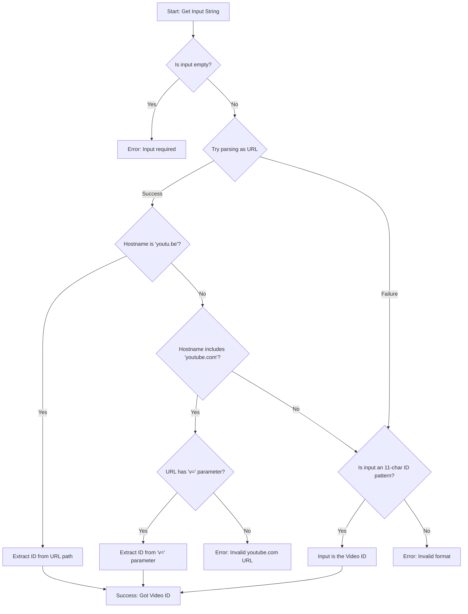

# Chapter 6: Video ID Extraction

In the [previous chapter](05_transcript_extraction_logic_.md), we met the `YouTubeTranscriptExtractor`, our specialist worker that fetches YouTube transcripts. We saw that its main method, `getTranscript`, needs two key ingredients: the **video ID** and the language code. But where does that *video ID* come from?

Users might give us a full YouTube link (`https://www.youtube.com/watch?v=dQw4w9WgXcQ`), a shorter link (`https://youtu.be/dQw4w9WgXcQ`), or maybe just the unique ID itself (`dQw4w9WgXcQ`). However, the underlying tool we use to fetch transcripts needs *only* the specific, 11-character video ID, like `dQw4w9WgXcQ`.

How do we reliably get this exact ID from all these different possible inputs? That's the job of **Video ID Extraction**!

## The Universal Address Parser: `extractYoutubeId`

Think about mailing a letter. You might write the address in different ways:

*   "123 Main Street, Anytown, CA 91234"
*   "Anytown California, 123 Main St."
*   "123 Main St" (if you're already in Anytown)

The postal service needs to understand all these formats and figure out the specific destination house.

Similarly, our `YouTubeTranscriptExtractor` has a special helper method called `extractYoutubeId`. This method acts like a smart address parser for YouTube videos. Its only job is to take whatever input the user provides (`url` or `ID` string) and figure out the unique 11-character video ID.

## Handling Different Inputs

Let's see what `extractYoutubeId` does with various inputs:

*   **Input:** `"https://www.youtube.com/watch?v=dQw4w9WgXcQ"`
    *   **Output:** `"dQw4w9WgXcQ"` (It finds the `v=` part in the URL)
*   **Input:** `"https://youtu.be/dQw4w9WgXcQ"`
    *   **Output:** `"dQw4w9WgXcQ"` (It takes the part after `youtu.be/`)
*   **Input:** `"https://www.youtube.com/watch?v=dQw4w9WgXcQ&list=PL...&index=2"`
    *   **Output:** `"dQw4w9WgXcQ"` (It ignores the extra stuff like `&list=` and `&index=`)
*   **Input:** `"dQw4w9WgXcQ"`
    *   **Output:** `"dQw4w9WgXcQ"` (It recognizes this as a valid ID already)
*   **Input:** `"some random text"`
    *   **Output:** *Error* (It realizes this isn't a valid URL or ID)
*   **Input:** `""` (empty string)
    *   **Output:** *Error* (Input is required)

No matter the valid format, `extractYoutubeId` aims to return just the core 11-character identifier.

## How It's Used by the Transcript Logic

Remember the `getTranscript` method from the [previous chapter](05_transcript_extraction_logic_.md)? It uses `extractYoutubeId` *before* trying to fetch the transcript.

Here's a simplified look at how `handleToolCall` (from [Chapter 4](04_mcp_request_handling_.md)) uses the extractor:

```typescript
// Inside TranscriptServer's handleToolCall method (Simplified)

case "get_transcript": {
  const { url: input, lang = "en" } = args; // Get the user's input

  try {
    // Step 1: Call the ID extractor FIRST!
    // 'this.extractor' is our YouTubeTranscriptExtractor instance
    const videoId = this.extractor.extractYoutubeId(input);
    console.error(`Successfully extracted video ID: ${videoId}`);

    // Step 2: Now use the clean videoId to get the transcript
    const transcript = await this.extractor.getTranscript(videoId, lang);

    // Step 3: Return the result...
    // ...
  } catch (error) {
    // Handle errors, maybe the ID couldn't be extracted
    // (More details in Chapter 7: Error Handling & Process Management)
    // ...
  }
}
```

First, it calls `this.extractor.extractYoutubeId()` with the raw user input. Only if that succeeds and returns a `videoId` does it proceed to call `this.extractor.getTranscript()` using that clean ID.

## Under the Hood: How `extractYoutubeId` Works

So, how does this "address parser" figure things out? It follows a sequence of checks:

1.  **Is Input Empty?** If the input string is missing or empty, it immediately stops and reports an error.
2.  **Is it a URL?** It tries to understand the input as a web address (URL).
    *   If it *is* a URL, it checks the website name (hostname):
        *   Is it `youtu.be`? If yes, it takes the part of the path *after* the `/` (e.g., in `youtu.be/ABCDE`, it takes `ABCDE`).
        *   Is it `youtube.com`? If yes, it looks for the `v=` part in the address query string (e.g., in `watch?v=FGHIJ`, it takes `FGHIJ`). If `v=` is missing, it's an invalid YouTube URL.
    *   If it's *not* a valid URL (maybe the user just typed the ID)...
3.  **Is it an ID?** It checks if the input string looks exactly like an 11-character YouTube ID (containing letters, numbers, hyphens, and underscores).
4.  **Give Up:** If none of the above worked, the input is considered invalid, and it reports an error.

Here’s a diagram showing this decision flow:



## Diving into the Code

Let's look at the code for `extractYoutubeId` inside the `YouTubeTranscriptExtractor` class (`src/index.ts`). We'll break it down piece by piece.

**1. Initial Check:**

```typescript
  // Inside YouTubeTranscriptExtractor class

  extractYoutubeId(input: string): string {
    // First, make sure we actually received some input
    if (!input) {
      throw new McpError( // Report a specific MCP error
        ErrorCode.InvalidParams,
        'YouTube URL or ID is required'
      );
    }
    // ... more logic follows
```
This simply checks if the `input` string is provided. If not, it throws an error immediately (using `McpError`, which we'll learn more about in [Chapter 7](07_error_handling___process_management_.md)).

**2. Trying to Parse as URL:**

```typescript
    // ... inside extractYoutubeId method

    // Try to interpret the input as a URL
    try {
      const url = new URL(input); // This might fail if 'input' isn't a URL format

      // Check for youtu.be links
      if (url.hostname === 'youtu.be') {
        return url.pathname.slice(1); // Get the part after the '/'
      }
      // Check for youtube.com links
      else if (url.hostname.includes('youtube.com')) {
        const videoId = url.searchParams.get('v'); // Look for '?v=...'
        if (!videoId) { // If 'v' parameter is missing
          throw new McpError( /* ... error ... */ );
        }
        return videoId; // Return the value of 'v'
      }
      // If it's some other valid URL, it's not what we want
    } catch (error) {
      // If 'new URL(input)' failed, it means 'input' was not a URL.
      // Now we check if it's a direct ID... (see next snippet)
    }
    // ... further checks if it wasn't a recognized YouTube URL ...
```
This `try...catch` block attempts to create a standard `URL` object. If successful, it checks the `hostname`.
*   If it's `youtu.be`, it grabs the ID directly from the path (`/dQw4w9WgXcQ` becomes `dQw4w9WgXcQ`).
*   If it's `youtube.com`, it specifically looks for the `v` parameter in the query string (`?v=dQw4w9WgXcQ`) and returns its value.

**3. Checking for Direct ID (if not a URL):**

```typescript
    // ... inside extractYoutubeId, within the 'catch' block from above
    // or if it was a URL but not a recognized YouTube one.

      // Check if the input matches the pattern for an 11-character ID
      // (letters, numbers, underscore, hyphen)
      if (!/^[a-zA-Z0-9_-]{11}$/.test(input)) {
        // If it doesn't match the pattern, it's invalid
        throw new McpError(
          ErrorCode.InvalidParams,
          `Invalid YouTube video ID: ${input}`
        );
      }
      // If it DOES match the pattern, the input itself is the ID!
      return input;
    } // End of the 'catch' block started earlier

    // Final fallback error if none of the above worked
    // (e.g., it was a URL but not youtu.be or youtube.com)
    throw new McpError( /* ... general error ... */);
  }
```
If the input *wasn't* a valid URL, the `catch` block runs. Inside it (or if it was a URL but didn't match `youtu.be` or `youtube.com`), we perform one last check. We use a regular expression (`/^[a-zA-Z0-9_-]{11}$/`) to see if the `input` string consists of exactly 11 characters that are allowed in YouTube IDs. If it matches, we assume the `input` *is* the ID and return it directly.

If none of these checks succeed (it wasn't a valid YouTube URL, and it wasn't an 11-character ID), the function throws a final error.

## Conclusion

In this chapter, we learned about the crucial **Video ID Extraction** step performed by the `extractYoutubeId` method within our `YouTubeTranscriptExtractor`.

*   We saw that users can provide YouTube links in various formats (full URLs, short URLs) or just the 11-character ID.
*   The `extractYoutubeId` method acts like a reliable parser (our "address parser") that figures out the specific 11-character video ID from these different inputs.
*   It follows a clear logic: check if it's a `youtu.be` URL, check if it's a `youtube.com` URL with a `v=` parameter, or check if the input itself looks like an ID.
*   This clean ID is then used by the `getTranscript` method to fetch the actual transcript.

This extraction step ensures that our transcript-fetching logic always works with the correct identifier, making our tool more robust and user-friendly.

We've also seen several places where things can go wrong – an invalid URL, a missing ID, or maybe the transcript itself isn't available. How does our server handle these situations gracefully? Let's explore that next!

Next up: [Error Handling & Process Management](07_error_handling___process_management_.md)

---

Generated by [AI Codebase Knowledge Builder](https://github.com/The-Pocket/Tutorial-Codebase-Knowledge)