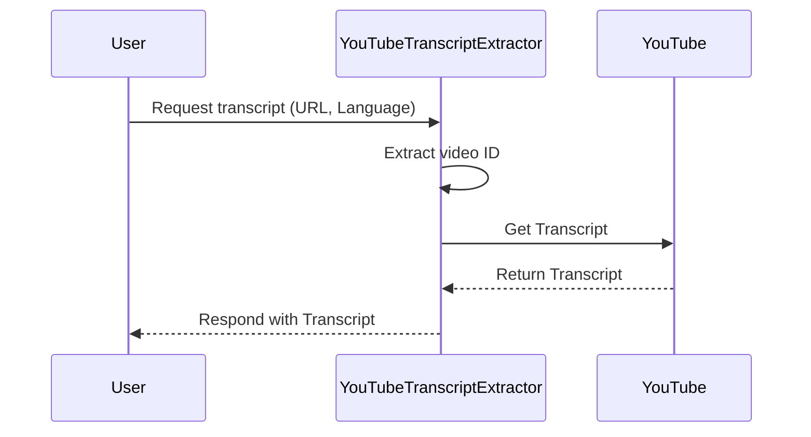

# Chapter 2: YouTubeTranscriptExtractor

Welcome back! In the previous chapter, we explored the **TranscriptServer**, which serves as the gateway for users to request transcripts of YouTube videos. Now, it's time to dive into the heart of transcript extraction by learning about the **YouTubeTranscriptExtractor**. Just as a librarian fetches books for us, this class is tasked with getting the written text from YouTube videos!

## What Is the YouTubeTranscriptExtractor?

The **YouTubeTranscriptExtractor** is a class that simplifies the process of retrieving video transcripts from YouTube. Whenever you provide a YouTube URL or video ID, this class takes over, fetching the spoken words in written form, making them accessible and readable.

### Why Is This Important?

Imagine you want to understand a tutorial video without sound, or maybe you're trying to learn a new language. Having a transcript allows you to read along. The **YouTubeTranscriptExtractor** enables this by fetching the transcript in the language you prefer.

### Key Concepts of YouTubeTranscriptExtractor

Let's break down the key functions of the **YouTubeTranscriptExtractor**:

1. **Extract YouTube Video ID**: It can take a YouTube URL or direct video ID and extract the necessary video ID that’s required to fetch the transcript.
2. **Retrieve Transcript**: Once it has the video ID, it interacts with YouTube to obtain the spoken text in the requested language.
3. **Format Transcript**: The class handles various formats of transcripts and converts them into a readable text format.

### Solving a Use Case

Let’s say you have a YouTube video, and you want to get the transcript. Here’s how it works:

**Example Input**:
- **URL**: `https://www.youtube.com/watch?v=dQw4w9WgXcQ`
- **Language**: `en`

**What Happens**:
1. The **YouTubeTranscriptExtractor** extracts the video ID from the URL.
2. It requests the transcript from the video in English.
3. It returns the readable transcript to you.

```typescript
// Example input for extracting a transcript
const input = {
  url: "https://www.youtube.com/watch?v=dQw4w9WgXcQ",
  lang: "en"
};

// The extractor fetches the transcript based on this input
```

The expected output would be the transcript's text:

```plaintext
"Welcome to my channel! In this video, we will discuss..."
```

### How It Works Internally

Let’s visualize the process of using the **YouTubeTranscriptExtractor** with a simple sequence diagram:



### Under the Hood: Internal Implementation

Now, let's take a look at how the **YouTubeTranscriptExtractor** is structured. We will explore its key functions.

#### Extracting the YouTube Video ID

When you provide a URL or ID, the extractor first needs to determine if it’s a proper video ID.

```typescript
class YouTubeTranscriptExtractor {
  extractYoutubeId(input: string): string {
    // Ensure the input is valid
    if (!input) {
      throw new Error('YouTube URL or ID is required');
    }

    // Attempt to create a URL object
    try {
      const url = new URL(input);
      if (url.hostname === 'youtu.be') {
        return url.pathname.slice(1); // Extract ID from youtu.be format
      } else if (url.hostname.includes('youtube.com')) {
        const videoId = url.searchParams.get('v');
        if (!videoId) throw new Error(`Invalid YouTube URL: ${input}`);
        return videoId; // Extract ID from youtube.com format
      }
    } catch (error) {
      // Handle direct video ID input
      if (!/^[a-zA-Z0-9_-]{11}$/.test(input)) {
        throw new Error(`Invalid YouTube video ID: ${input}`);
      }
      return input; // Directly return valid video ID
    }

    throw new Error(`Could not extract video ID from: ${input}`);
  }
}
```

- **What’s Happening?**
  - The extractor checks if there's a valid input.
  - It processes the URL to derive the video ID based on different formats like `youtube.com` and `youtu.be`.
  - If it fails to identify the ID, it throws an error.

#### Retrieving the Transcript

After extracting the video ID, the extractor fetches the actual transcript.

```typescript
async getTranscript(videoId: string, lang: string): Promise<string> {
  try {
    const transcript = await getSubtitles({
      videoID: videoId,
      lang: lang,
    });

    return this.formatTranscript(transcript);
  } catch (error) {
    throw new Error(`Failed to retrieve transcript: ${(error as Error).message}`);
  }
}
```

- **How It Works**:
  - It uses a library to fetch the subtitles based on the video ID and language.
  - It calls a method to format the transcript before returning it.

### Conclusion

In this chapter, we introduced the **YouTubeTranscriptExtractor** and saw how it plays a crucial role in making YouTube video transcripts accessible. We learned about its key functions: extracting video IDs, retrieving transcripts, and formatting them for readability.

Now that we've covered how to extract transcripts, the next chapter will guide us through parsing URLs and IDs, ensuring we effectively integrate this functionality. Let's keep the momentum going in the [URL and ID Parsing](03_url_and_id_parsing_.md)!

---

Generated by [AI Codebase Knowledge Builder](https://github.com/The-Pocket/Tutorial-Codebase-Knowledge)