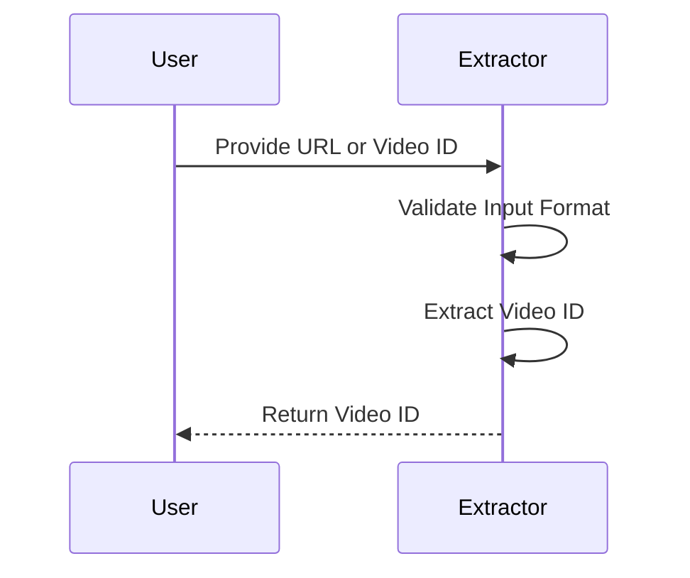

# Chapter 3: URL and ID Parsing

Welcome back! In the previous chapter, we explored the **YouTubeTranscriptExtractor**, which fetches transcripts from YouTube videos. Now, we’re diving into another crucial part of our project—the **URL and ID Parsing**. This step ensures that we can handle various YouTube URL formats and extract the video ID we need to get the transcript.

## Why Is URL and ID Parsing Important?

Imagine you want to get a transcript of a YouTube video, but you have different ways of providing the video link. You might have a full URL like `https://www.youtube.com/watch?v=dQw4w9WgXcQ`, or just the video ID `dQw4w9WgXcQ`. Our URL and ID Parsing logic acts like a friendly chef in our restaurant—no matter how you order your dish (the video), we will always prepare it right! 

The parser helps us:
- Ensure the user provides a format we can work with.
- Handle various versions of YouTube URLs gracefully.
- Extract the video ID so we can serve the transcript correctly.

### Key Concepts of URL and ID Parsing

Let's take a closer look at the main components involved in URL and ID parsing:

1. **Valid Input Checking**: We check if the user input is not empty and is in the correct format.
2. **Extracting Video IDs**: We identify and extract the video ID from the provided URL formats (`youtube.com` and `youtu.be`) or directly from the input.
3. **Graceful Handling of Invalid Input**: If the input format is wrong, we provide clear and friendly error messages instead of crashing.

### How to Use This Abstraction

To see how this parsing process unfolds, here’s a step-by-step walkthrough using some sample inputs.

#### Example Input

Suppose you want to extract the video ID from a URL or a direct input. 

- **Input**: `https://www.youtube.com/watch?v=dQw4w9WgXcQ`
- **Or Input**: `dQw4w9WgXcQ`

#### Expected Output

- For the first input, the output will be: `dQw4w9WgXcQ`
- For the second input, the output will also be: `dQw4w9WgXcQ`

This means, regardless of how the user provides the video ID, we can retrieve it effectively!

Here's how you might see this in code:

```typescript
const inputUrl = "https://www.youtube.com/watch?v=dQw4w9WgXcQ";
const inputId = "dQw4w9WgXcQ";

const videoId1 = extractor.extractYoutubeId(inputUrl);
const videoId2 = extractor.extractYoutubeId(inputId);

console.log(videoId1); // Outputs: dQw4w9WgXcQ
console.log(videoId2); // Outputs: dQw4w9WgXcQ
```

In this example:
- We call the `extractYoutubeId` method from our extractor object twice—with a full URL and a direct ID input.
- The console outputs the correct video ID for both cases.

### Internal Implementation Walkthrough

Let’s take a look at what happens internally when we use the URL and ID parsing feature. 

#### Steps to Parse the Input

1. The user provides a URL or video ID.
2. The extractor checks if the input is valid.
3. It then verifies the format—whether it’s a URL or a direct ID.
4. Finally, it extracts and returns the video ID to be used later for transcript fetching.

Here’s a simple sequence diagram to illustrate this flow:



### The Code Behind URL and ID Parsing

We use a class called `YouTubeTranscriptExtractor` to handle the parsing logic. Here’s the relevant part:

```typescript
class YouTubeTranscriptExtractor {
  extractYoutubeId(input: string): string {
    // Check if input is empty
    if (!input) {
      throw new Error('YouTube URL or ID is required');
    }

    // Process URL formats
    try {
      const url = new URL(input);
      if (url.hostname === 'youtu.be') {
        return url.pathname.slice(1); // From youtu.be
      } else if (url.hostname.includes('youtube.com')) {
        const videoId = url.searchParams.get('v');
        if (!videoId) throw new Error(`Invalid YouTube URL: ${input}`);
        return videoId; // From youtube.com
      }
    } catch {
      // If not a URL, check if it's a direct ID
      if (!/^[a-zA-Z0-9_-]{11}$/.test(input)) {
        throw new Error(`Invalid YouTube video ID: ${input}`);
      }
    }

    throw new Error(`Could not extract video ID from: ${input}`);
  }
}
```

- In this snippet, we check if the input is provided. 
- We parse the URL and attempt to extract the ID based on the format.
- If the input isn’t a valid URL or ID, we throw an error so users know something went wrong.

### Conclusion

In this chapter, we learned about **URL and ID Parsing** by thoroughly exploring how to extract video IDs from different YouTube URL formats. This functionality serves as an essential step in the transcript extraction process, helping to ensure that we can process user inputs reliably and efficiently.

Next up, we’ll configure our tool to better understand how everything fits together in our system. Let’s dive into [Tool Configuration](04_tool_configuration_.md)!

---

Generated by [AI Codebase Knowledge Builder](https://github.com/The-Pocket/Tutorial-Codebase-Knowledge)