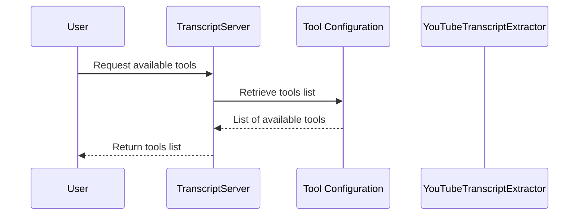

# Chapter 4: Tool Configuration

Welcome back! In the previous chapter, we dug into how to effectively parse URLs and video IDs with our **URL and ID Parsing** functionality. Now, it’s time to explore another essential component of our project: **Tool Configuration**. This part sets the stage for how our tools will work together, much like a menu in a restaurant that details the available dishes and their ingredients.

## Why Is Tool Configuration Important?

Imagine you want to order a dish from a restaurant, but nobody tells you what’s available. Frustrating, right? Tool Configuration works similarly—it acts as a menu for our transcript extraction functionalities. It specifies what tools (or services) are available, describes what each tool does, and defines the necessary inputs to use them.

### Let's Solve a Use Case

Let’s say you want to extract a transcript from a YouTube video. Here’s how Tool Configuration can help you do that:

1. You first check the available tools (like looking at the menu).
2. You find a tool to extract the transcript from YouTube.
3. You provide the required input: either a YouTube video URL or ID along with a language code.
4. You receive the transcript output!

To put it simply, Tool Configuration ensures that you have all the options clearly laid out to get the transcript with ease.

### Key Concepts of Tool Configuration

Let’s break down the key concepts involved in Tool Configuration:

1. **Tool Definitions**: Each tool is defined with its functionality and purpose.
2. **Input Requirements**: Each tool specifies what information you need to provide.
3. **Descriptive Metadata**: Each tool includes a description, helping users understand its functionality.

### Using Tool Configuration to Extract a Transcript

To give you a practical sense of how this works, here’s an example of how to use the **get_transcript** tool defined in our configuration.

#### Example Input

Suppose you want to extract the transcript from a video:

```json
{
  "url": "https://www.youtube.com/watch?v=dQw4w9WgXcQ",
  "lang": "en"
}
```

- **URL**: The link to the YouTube video.
- **Language**: The language for the transcript (in this case, English).

#### Expected Output

When you call the tool with the above input, you will receive a text output:

```plaintext
"Hello, and welcome to my video on programming..."
```

### Internal Implementation of Tool Configuration

When using Tool Configuration, here's the step-by-step process that occurs internally:



#### Breakdown of the Steps:

1. **User Requests Tools**: The user sends a request to the TranscriptServer for available tools.
2. **Retrieve Tools List**: The TranscriptServer queries Tool Configuration for the list of tools.
3. **Return Available Tools**: Tool Configuration responds with the available tools and their descriptions.
4. **Display the List**: Finally, the TranscriptServer presents the tools to the user.

### The Code Behind Tool Configuration

Let's see how Tool Configuration is structured in our code. Here’s the relevant part from the configuration section inside `src/index.ts`.

```typescript
const TOOLS = [
  {
    name: "get_transcript",
    description: "Extract transcript from a YouTube video URL or ID",
    inputSchema: {
      type: "object",
      properties: {
        url: {
          type: "string",
          description: "YouTube video URL or ID",
        },
        lang: {
          type: "string",
          description: "Language code for transcript (e.g., 'ko', 'en')",
          default: "en"
        }
      },
      required: ["url", "lang"]
    }
  }
];
```

- **What’s Happening Here?**
  - We define an array called `TOOLS` containing an object for each tool.
  - Each tool has a `name`, a `description`, and an `inputSchema` that details what inputs are required.
  - Here, the **get_transcript** tool is defined with its required parameters, ensuring users know how to utilize it.

### Conclusion

In this chapter, we explored **Tool Configuration**, understanding how it defines the tools available for transcript extraction and what users need to know to successfully use them. This configuration acts like a menu, giving users clear choices on the services they can access.

Congratulations—you now have the foundational knowledge to extract transcripts using the configured tools! In the next chapter, we’ll learn how to format the transcripts once they are extracted. Let’s continue our journey in the [Format Transcript](05_format_transcript_.md) chapter!

---

Generated by [AI Codebase Knowledge Builder](https://github.com/The-Pocket/Tutorial-Codebase-Knowledge)