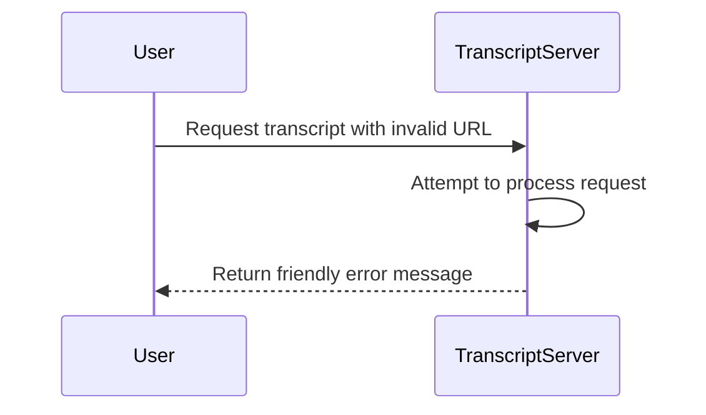

# Chapter 6: Error Handling

Welcome back! In the previous chapter, we learned about [Formatting the Transcript](05_format_transcript_.md) to make the extracted text clean and readable. Now, we're diving into an essential aspect of any application—**Error Handling**. 

## Why Do We Need Error Handling?

Imagine you’re at a restaurant, and you order a dish, but instead, you receive something you didn’t ask for. What happens? This could lead to confusion and frustration, right? Similarly, when a user makes a request to our application, things might not always go as planned. Errors may occur, whether it’s a bad YouTube URL, a network issue, or something else. 

**Error Handling** acts as our safety net. It catches these mishaps and provides clear feedback to users, instead of crashing the application. It logs errors and gives friendly error messages, keeping the user informed and the application robust.

### Key Concepts of Error Handling

To help you understand **Error Handling** better, let’s break it down into key concepts:

1. **Error Types**: Different kinds of problems can arise—invalid input, failed network requests, etc.
  
2. **Logging Errors**: Keeping track of errors in a log helps developers understand what went wrong after the fact.

3. **User-Friendly Messages**: Instead of showing technical jargon, we communicate issues to the users in a way they can easily understand.

### Using Error Handling to Solve a Use Case

Let’s imagine a user wants a transcript but provides an incorrect YouTube URL. Rather than letting the server crash or respond with confusing error codes, we can handle this gracefully:

#### Example Input:
- URL: `htp://invalid-url`

#### Expected Output:
Instead of crashing, our application should respond with:

```plaintext
"Invalid YouTube URL: htp://invalid-url. Please provide a valid URL."
```

### Implementing Error Handling

Let's take a look at how we can implement error handling within our code. Here’s how we structure the error handling in the `TranscriptServer` class.

#### Step 1: Setting Up Error Handling

This snippet shows how we initialize basic error handling:

```typescript
private setupErrorHandling(): void {
  this.server.onerror = (error) => {
    console.error("[MCP Error]", error); // Log the error to the console
  };

  process.on('SIGINT', async () => { // Handle graceful shutdown
    await this.stop();
    process.exit(0);
  });
}
```

- **Explanation**: 
  - We log errors that occur using `console.error`.
  - We ensure our application can neatly shut down when interruption signals are received.

#### Step 2: Handling Errors in Requests

When processing requests, we want to catch any errors that arise:

```typescript
private async handleToolCall(name: string, args: any): Promise<any> {
  try {
    // Process request here...
  } catch (error) {
    console.error('Transcript extraction failed:', error);
    
    // If the error is a known issue, throw it back to the user
    if (error instanceof McpError) {
      throw error;
    }
    
    // Throw a generic internal error
    throw new McpError(ErrorCode.InternalError, `Failed to process request: ${(error as Error).message}`);
  }
}
```

- **Explanation**:
  - Here we wrap our processing logic in a try-catch block.
  - We catch any errors during request handling and log them.
  - We check if the error is a known application error to provide a relevant message.

### Internal Implementation of Error Handling

Let’s visualize what happens when a user makes a faulty request. Here’s a simple sequence diagram illustrating our error handling process:



#### Breakdown of the Steps:

1. **User Request**: The user sends a request, but the URL is invalid.
2. **Processing Attempt**: The server attempts to process the request but encounters an issue.
3. **Error Response**: The server catches the error and responds with a friendly message instead of crashing.

### Diving Deeper into Code

Now, let’s look at the core part of our error handling logic in `src/index.ts`.

#### Creating the Mapped Error Class

We define a custom error class to standardize errors in our application:

```typescript
class McpError extends Error {
  constructor(public code: ErrorCode, message: string) {
    super(message);
    this.name = "McpError"; // Set the error name
  }
}
```

- **Explanation**:
  - This class extends the built-in Error class.
  - It includes an error code and a message, standardizing how we handle errors across our application.

### Conclusion

In this chapter, we explored **Error Handling** and learned how to provide clear and friendly feedback to users when things don’t go as planned. We set up logging to keep track of errors, ensuring our application remains robust and user-friendly.

Now, you’re equipped to handle errors gracefully in your application! In the next chapter, we’ll be discussing how we can initialize the server to bring everything to life. Let’s venture into [Server Initialization](07_server_initialization_.md)!

---

Generated by [AI Codebase Knowledge Builder](https://github.com/The-Pocket/Tutorial-Codebase-Knowledge)