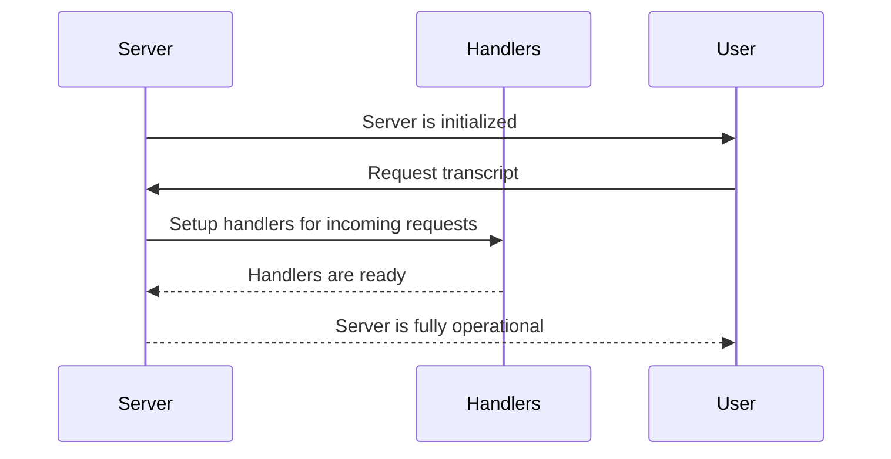

# Chapter 7: Server Initialization

Welcome back! In the previous chapter, we dove into **Error Handling** and learned how to keep our application robust by managing potential issues gracefully. Now, we’re stepping into an exciting phase—**Server Initialization**. 

## Why Is Server Initialization Important?

Imagine you’re preparing to open a restaurant each morning. Before welcoming customers, you need to ensure everything is in place: the staff is ready, the menu is set, and the tables are clean. Similarly, **Server Initialization** prepares our application to handle requests. This process ensures that it can listen for incoming requests and properly respond.

### Central Use Case

Let’s say a user wants to retrieve a transcript of a YouTube video. Before our **TranscriptServer** can respond to this request, it needs to be fully initialized and ready to go. 

With proper initialization, the server can accept requests, call the necessary tools (like the **YouTubeTranscriptExtractor**), and return the requested transcript smoothly.

### Key Concepts of Server Initialization

To break down **Server Initialization**, we’ll look at a few key concepts that help clarify how it all works:

1. **Creating the Server Instance**: This involves setting up the actual server that listens for requests.
2. **Setup Handlers**: These are the functions that define how the server processes incoming requests.
3. **Error Management**: Preparing the server to handle errors that may arise during operation.

### Initializing the Server

Let’s see how we can initialize our server. The following example shows how we create a server instance and set it up to listen for requests using the appropriate handlers.

```typescript
this.server = new Server({
  name: "mcp-servers-youtube-transcript",
  version: "0.1.0",
});
this.setupHandlers();
```

- **What’s Happening Here?**
  - A new `Server` instance is created with a name and version.
  - After creating the server, we call `setupHandlers()` to prepare it for incoming requests.

### Step-by-Step Process of Server Initialization

Now, let’s walk through the process of initializing the server step by step. Here’s a sequence diagram to illustrate how a server gets ready to handle requests:



#### Breakdown of the Steps:
1. The **Server** gets initialized (created).
2. The **User** sends a request to retrieve a transcript.
3. The server sets up the necessary **Handlers** to manage incoming requests.
4. Once set up, the server is ready to respond to the user’s request.

### Internal Implementation of Server Initialization

Now that we have a general overview, let’s explore the internal implementation of server initialization. Here’s the relevant section from our server code:

```typescript
class TranscriptServer {
  private extractor: YouTubeTranscriptExtractor;
  private server: Server;

  constructor() {
    this.extractor = new YouTubeTranscriptExtractor(); // Instantiate extractor
    this.server = new Server({ // Create server instance
      name: "mcp-servers-youtube-transcript",
      version: "0.1.0",
    });
    this.setupHandlers(); // Setup request handlers
  }
}
```

- **Explanation**:
  - The `TranscriptServer` class initializes the **YouTubeTranscriptExtractor**.
  - The server instance is created, and then `setupHandlers()` prepares the server to listen for requests.

Let’s look at the `setupHandlers()` method to understand how we define the behavior of our server when it receives requests.

```typescript
private setupHandlers(): void {
  this.server.setRequestHandler(ListToolsRequestSchema, async () => ({
    tools: TOOLS
  }));

  this.server.setRequestHandler(CallToolRequestSchema, async (request) => 
    this.handleToolCall(request.params.name, request.params.arguments ?? {})
  );
}
```

- **What’s Happening Here?**
  - We define handlers for two types of requests: listing available tools and processing tool calls.
  - The server is now ready to respond to requests regarding the tools it offers.

### Conclusion

In this chapter, we learned about **Server Initialization** and how it prepares our application to handle requests efficiently. We explored the steps involved in setting up the server, creating request handlers, and ensuring the server is ready to process tasks smoothly.

Now that you have a solid understanding of how to initialize the server, get ready for the next exciting chapter where we will dive into setting up the **YouTubeTranscriptExtractor** and how it fetches transcripts from YouTube videos. Join me in our journey in the [YouTubeTranscriptExtractor](02_youtubetranscriptextractor_.md)!

---

Generated by [AI Codebase Knowledge Builder](https://github.com/The-Pocket/Tutorial-Codebase-Knowledge)