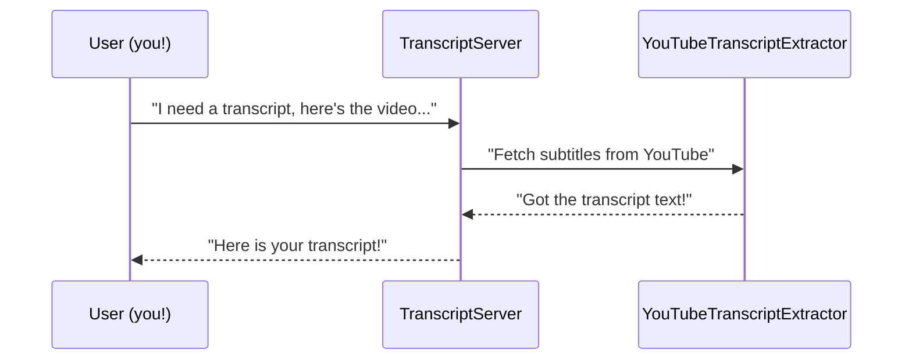

# Chapter 1: TranscriptServer

Welcome to your very first step in exploring the “mcp-server-youtube-transcript” project! In this chapter, we’ll meet the “TranscriptServer.” Imagine it as the friendly front desk manager that organizes all the requests to get YouTube transcripts. It listens for someone asking to fetch a transcript, delegates the work, and politely handles any errors that come up.

## Why Do We Need a TranscriptServer?

Let’s say you have a YouTube video link and you want to get its transcript in English. You could do all of that yourself—parsing the link, talking to YouTube, handling errors, and returning the result. But as your project grows, you’ll want a single place to handle these tasks in a systematic way. That’s what the TranscriptServer does:
- It receives a transcript request (like “Hey, I want the subtitles!”).  
- It checks if the request parameters are valid.  
- It tells the right tool to extract the transcript.  
- It sends back the final text or an error if something goes wrong.  

By having a dedicated front desk (TranscriptServer), everyone on your team will know exactly how to use and troubleshoot the transcript workflow.  

## How It Works (In a Nutshell)

Below is a quick high-level sequence of who talks to whom:



1. The user asks for a transcript.  
2. The TranscriptServer delegates the job to a helper class (YouTubeTranscriptExtractor).  
3. It then returns the completed transcript back to the user.  
4. If there’s an error, the TranscriptServer handles it gracefully (like apologizing and explaining what went wrong).

## The Main Parts Inside TranscriptServer

When you open the file “src/index.ts”, you’ll find the TranscriptServer class. Here’s a simplified look at its constructor:

```ts
// Simplified excerpt from src/index.ts

class TranscriptServer {
  private extractor: YouTubeTranscriptExtractor;
  private server: Server;

  constructor() {
    // 1) Creates a helper to actually get the transcripts
    this.extractor = new YouTubeTranscriptExtractor();

    // 2) Creates a "Server" that will manage incoming requests
    this.server = new Server(
      { name: "mcp-servers-youtube-transcript", version: "0.1.0" },
      { capabilities: { tools: {} } }
    );

    // 3) Setup request handling and error handling
    this.setupHandlers();
    this.setupErrorHandling();
  }

  // (Other methods follow...)
}
```

### Explanation

1. We keep an instance of “YouTubeTranscriptExtractor” (we’ll discuss it in [YouTubeTranscriptExtractor](05_youtubetranscriptextractor_.md)). This object does the actual text fetching.  
2. We initialize a “Server,” which comes from the [Server (from @modelcontextprotocol/sdk)](02_server__from__modelcontextprotocol_sdk__.md). This “Server” can receive and respond to requests through different transports (like sending info to your console or a network).  
3. We call two setup methods: one for handling requests, another for handling errors.

## Handling Requests

Here’s a simplified version of how the TranscriptServer sets up the request handlers. It basically says:  
• “If someone asks for a list of tools, show them.”  
• “If someone calls a tool, run the tool’s action.”

```ts
// Another simplified excerpt

private setupHandlers(): void {
  // 1) List available tools
  this.server.setRequestHandler(ListToolsRequestSchema, async () => ({
    tools: TOOLS
  }));

  // 2) Process calls for the 'get_transcript' tool
  this.server.setRequestHandler(CallToolRequestSchema, async (request) => {
    return this.handleToolCall(request.params.name, request.params.arguments ?? {});
  });
}
```

### Explanation

1. If the request asks for “ListTools,” we respond with what’s in the `TOOLS` array. 
2. If a request wants to “CallTool,” we check which tool it needs (like “get_transcript”) and handle it with our helper method.

## Fetching the Transcript

The real action is in `handleToolCall()`. Below is an even shorter version:

```ts
// A simplified version of the handleToolCall method

private async handleToolCall(name: string, args: any) {
  switch (name) {
    case "get_transcript": {
      const { url, lang = "en" } = args;
      // 1) Validate the input
      if (!url || typeof url !== 'string') {
        throw new McpError(ErrorCode.InvalidParams, "URL must be a string");
      }
      // 2) Extract YouTube's video ID
      const videoId = this.extractor.extractYoutubeId(url);
      // 3) Ask the extractor for the transcript text
      const transcript = await this.extractor.getTranscript(videoId, lang);
      // 4) Return the transcript
      return {
        toolResult: {
          content: [{ type: "text", text: transcript }],
          isError: false
        }
      };
    }
    default:
      throw new McpError(ErrorCode.MethodNotFound, `Unknown tool: ${name}`);
  }
}
```

### Explanation of the Steps

1. We check if the ‘url’ is valid. If not, we raise an error politely (through an McpError).  
2. We get the actual videoId (like “abcdefg1234”) from the provided YouTube URL (or ID).  
3. We call our `extractor.getTranscript()` with the videoId. This goes off to YouTube to retrieve the transcript.  
4. Finally, we bundle the transcript text in a response so it can be sent back to the user.

## Internal Flow (A Recap)

While the code might look a bit advanced, conceptually it’s straightforward:
1. The TranscriptServer’s job is to receive transcript requests and route them to the correct extracting tool.  
2. Any errors get transformed into user-friendly messages.  
3. The final transcript is delivered as a nice JSON object or text.

## In Summary

The TranscriptServer is our central “messenger.” It doesn’t do the actual subtitle fetching—it simply knows how to talk to the right place (YouTubeTranscriptExtractor). It also logs what’s going on, catches errors, and returns the final result. This is extremely handy as your application scales and you need a clear, consistent way to request transcripts.

In the next chapter, we’ll take a closer look at the underlying [Server (from @modelcontextprotocol/sdk)](02_server__from__modelcontextprotocol_sdk__.md), which is what actually listens for incoming requests and sends responses to the outside world. See you there!

---

Generated by [AI Codebase Knowledge Builder](https://github.com/The-Pocket/Tutorial-Codebase-Knowledge)