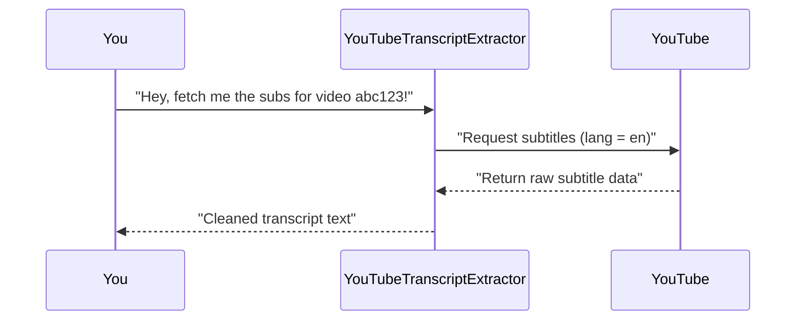
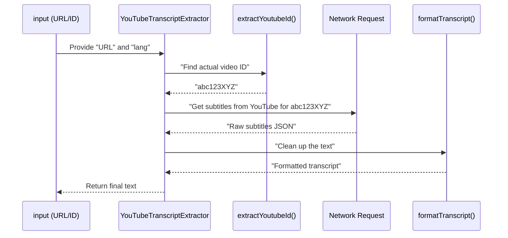

# Chapter 5: YouTubeTranscriptExtractor

In the [previous chapter](04_tool_definition__tools_array__.md), we discovered how we define different tools in our server through a “TOOLS array.” Now we’re finally ready to meet the real hero that fetches YouTube subtitles: **YouTubeTranscriptExtractor**.

Picture this class as a super-smart librarian who knows exactly where to find the correct subtitles for any YouTube video. Given a YouTube link (or even just a direct ID), it:  
1. Locates the right video, whichever URL format you provide.  
2. Fetches the subtitles in the language you request.  
3. Cleans those subtitles up into a neat transcript string.

## Why Do We Need a YouTubeTranscriptExtractor?

Let’s say you have a YouTube URL like "https://youtu.be/abc123XYZ" (or maybe "https://www.youtube.com/watch?v=abc123XYZ") and you want the English subtitles. Doing it yourself would mean:  
• Parsing the URL to find the video ID.  
• Making a request to fetch the subtitles.  
• Handling all the different language codes.  
• Formatting the subtitles into a readable string.

All of these steps get repetitive and messy. Instead, our “YouTubeTranscriptExtractor” library can handle it in a snap. You simply say “extract the transcript from that URL/ID,” and it returns clean text.  

---

## Core Use Case Example

• You want to automatically fetch English subtitles for a cooking tutorial video.  
• You pass the YouTube link to the extractor: "https://youtu.be/YUMMY-COOKIES" with language "en".  
• A few moments later, you get back the transcript of that cooking tutorial.

Here’s a small sequence diagram showing the general flow:



---

## Key Concepts

### 1) Extracting the YouTube Video ID

A YouTube link might have various forms (short link, normal link, or just the ID). Our extractor needs to handle all of them gracefully. Think of it as the librarian deciphering all the tricky ways a book’s title could be referenced.

Below is a simplified version of the “extractYoutubeId” method (trimmed to focus on its essence):

```ts
class YouTubeTranscriptExtractor {
  extractYoutubeId(input: string): string {
    // (1) If input is empty or doesn't match expected patterns, raise error
    // (2) If it's a full URL, parse it. If it's "youtu.be", get path
    // (3) If it's "youtube.com", get the 'v' parameter
    // (4) Otherwise, assume it's already just the raw video ID
    return "abc123XYZ"; // (Pretend we found the real ID)
  }
}
```

Explanation:  
1. We check if “input” is a valid string.  
2. We identify the video ID for “youtu.be” or “youtube.com.”  
3. If it’s not a URL, but looks like an 11-character YouTube video ID, use it directly.  
4. Return the discovered ID (e.g., “abc123XYZ”), or throw an error if it’s invalid.

### 2) Getting the Transcript

Once we have the correct video ID, we ask YouTube for subtitles in a specific language “lang” (e.g., "en" or "ko"). Here’s a simplified snippet:

```ts
class YouTubeTranscriptExtractor {
  async getTranscript(videoId: string, lang: string): Promise<string> {
    // (1) Request the captions data from YouTube
    // (2) On success, format it into a plaintext string
    // (3) Return that plaintext
    return "Hello, welcome to my channel..."; // (Short example)
  }
}
```

Explanation:  
1. This method handles the actual network request to retrieve subtitle data.  
2. After successful retrieval, it formats the subtitles (removing timecodes, extra spacing, etc.).  
3. Finally, it returns a single text string containing the entire transcript.

---

## How to Use YouTubeTranscriptExtractor

In practice, you rarely call “YouTubeTranscriptExtractor” directly. Instead, the [TranscriptServer](01_transcriptserver_.md) calls it when you invoke the “get_transcript” tool. But let’s imagine you’re testing it directly in a small script:

```ts
// Pseudocode example
const extractor = new YouTubeTranscriptExtractor();
const videoLink = "https://youtu.be/abc123XYZ";

// This will be asynchronous
extractor.getTranscript(videoLink, "en")
  .then((text) => {
    console.log("Transcript:", text);
  })
  .catch((err) => {
    console.error("Error fetching transcript:", err);
  });
```

• We create an `extractor`.  
• We tell it the link and language we want.  
• The promise resolves with the final transcript text.  

If all goes well, you’ll see something like:
  
"Transcript: Hello everyone, welcome to today’s video. Today we’ll be making cookies..."

---

## Under the Hood

Internally, the steps look like this:



1. We parse the URL (or ID) to find the real video ID.  
2. We request subtitles from YouTube’s service.  
3. We format the raw data into a meat-and-potatoes transcript.  
4. We return the final result to the caller.

---

## Behind the Scenes in Our Project

Here’s a peek at the actual class (in a highly condensed form) to see how it fits into our codebase:

```ts
// File: src/index.ts (simplified excerpt)
class YouTubeTranscriptExtractor {
  extractYoutubeId(input: string): string {
    // ... (validates and extracts the ID)
    return "abc123XYZ";
  }

  async getTranscript(videoId: string, lang: string): Promise<string> {
    try {
      // ... (fetch subtitles from YouTube + handle errors)
      const rawCaptions = /* some network call */;
      return this.formatTranscript(rawCaptions);
    } catch (err) {
      // ... (throw user-friendly error)
    }
  }

  private formatTranscript(captions: any[]): string {
    // ... (join text from each line)
    return "Video Transcript content ...";
  }
}
```

Explanation:  
1. `extractYoutubeId` handles all the complicated URL or ID parsing.  
2. `getTranscript` does the real work of contacting YouTube and turns the raw captions into something readable.  
3. `formatTranscript` merges lines or segments into a final string so you see everything in one place.

---

## Conclusion

The **YouTubeTranscriptExtractor** is our behind-the-scenes specialist. It ensures that no matter what YouTube link (or ID) you throw at it, you get a clean transcript in one easy step. This clean text is then presented to you via the “TranscriptServer” when calling the “get_transcript” tool.

In the next chapter, we’ll explore how each line of the transcript is represented before we convert it into pure text. You’ll learn about the [TranscriptLine Interface](06_transcriptline_interface_.md) and how it stores timing info, durations, and more. See you there!

---

Generated by [AI Codebase Knowledge Builder](https://github.com/The-Pocket/Tutorial-Codebase-Knowledge)