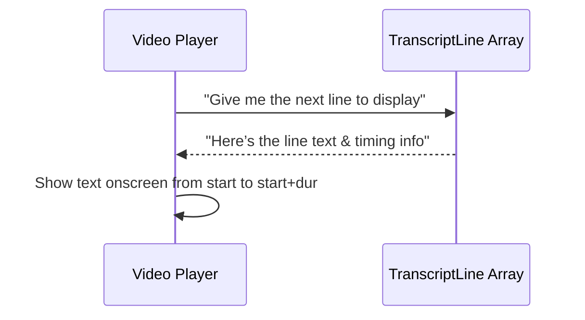
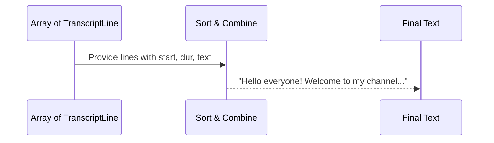

# Chapter 6: TranscriptLine Interface

In the [YouTubeTranscriptExtractor](05_youtubetranscriptextractor_.md) chapter, we saw how transcripts from YouTube are fetched, cleaned up, and combined into one big string. But have you ever wondered how each individual subtitle snippet is stored before it all gets merged? Enter the “TranscriptLine” interface—like a neat little sticky note for each line of subtitle text.

---

## Why Do We Need TranscriptLine?

Imagine you have a movie script. Each subtitle line isn’t just text—it also has a start time (when to display that line on screen) and a duration (how long it stays there). The “TranscriptLine” interface packages up these three pieces of data:
1. The subtitle text (e.g., “Hello! Welcome to my channel.”)  
2. The start time in seconds (e.g., 5.2, meaning it appears at 5.2 seconds into the video)  
3. The duration in seconds (e.g., 3.0, meaning it stays until 8.2 seconds)

By storing each line like this, you keep your subtitles organized. Later on, these separate lines can be combined, checked for timing, or displayed individually.

---

## A Simple Use Case

Let’s say your app wants to show subtitles one line at a time in a player. You have multiple “TranscriptLine” objects in an array:

• Each “TranscriptLine” has its own text and timing.  
• You iterate through them, displaying a line at its start time and hiding it after its duration.

### Sequence Diagram Overview

Below is a minimal view of how a video player might use these transcript lines:



1. The player asks for the next subtitle line.  
2. The “TranscriptLine” object returns the text and exact timing.  
3. The player places the text on screen for the specified duration.

---

## Key Concepts

1. text (string): The actual subtitle sentence or phrase.  
2. start (number): The time (in seconds) from the beginning of the video when the subtitle should appear.  
3. dur (number): How many seconds it remains visible.

Each line is like its own “sticky note” pinned to a timeline. You can shuffle them, slice them, or display them in sequence.

---

## Basic Definition

Below is a simple code snippet showing an interface that captures these fields:

```ts
// Minimal snippet of TranscriptLine interface
interface TranscriptLine {
  text: string;  // The subtitle text
  start: number; // When to show this line (in seconds)
  dur: number;   // How long to keep it on screen (in seconds)
}
```

Explanation:

• text: Holds the sentence block from your subtitles.  
• start: If this is 5.5, that means at 5.5 seconds into the video, display the text.  
• dur: If this is 2.0, then after 2 seconds, remove the text (so it hides at 7.5 seconds in total).

---

## Using TranscriptLine in Practice

Let’s pretend you’ve fetched subtitles and want to store them. Here’s a mini example of how you might build an array of “TranscriptLine” objects:

```ts
// Storing lines as an array of TranscriptLine
const lines: TranscriptLine[] = [
  { text: "Hello everyone!", start: 0,   dur: 2.5 },
  { text: "Welcome to my channel.", start: 2.5, dur: 3 },
  { text: "Let's learn something fun today!", start: 5.5, dur: 4 }
];

// Later, you can iterate to display them in a player or format them as text
```

Explanation:

1. Each object in the array is one line (with text, start, and dur).  
2. If you have a video player, you can loop through these lines, show each subtitle at the correct time, and remove it after its duration ends.

---

## What Happens Under the Hood?

When you eventually combine everything into a single transcript string (like “Hello everyone! Welcome to my channel. Let’s learn…”), the application typically does something like this:

1. Gather all “TranscriptLine” objects.  
2. Sort them by their “start” times.  
3. Extract each line’s “text” property.  
4. Join them together with spaces or newlines.

Here’s a conceptual peak:



---

## Inside the Code

In our [YouTubeTranscriptExtractor](05_youtubetranscriptextractor_.md), we receive raw subtitle data from YouTube. That data is turned into an array of “TranscriptLine” objects, each line capturing:
• text: The snippet of subtitle text.  
• start: A numeric timestamp.  
• dur: The length of that snippet on screen.

Example (simplified):

```ts
// Inside YouTubeTranscriptExtractor (shortened)
private formatTranscript(lines: TranscriptLine[]): string {
  // Join line texts into a single big string
  return lines
    .map(line => line.text.trim())
    .join(' ');
}
```

Explanation:  

• The method “formatTranscript” receives an array of “TranscriptLine” objects.  
• It extracts each “text” and glues them into one final transcript.

---

## Conclusion and Next Steps

The “TranscriptLine” interface keeps each subtitle segment neatly labeled with timing. This ensures your subtitles can easily be displayed, manipulated, or combined.  

In the next chapter, we’ll look at how we handle errors gracefully when something goes wrong. Dive into [McpError](07_mcperror_.md) to see how we generate user-friendly error messages for any mishaps along the way!

---

Generated by [AI Codebase Knowledge Builder](https://github.com/The-Pocket/Tutorial-Codebase-Knowledge)