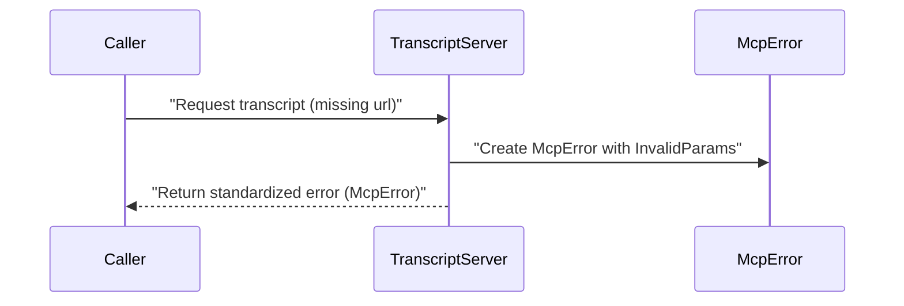

# Chapter 7: McpError

In our last chapter, we learned how to structure each subtitle snippet with the [TranscriptLine Interface](06_transcriptline_interface_.md). But what happens when the journey from video URL to transcript text hits a snag? That’s where “McpError” swoops in to keep things clean, consistent, and easy to diagnose!

## Why McpError?

Imagine an assembly line building toy cars. If a critical bolt is missing, you need a standardized way of announcing “Oops! Issue here!” so the team can fix it quickly. “McpError” works just like that announcement—it’s a special “error box” that:
1. Tells you what went wrong (e.g., “Invalid parameters!”).  
2. Gives you an error code (like a label for quick scanning).  
3. Keeps a uniform format across the entire codebase so it’s easy to catch, log, and handle.

By having all your errors look and act the same, you avoid confusion and can quickly pinpoint problems like missing URL fields, internal server glitches, or unknown method calls.

---

## Use Case Example

Suppose you call our “get_transcript” tool without providing the “url” parameter. Instead of random or cryptic messages, you’ll see a tidy error greeting:

“Error: [ErrorCode.InvalidParams] URL must be a string”

That makes it crystal clear what’s wrong—no guesswork or rummaging through logs needed.

---

## Key Concepts

1. Error Code: A constant (like “InvalidParams,” “MethodNotFound,” or “InternalError”) that classifies the problem.  
2. Human-Readable Message: A short string explaining the specific reason (e.g., “You must provide a video URL.”).  
3. Throwing & Catching: You create or “throw” an McpError when something’s off; the server or calling code “catches” it to display a neat error response.

### Mermaid Diagram: Error Lifecycle



• The caller makes a request.  
• The TranscriptServer spots the missing parameter and constructs an “McpError.”  
• The caller (or user) receives a clear error response.

---

## How to Use McpError

Below is a tiny snippet to show how we might throw an “McpError” if someone forgets the “url” parameter:

```ts
// If parameter is missing, throw an McpError
if (!url) {
  throw new McpError(
    ErrorCode.InvalidParams,
    "Missing parameter: url"
  );
}
```

Explanation:  
1. We check if “url” exists.  
2. If not, we “throw” a new “McpError,” passing in a code (“InvalidParams”) and a helpful message.  
3. This bubble of error is caught by the TranscriptServer, which then sends a neat JSON message to the user.

---

## Internal Implementation

You’ll often see “McpError” imported from our MCP library. Below is a simplified glance at how it might look inside:

```ts
/**
 * A standardized MCP error.
 */
export class McpError extends Error {
  public code: ErrorCode;

  constructor(code: ErrorCode, message: string) {
    super(message);
    this.code = code;
  }
}
```

Explanation:  
- “ErrorCode” is just an enum (or similar) that groups known error types like “InvalidParams” or “InternalError.”  
- The constructor sets both the “message” (inherited from JavaScript’s Error) and the “code” for easy reference.

When the server catches this error, it knows exactly what type of issue happened (like a missing parameter vs. an internal meltdown).

---

## Putting It All Together

• The user calls a tool—like “get_transcript.”  
• Our code checks if everything is valid.  
• If something is missing or broken, we raise an “McpError.”  
• The TranscriptServer politely returns a standardized JSON response with an error code and message.  

No matter where the error originates, you’ll see the same structured format every time. This uniformity makes it a breeze to debug.

---

## Conclusion

“McpError” is the safety net that catches any slip-ups in our transcript machine. By providing a consistent code and message, it makes spotting and fixing problems quick and painless.  

Thanks for following along through this entire tutorial! You’ve now seen how each piece of the “mcp-server-youtube-transcript” puzzle fits together—from the [TranscriptServer](01_transcriptserver_.md) to how we gracefully handle errors with McpError.  
Happy coding and transcript-fetching!  

---

Generated by [AI Codebase Knowledge Builder](https://github.com/The-Pocket/Tutorial-Codebase-Knowledge)