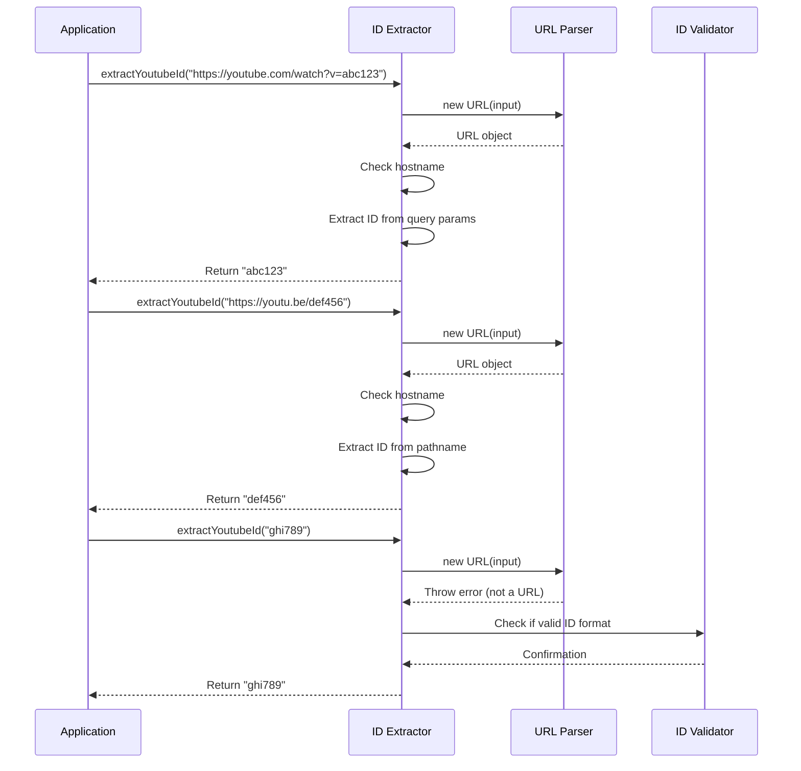

# Chapter 4: YouTube ID Extraction

In [Chapter 3: YouTubeTranscriptExtractor](03_youtubetranscriptextractor_.md), we learned about the component that handles fetching and processing transcripts. Now, let's take a closer look at a crucial first step in that process: extracting YouTube video IDs.

## Why Do We Need YouTube ID Extraction?

Imagine you're showing a friend a funny cat video. You might share it in several ways:
- As a full YouTube link: `https://www.youtube.com/watch?v=dQw4w9WgXcQ`
- As a shortened link: `https://youtu.be/dQw4w9WgXcQ`
- Or maybe just copy the video ID: `dQw4w9WgXcQ`

No matter how the video is shared, our application needs to identify the unique video ID to fetch its transcript. This is exactly what our YouTube ID extraction component does - it acts like a detective that can spot a YouTube video ID in various disguises!

## Understanding YouTube Video IDs

Before we dive into the code, let's understand what a YouTube video ID looks like:

- It's always **11 characters long**
- It contains a mix of **letters** (both uppercase and lowercase), **numbers**, **underscores** (`_`), and **hyphens** (`-`)
- It uniquely identifies a video on YouTube's platform

For example, in the URL `https://www.youtube.com/watch?v=dQw4w9WgXcQ`, the video ID is `dQw4w9WgXcQ`.

## Common YouTube URL Formats

YouTube links come in several formats, and our extractor needs to handle all of them:

1. **Standard YouTube URL**: `https://www.youtube.com/watch?v=dQw4w9WgXcQ`
2. **Shortened YouTube URL**: `https://youtu.be/dQw4w9WgXcQ`
3. **YouTube URL with timestamp**: `https://www.youtube.com/watch?v=dQw4w9WgXcQ&t=42s`
4. **YouTube URL with playlist**: `https://www.youtube.com/watch?v=dQw4w9WgXcQ&list=PLjp0AEEJ0-fGi7bkjrGhBLUF9NMraL9cL`
5. **Direct video ID**: `dQw4w9WgXcQ`

Our extractor needs to be smart enough to identify the video ID in all these cases.

## The YouTube ID Extractor Function

Let's look at the code that does this magic:

```javascript
extractYoutubeId(input: string): string {
  if (!input) {
    throw new McpError(
      ErrorCode.InvalidParams,
      'YouTube URL or ID is required'
    );
  }

  // Handle URL formats
  try {
    const url = new URL(input);
    
    // Handle youtu.be short links
    if (url.hostname === 'youtu.be') {
      return url.pathname.slice(1);
    } 
    // Handle youtube.com links
    else if (url.hostname.includes('youtube.com')) {
      const videoId = url.searchParams.get('v');
      if (!videoId) {
        throw new McpError(
          ErrorCode.InvalidParams,
          `Invalid YouTube URL: ${input}`
        );
      }
      return videoId;
    }
  } catch (error) {
    // Not a URL, check if it's a direct video ID
    if (!/^[a-zA-Z0-9_-]{11}$/.test(input)) {
      throw new McpError(
        ErrorCode.InvalidParams,
        `Invalid YouTube video ID: ${input}`
      );
    }
    return input;
  }
}
```

This function takes any input string and tries to extract a YouTube video ID from it. Let's break down how it works step by step:

1. First, it checks if any input was provided at all
2. Then, it tries to parse the input as a URL using JavaScript's built-in `URL` class
3. If it's a valid URL, it checks which type of YouTube URL it is:
   - If it's a `youtu.be` short link, it extracts the ID from the pathname
   - If it's a `youtube.com` link, it extracts the ID from the `v` query parameter
4. If the input isn't a valid URL (which throws an error), it checks if the input itself is a valid video ID
5. If all checks fail, it throws an error indicating the input is invalid

## Examples of ID Extraction in Action

Let's see how our extractor works with different inputs:

### Example 1: Standard YouTube URL

```javascript
const input = 'https://www.youtube.com/watch?v=dQw4w9WgXcQ';
const videoId = extractYoutubeId(input);
console.log(videoId); // Outputs: dQw4w9WgXcQ
```

### Example 2: Shortened YouTube URL

```javascript
const input = 'https://youtu.be/dQw4w9WgXcQ';
const videoId = extractYoutubeId(input);
console.log(videoId); // Outputs: dQw4w9WgXcQ
```

### Example 3: Direct Video ID

```javascript
const input = 'dQw4w9WgXcQ';
const videoId = extractYoutubeId(input);
console.log(videoId); // Outputs: dQw4w9WgXcQ
```

### Example 4: Invalid Input

```javascript
const input = 'https://example.com/not-a-youtube-video';
try {
  const videoId = extractYoutubeId(input);
} catch (error) {
  console.error(error.message); 
  // Outputs: "Invalid YouTube URL: https://example.com/not-a-youtube-video"
}
```

## Behind the Scenes: How ID Extraction Works

Let's visualize what happens when we extract a YouTube video ID:



This diagram shows three different cases:
1. Extracting an ID from a standard YouTube URL
2. Extracting an ID from a shortened youtu.be URL
3. Validating a direct video ID input

## Handling Error Cases

Our extractor is designed to fail gracefully when given invalid inputs. Let's look at how it handles different error cases:

### Case 1: Empty Input

```javascript
try {
  const videoId = extractYoutubeId('');
} catch (error) {
  console.error(error.message); 
  // Outputs: "YouTube URL or ID is required"
}
```

### Case 2: Invalid YouTube URL (Missing video ID)

```javascript
try {
  const videoId = extractYoutubeId('https://youtube.com/playlist');
} catch (error) {
  console.error(error.message); 
  // Outputs: "Invalid YouTube URL: https://youtube.com/playlist"
}
```

### Case 3: Invalid Video ID Format

```javascript
try {
  const videoId = extractYoutubeId('abc123'); // Too short
} catch (error) {
  console.error(error.message); 
  // Outputs: "Invalid YouTube video ID: abc123"
}
```

## Integration with the TranscriptServer

Now that we understand how ID extraction works, let's see how it fits into our overall application flow:

```javascript
private async handleToolCall(name: string, args: any): 
  Promise<{ toolResult: CallToolResult }> {
  switch (name) {
    case "get_transcript": {
      const { url: input, lang = "en" } = args;
      
      // ... input validation ...
      
      try {
        // First extract the video ID
        const videoId = this.extractor.extractYoutubeId(input);
        console.error(`Processing transcript for video: ${videoId}`);
        
        // Then use that ID to get the transcript
        const transcript = await this.extractor.getTranscript(videoId, lang);
        
        // ... return the transcript ...
      } catch (error) {
        // ... error handling ...
      }
    }
    // ... other cases ...
  }
}
```

In this code snippet, you can see that the `extractYoutubeId` method is called first to get the video ID, which is then passed to the `getTranscript` method. This shows how ID extraction is the first crucial step in the transcript retrieval process.

## Best Practices for YouTube ID Extraction

When working with YouTube ID extraction, keep these tips in mind:

1. **Always validate inputs**: YouTube IDs have a specific format, so check that the extracted ID matches the expected pattern.
2. **Handle errors gracefully**: Provide clear error messages when invalid inputs are received.
3. **Support multiple URL formats**: Users may provide links in different formats, so be ready to handle them all.
4. **Use built-in URL parsing**: Leverage JavaScript's `URL` class for parsing rather than complex regular expressions.

## Conclusion

In this chapter, we've learned about YouTube ID extraction, a critical first step in our transcript extraction process. We've seen how our application can identify and extract video IDs from various URL formats, and how it validates these IDs to ensure they're in the correct format.

The YouTube ID extractor acts like a detective that can recognize a YouTube video no matter how it's disguised - whether it's a full URL, a shortened link, or just the ID itself. This capability is essential for making our transcript extractor user-friendly and flexible.

In the next chapter, [Request Handlers](05_request_handlers_.md), we'll learn how our application processes incoming requests and routes them to the appropriate handlers, continuing our journey through the complete transcript extraction workflow.

---

Generated by [AI Codebase Knowledge Builder](https://github.com/The-Pocket/Tutorial-Codebase-Knowledge)