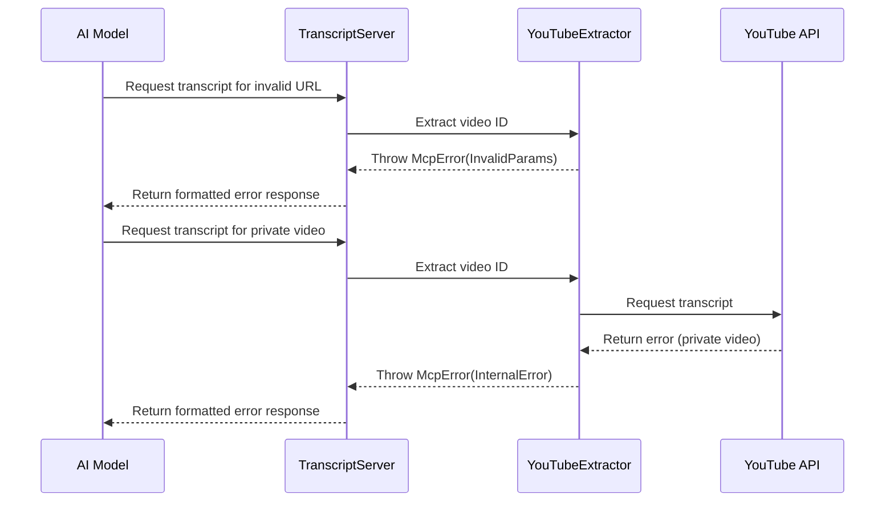

# Chapter 6: Error Handling System

In [Chapter 5: Request Handlers](05_request_handlers_.md), we explored how our application processes incoming requests. Now, let's learn about the safety net that catches problems when things go wrong - our Error Handling System.

## Why Do We Need Error Handling?

Imagine you're driving a car with an airbag. You don't expect to crash, but the airbag is there just in case something goes wrong. In our YouTube transcript application, the Error Handling System works just like that airbag - it activates when something unexpected happens, protecting both our application and the users from the full impact of errors.

For example, what if a user provides a link to a private YouTube video? Or what if YouTube's servers are temporarily down? Without proper error handling, our application would crash or freeze, leaving users confused. With good error handling, we can provide helpful messages like: "Sorry, we can't access the transcript because this video is private."

## The Layers of Error Handling

Our error handling system works at different layers, similar to how a building has multiple safety systems:

1. **Input Validation**: Checking if the user's request makes sense before processing it
2. **Operation Errors**: Catching problems that occur during normal operations
3. **Network Errors**: Handling issues with external services (like YouTube)
4. **System Errors**: Managing unexpected application-level problems

Let's explore each of these layers with examples.

## Layer 1: Input Validation

The first layer checks if the user's input is valid before we try to process it:

```javascript
if (!input || typeof input !== 'string') {
  throw new McpError(
    ErrorCode.InvalidParams,
    'URL parameter is required and must be a string'
  );
}
```

This simple code:
1. Checks if the input exists and is a string
2. If not, it throws a specific error with a clear message
3. The error includes a standardized error code (`ErrorCode.InvalidParams`)

It's like a bouncer at a club checking IDs before letting people in - catching problems early before they can cause trouble inside.

## Layer 2: Operation Errors

The second layer catches errors that happen during normal operations, like extracting a video ID from a URL:

```javascript
try {
  const videoId = this.extractor.extractYoutubeId(input);
  // Continue processing...
} catch (error) {
  // Rethrow MCP errors directly
  if (error instanceof McpError) {
    throw error;
  }
  
  // Wrap other errors in an MCP error
  throw new McpError(
    ErrorCode.InternalError,
    `Failed to extract video ID: ${(error as Error).message}`
  );
}
```

This code:
1. Tries to extract a video ID from the input
2. If an error occurs, it catches it
3. If it's already an MCP error, it passes it along unchanged
4. If it's any other type of error, it converts it to a standardized MCP error

It's like having a translator who converts all different languages into one language everyone can understand.

## Layer 3: Network Errors

The third layer handles problems that occur when communicating with external services (like YouTube):

```javascript
async getTranscript(videoId: string, lang: string): Promise<string> {
  try {
    const transcript = await getSubtitles({
      videoID: videoId,
      lang: lang,
    });
    return this.formatTranscript(transcript);
  } catch (error) {
    console.error('Failed to fetch transcript:', error);
    throw new McpError(
      ErrorCode.InternalError,
      `Failed to retrieve transcript: ${(error as Error).message}`
    );
  }
}
```

In this example:
1. We try to fetch subtitles from YouTube
2. If anything goes wrong (network error, video unavailable, etc.), we catch it
3. We log the error for debugging
4. We throw a standardized error that clients can understand

It's like having a customer service representative who can explain technical problems in simple terms that customers understand.

## Layer 4: System Errors

The fourth layer deals with unexpected application-level issues:

```javascript
private setupErrorHandling(): void {
  this.server.onerror = (error) => {
    console.error("[MCP Error]", error);
  };

  process.on('SIGINT', async () => {
    await this.stop();
    process.exit(0);
  });
  
  process.on('uncaughtException', (error) => {
    console.error("Fatal error:", error);
    process.exit(1);
  });
}
```

This code:
1. Sets up a global error handler for MCP server errors
2. Handles program termination signals (like Ctrl+C)
3. Catches any uncaught exceptions to prevent the application from crashing silently

It's like having a building's emergency systems that handle power outages, fire alarms, and other facility-wide emergencies.

## The McpError Class: Our Standardized Error Format

At the heart of our error handling system is the `McpError` class, which provides a standardized way to represent errors:

```javascript
// Example of creating an McpError
throw new McpError(
  ErrorCode.InvalidParams,
  'URL parameter is required and must be a string'
);
```

The `McpError` has two main components:
1. An **error code** that identifies the type of error (like `InvalidParams` or `InternalError`)
2. A **message** that explains what went wrong in human-readable terms

It's like a standardized form that all departments in a company use to report problems - ensuring everyone speaks the same language when discussing errors.

## Error Codes: Categorizing Different Types of Errors

Our system uses several standard error codes to categorize different problems:

```javascript
// These are the standard MCP error codes we use
const ErrorCode = {
  ParseError: -32700,     // Invalid JSON
  InvalidRequest: -32600, // Request doesn't match schema
  MethodNotFound: -32601, // Unknown method
  InvalidParams: -32602,  // Invalid method parameters
  InternalError: -32603,  // Server-side error
};
```

Each error code represents a specific category of problem:
- `ParseError`: There's a problem with the format of the request
- `InvalidRequest`: The request doesn't follow the expected structure
- `MethodNotFound`: The requested tool or method doesn't exist
- `InvalidParams`: The parameters provided are invalid
- `InternalError`: Something went wrong inside our application

It's like having different colored flags to signal different types of problems - each color has a specific meaning.

## How Errors Flow Through Our System

Let's visualize how an error travels through our application:



This diagram shows two error scenarios:
1. The AI model provides an invalid URL, which is caught early in the process
2. The AI model requests a private video, which fails when we try to fetch the transcript

In both cases, the error is caught, converted to a standardized format, and returned to the AI model.

## Returning Errors to Clients

When an error occurs, we need to return it to the client in a format they can understand:

```javascript
// Inside request handler
try {
  // Process the request...
  return {
    toolResult: {
      content: [{ type: "text", text: transcript }],
      isError: false
    }
  };
} catch (error) {
  // Format and return error response
  return {
    toolResult: {
      content: [{
        type: "text",
        text: `Error: ${error.message}`
      }],
      isError: true,
      errorCode: error.code || ErrorCode.InternalError
    }
  };
}
```

This code:
1. Tries to process the request normally
2. If an error occurs, it catches it
3. It formats the error into a standardized response
4. It sets `isError` to `true` so the client knows there was a problem
5. It includes the error message and code

It's like how a restaurant might send back a note saying "Sorry, we're out of that dish" instead of just not bringing you anything.

## Logging Errors for Debugging

Besides returning errors to clients, we also log them for our own debugging purposes:

```javascript
try {
  const transcript = await this.extractor.getTranscript(videoId, lang);
  // Continue processing...
} catch (error) {
  console.error('Transcript extraction failed:', error);
  // Rethrow or convert error...
}
```

By logging errors with detailed information, we can:
1. Track down problems more easily
2. See patterns in errors that might indicate bigger issues
3. Monitor the health of our application

It's like a black box recorder in an airplane - it helps us understand what went wrong after the fact.

## Common Error Scenarios and How We Handle Them

Let's look at some common error scenarios in our YouTube transcript application:

### Scenario 1: Invalid YouTube URL

```javascript
// User provides a non-YouTube URL
try {
  const videoId = this.extractor.extractYoutubeId("https://example.com/not-youtube");
} catch (error) {
  // Error: "Invalid YouTube URL: https://example.com/not-youtube"
}
```

### Scenario 2: Private or Unavailable Video

```javascript
// User requests a private video
try {
  const transcript = await this.extractor.getTranscript("privateVideoId", "en");
} catch (error) {
  // Error: "Failed to retrieve transcript: This video is unavailable"
}
```

### Scenario 3: Unsupported Language

```javascript
// User requests a language that isn't available for this video
try {
  const transcript = await this.extractor.getTranscript("videoId", "xyz");
} catch (error) {
  // Error: "Failed to retrieve transcript: Language xyz not available"
}
```

### Scenario 4: Network Issues

```javascript
// YouTube's API is temporarily unavailable
try {
  const transcript = await this.extractor.getTranscript("videoId", "en");
} catch (error) {
  // Error: "Failed to retrieve transcript: Network request failed"
}
```

For each of these scenarios, our error handling system:
1. Catches the specific error
2. Converts it to a standardized format
3. Returns a helpful message to the client
4. Logs details for debugging

## Best Practices for Error Handling

Based on our implementation, here are some best practices for error handling:

1. **Validate early**: Check inputs before processing them to catch problems early
2. **Use specific error codes**: Different types of errors should have different codes
3. **Include helpful messages**: Error messages should explain what went wrong and why
4. **Log for debugging**: Keep detailed logs to help diagnose problems
5. **Handle gracefully**: Never let errors crash your entire application
6. **Standardize format**: All errors should follow the same structure

## Conclusion

In this chapter, we've explored the Error Handling System of our YouTube transcript application. Like a safety net in a circus, it catches problems at different levels - from invalid user inputs to network failures - and transforms them into standardized error responses.

A good error handling system doesn't just prevent crashes; it provides helpful information to both users and developers about what went wrong and potentially how to fix it. Our layered approach ensures that no matter where an error occurs, it's caught, processed, and reported appropriately.

In the next chapter, [Tool Configuration](07_tool_configuration_.md), we'll learn how to configure our transcript tool to customize its behavior and appearance, completing our journey through the YouTube transcript extractor application.

---

Generated by [AI Codebase Knowledge Builder](https://github.com/The-Pocket/Tutorial-Codebase-Knowledge)