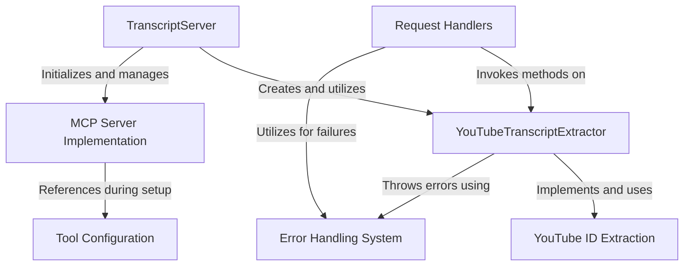

# Tutorial: mcp-server-youtube-transcript

This project is a **YouTube Transcript Extractor** service that provides AI models with the ability to *request and receive transcripts* from YouTube videos. It implements the **Model Context Protocol (MCP)** specification, allowing AI models to seamlessly interact with the service through a standardized interface. The server accepts a YouTube URL or video ID plus an optional language code, extracts the unique video identifier, fetches the transcript using a third-party library, and returns the formatted text content. The system includes comprehensive **error handling** to manage invalid inputs and processing failures.

**Source Repository:** [https://github.com/kimtaeyoon83/mcp-server-youtube-transcript](https://github.com/kimtaeyoon83/mcp-server-youtube-transcript)

## Chapters

1. [MCP Server Implementation
](01_mcp_server_implementation_.md)
2. [TranscriptServer
](02_transcriptserver_.md)
3. [YouTubeTranscriptExtractor
](03_youtubetranscriptextractor_.md)
4. [YouTube ID Extraction
](04_youtube_id_extraction_.md)
5. [Request Handlers
](05_request_handlers_.md)
6. [Error Handling System
](06_error_handling_system_.md)
7. [Tool Configuration
](07_tool_configuration_.md)

---

Generated by [AI Codebase Knowledge Builder](https://github.com/The-Pocket/Tutorial-Codebase-Knowledge)