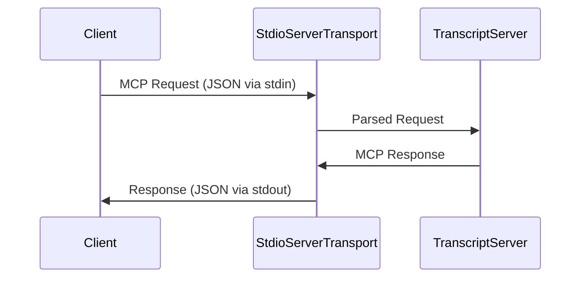

# Chapter 6: StdioServerTransport

This chapter explores the `StdioServerTransport`, a crucial component for enabling communication with the MCP server (introduced in the [`Model Context Protocol (MCP) Server`](01_model_context_protocol__mcp__server_.md) chapter). This transport mechanism allows the server to communicate via standard input (stdin) and standard output (stdout), a common method for inter-process communication. This enables the server to be easily integrated with other applications or services that can send and receive data through stdio.

In essence, `StdioServerTransport` acts as a bridge, allowing the MCP server to receive requests from and send responses to a client application through the command line or similar interfaces.

Here's how `StdioServerTransport` is used in the `TranscriptServer` class:

```typescript
async start(): Promise<void> {
  const transport = new StdioServerTransport();
  await this.server.connect(transport);
}
```

This code snippet demonstrates that the `StdioServerTransport` is instantiated and then passed to the `server.connect()` method. This establishes the communication channel between the server and the outside world via standard input and output.

The `StdioServerTransport` is provided by the `@modelcontextprotocol/sdk/server/stdio.js` module. Let's examine how it works internally.

The `StdioServerTransport` class handles the reading of input from `stdin` and writing output to `stdout`. It does so by listening for data events on `stdin` and then processing that data as an incoming MCP request. Similarly, when the server needs to send a response, the `StdioServerTransport` writes the response data to `stdout`.

While the internal implementation details are handled by the `@modelcontextprotocol/sdk`, understanding the conceptual flow is important. The `StdioServerTransport` essentially serializes and deserializes MCP messages to and from the standard input and output streams.

Consider the following diagram which illustrates how the components fit together:



This diagram shows a simplified view:

1.  The *Client* sends an MCP request as a JSON string through standard input.
2.  The *StdioServerTransport* reads this JSON string from `stdin`, parses it into a structured MCP request object, and forwards it to the *TranscriptServer*.
3.  The *TranscriptServer* processes the request and generates an MCP response object.
4.  The *TranscriptServer* hands the response object to the *StdioServerTransport*.
5.  The *StdioServerTransport* serializes the response object into a JSON string and writes it to standard output, which the *Client* can then read.

The format of the JSON messages sent and received are defined by the schemas discussed in the [`CallToolRequestSchema & ListToolsRequestSchema`](03_calltoolrequestschema___listtoolsrequestschema_.md) chapter.

## Example interaction

Suppose you have a client application that wants to use the `get_transcript` tool. The client would send a JSON string representing a `CallToolRequestSchema` to the server's standard input:

```json
{
  "method": "callTool",
  "params": {
    "name": "get_transcript",
    "arguments": {
      "url": "dQw4w9WgXcQ",
      "lang": "en"
    }
  }
}
```

The server, via the `StdioServerTransport`, would receive this input, process it, and then send a JSON string representing the `CallToolResult` to standard output. The client could then read this JSON string from standard output and parse it to retrieve the transcript.

## Summary

In this chapter, we examined the `StdioServerTransport`, a vital component for enabling communication between the MCP server and client applications through standard input and output. We learned how this transport mechanism allows the server to receive requests and send responses via the command line or similar interfaces. This provides a simple way to interact with the MCP server.

Next, we will explore the [`McpError`](07_mcperror_.md) and the different error codes that can be returned by the server.


---

Generated by [AI Codebase Knowledge Builder](https://github.com/The-Pocket/Tutorial-Codebase-Knowledge)