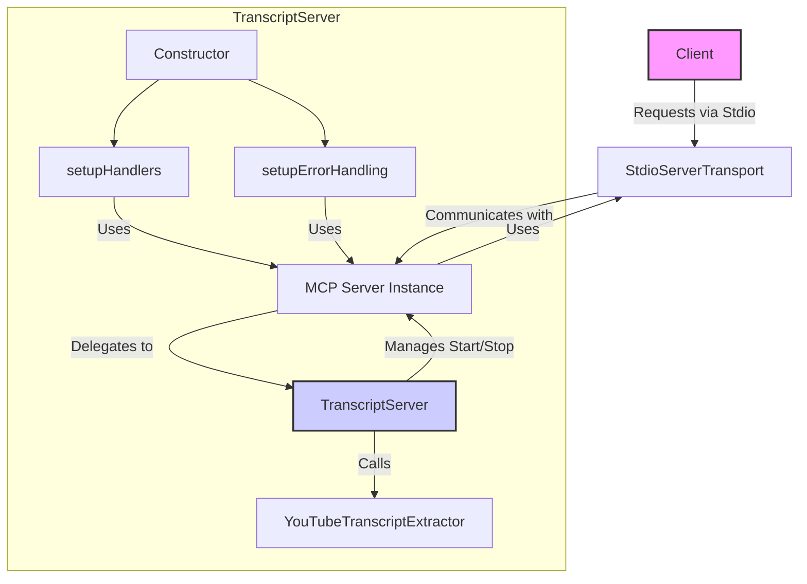

# Chapter 1: Transcript Server Application (`TranscriptServer` class)

Welcome to the first chapter of our tutorial on the `mcp-server-youtube-transcript` project! Here, we'll explore the heart of our application: the `TranscriptServer` class.

Think of the `TranscriptServer` as the director of a play. It doesn't perform every action itself, but it knows all the actors (the different components like the transcript extractor and the communication channel), tells them when and how to act, and ensures the entire production runs smoothly from start to finish.

## What does `TranscriptServer` do?

The `TranscriptServer` class is the main application class. Its primary job is to bring together all the necessary pieces and manage the overall operation of our YouTube transcript service.

Here are its key responsibilities:

1.  **Initialization:** It creates instances of other essential classes, like the MCP `Server` (which handles the communication protocol) and our custom `YouTubeTranscriptExtractor` (which fetches the transcripts).
2.  **Configuration:** It sets up the server with specific information, like its name and capabilities.
3.  **Request Handling Setup:** It tells the underlying MCP `Server` *how* to respond to different types of requests from a client (e.g., "list the tools you support" or "run the 'get_transcript' tool with this URL").
4.  **Tool Integration:** It connects the defined tools (like `get_transcript`) with the actual logic that performs the work (using `YouTubeTranscriptExtractor`).
5.  **Lifecycle Management:** It provides methods to `start` the server (making it ready to listen for requests) and `stop` it gracefully.
6.  **Error Handling:** It sets up basic mechanisms to catch and log errors that might occur during operation.

## The `TranscriptServer` Class Structure

Let's look at the basic structure of the `TranscriptServer` class found in `src/index.ts`.

```typescript
// src/index.ts

// ... other imports ...
import { Server } from "@modelcontextprotocol/sdk/server/index.js";
import { StdioServerTransport } from "@modelcontextprotocol/sdk/server/stdio.js";
import { YouTubeTranscriptExtractor } from './youtubeExtractor'; // Assuming extractor is separate
import { TOOLS } from './tools'; // Assuming tools are defined separately
import { CallToolRequestSchema, ListToolsRequestSchema, CallToolResult, McpError, ErrorCode } from "@modelcontextprotocol/sdk/types.js";


class TranscriptServer {
  private extractor: YouTubeTranscriptExtractor;
  private server: Server;

  constructor() {
    // Create instances of dependencies
    this.extractor = new YouTubeTranscriptExtractor();
    this.server = new Server(
      {
        name: "mcp-servers-youtube-transcript",
        version: "0.1.0",
      },
      {
        capabilities: {
          tools: {}, // Indicates tool capability
        },
      }
    );

    // Setup how the server behaves
    this.setupHandlers();
    this.setupErrorHandling();
  }

  // ... other methods (setupHandlers, setupErrorHandling, handleToolCall, start, stop) ...
}
```

**Explanation:**

1.  **`private extractor: YouTubeTranscriptExtractor;`**: This line declares a private property named `extractor`. It will hold an instance of our `YouTubeTranscriptExtractor` class, which is responsible for the actual work of getting transcripts. We'll dive into this in [Chapter 4: YouTube Transcript Extractor (`YouTubeTranscriptExtractor` class)](04_youtube_transcript_extractor___youtubetranscriptextractor__class__.md).
2.  **`private server: Server;`**: This declares a private property named `server`. It holds an instance of the `Server` class from the MCP SDK. This object handles the core communication logic according to the Model Context Protocol. We cover this in detail in [Chapter 5: MCP Server (`Server` class)](05_mcp_server___server__class__.md).
3.  **`constructor()`**: This special method is called when we create a new `TranscriptServer` object (using `new TranscriptServer()`).
    *   `this.extractor = new YouTubeTranscriptExtractor();`: Inside the constructor, it creates a new `YouTubeTranscriptExtractor` object and stores it in the `extractor` property.
    *   `this.server = new Server(...)`: It creates a new MCP `Server` object. We provide some basic information:
        *   `name` and `version`: Identify our specific server.
        *   `capabilities: { tools: {} }`: Tells any connecting client that this server supports the "tools" capability (meaning it can execute predefined functions or tools).
    *   `this.setupHandlers();`: Calls another method within the class to set up how incoming requests are processed. We'll examine this in [Chapter 3: Request Handling (`setRequestHandler`, `handleToolCall`)](03_request_handling___setrequesthandler____handletoolcall___.md).
    *   `this.setupErrorHandling();`: Calls a method to configure how errors are logged or handled. More on this in [Chapter 7: MCP Error Handling (`McpError`, `onerror`)](07_mcp_error_handling___mcperror____onerror___.md).

## Orchestrating the Components

The `TranscriptServer` acts as the central hub connecting the different parts of the application.



This diagram shows:

*   The `TranscriptServer` (blue box) contains the logic.
*   It initializes and uses the MCP `Server` instance and the `YouTubeTranscriptExtractor`.
*   The MCP `Server` communicates with the outside world via a `Transport` mechanism (in our case, `StdioServerTransport`, covered in [Chapter 6: Stdio Transport (`StdioServerTransport`)](06_stdio_transport___stdioservertransport___.md)).
*   When a request comes in, the `Transport` passes it to the `Server`, which uses the handlers set up by `TranscriptServer` to decide what to do, often involving calling the `YouTubeTranscriptExtractor`.

## Starting and Stopping the Server

The `TranscriptServer` also controls when the server starts listening for requests and when it shuts down.

```typescript
// src/index.ts (within TranscriptServer class)

  /**
   * Starts the server
   */
  async start(): Promise<void> {
    // Create a communication channel using standard input/output
    const transport = new StdioServerTransport();
    // Connect the MCP Server to the transport channel
    await this.server.connect(transport);
    console.error("Transcript server started. Waiting for requests...");
  }

  /**
   * Stops the server
   */
  async stop(): Promise<void> {
    try {
      // Politely close the server connection
      await this.server.close();
      console.error("Transcript server stopped.");
    } catch (error) {
      console.error('Error while stopping server:', error);
    }
  }
```

**Explanation:**

*   **`async start(): Promise<void>`**: This method initializes the communication channel (`StdioServerTransport`) and tells the internal MCP `Server` object to start listening for messages on that channel using `this.server.connect(transport)`. The `async` keyword means this function might perform operations that take time (like setting up connections) and uses `await` to pause execution until those operations complete.
*   **`async stop(): Promise<void>`**: This method tells the internal MCP `Server` to close its connection and shut down gracefully using `this.server.close()`.

## Running the Server

Finally, the `src/index.ts` file has a small section at the bottom that actually creates an instance of our `TranscriptServer` and starts it.

```typescript
// src/index.ts

// ... (TranscriptServer class definition above) ...

// Main execution
async function main() {
  // Create the director object
  const server = new TranscriptServer();

  try {
    // Tell the director to start the show
    await server.start();
  } catch (error) {
    console.error("Server failed to start:", error);
    process.exit(1); // Exit if server cannot start
  }
}

// Run the main function and handle any unexpected errors
main().catch((error) => {
  console.error("Fatal server error:", error);
  process.exit(1); // Exit on fatal errors
});
```

**Explanation:**

1.  **`async function main()`**: Defines the main entry point of our application.
2.  **`const server = new TranscriptServer();`**: Creates an instance of our main application class.
3.  **`await server.start();`**: Calls the `start` method we just discussed to get the server running and listening for requests.
4.  **`main().catch(...)`**: Executes the `main` function and provides a last-resort error handler if anything goes wrong during startup or execution.

## Summary

The `TranscriptServer` class is the central component of our application. It acts as an orchestrator, initializing and coordinating the MCP `Server`, the `YouTubeTranscriptExtractor`, request handlers, and error handling. It manages the server's lifecycle through its `start` and `stop` methods. Understanding its role is crucial for grasping how the different parts of the transcript server work together.

In the next chapter, we'll look closely at how we define the specific capabilities or "tools" that our server offers, starting with the `get_transcript` tool itself.

**Next:** [Chapter 2: MCP Tool Definition (`TOOLS` constant)](02_mcp_tool_definition___tools__constant__.md)

---

Generated by [AI Codebase Knowledge Builder](https://github.com/The-Pocket/Tutorial-Codebase-Knowledge)