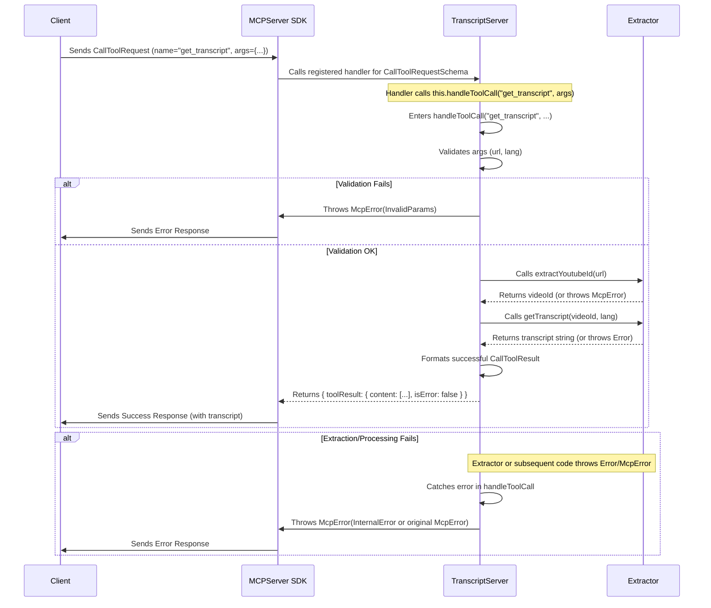

# Chapter 3: Request Handling (`setRequestHandler`, `handleToolCall`)

In the [previous chapter](02_mcp_tool_definition___tools__constant__.md), we learned how our server describes its capabilities using the `TOOLS` constant. Now, we'll explore how the server actually *responds* when a client sends a request, like asking for the list of tools or requesting to execute the `get_transcript` tool.

Think of the MCP `Server` object within our `TranscriptServer` like a central dispatch office. It receives incoming messages (requests) but needs instructions on where to route them and what actions to take. These instructions are set up using the `setRequestHandler` method. Then, for specific tasks like running a tool, a dedicated function like `handleToolCall` takes over.

## `setRequestHandler`: Routing Incoming Requests

The `Server` class from the `@modelcontextprotocol/sdk` provides a method called `setRequestHandler`. Its purpose is to associate a specific *type* of request (defined by a schema) with a function (a handler) that will process that request type.

**Syntax:**

```typescript
server.setRequestHandler(RequestSchema, handlerFunction);
```

*   `RequestSchema`: An object representing the expected structure of a specific request type (e.g., `ListToolsRequestSchema`, `CallToolRequestSchema`). These schemas are provided by the MCP SDK.
*   `handlerFunction`: An asynchronous function (`async (...) => { ... }`) that takes the incoming request object as an argument and returns a promise resolving to the appropriate response object.

In our `TranscriptServer`, we set up handlers in the `setupHandlers` method, which is called by the constructor:

```typescript
// src/index.ts (within TranscriptServer class)

  private setupHandlers(): void {
    // Handler 1: Responding to "List Tools" requests
    this.server.setRequestHandler(ListToolsRequestSchema, async () => ({
      tools: TOOLS // Return the list defined in Chapter 2
    }));

    // Handler 2: Responding to "Call Tool" requests
    this.server.setRequestHandler(CallToolRequestSchema, async (request) => 
      // Delegate the actual execution to handleToolCall
      this.handleToolCall(request.params.name, request.params.arguments ?? {})
    );
  }
```

**Explanation:**

1.  **Handler 1 (`ListToolsRequestSchema`)**:
    *   When the server receives a request matching the structure defined by `ListToolsRequestSchema` (essentially, a request asking "what tools do you support?"), this handler function is executed.
    *   It's very simple: it returns an object `{ tools: TOOLS }`. The `TOOLS` constant is the exact structure we defined in [Chapter 2: MCP Tool Definition (`TOOLS` constant)](02_mcp_tool_definition___tools__constant__.md), listing our `get_transcript` tool. The MCP `Server` takes care of sending this back to the client.

2.  **Handler 2 (`CallToolRequestSchema`)**:
    *   When the server receives a request matching `CallToolRequestSchema` (a request asking "run tool X with arguments Y"), this handler is called.
    *   The `request` object contains details like `request.params.name` (the name of the tool to call, e.g., `"get_transcript"`) and `request.params.arguments` (the parameters provided by the client, e.g., `{ "url": "...", "lang": "..." }`).
    *   Instead of containing all the logic here, this handler delegates the work to another method within our class: `this.handleToolCall`. It passes the tool name and arguments along. The `?? {}` ensures that if `arguments` is missing (null or undefined), we pass an empty object instead.

This delegation keeps our `setupHandlers` method clean and focuses the complex logic of executing tools into a dedicated method.

## `handleToolCall`: Executing the Requested Tool

The `handleToolCall` method is where the core logic for executing a specific tool resides. It's not part of the MCP SDK directly; it's a private method we created within `TranscriptServer`.

```typescript
// src/index.ts (within TranscriptServer class)

  /**
   * Handles tool call requests
   */
  private async handleToolCall(name: string, args: any): Promise<{ toolResult: CallToolResult }> {
    // Decide which tool's logic to run based on the name
    switch (name) {
      case "get_transcript": {
        // ... logic for get_transcript ...
        break; // Exit the switch after handling
      }

      // Handle cases where the requested tool name is not known
      default:
        throw new McpError(
          ErrorCode.MethodNotFound,
          `Unknown tool: ${name}`
        );
    }
  }
```

**Explanation:**

*   **Signature:** `private async handleToolCall(name: string, args: any): Promise<{ toolResult: CallToolResult }>`
    *   `private`: It's an internal helper method for `TranscriptServer`.
    *   `async`: It performs potentially time-consuming operations (like fetching transcripts) and uses `await`.
    *   `name: string`: Receives the name of the tool requested (e.g., `"get_transcript"`).
    *   `args: any`: Receives the arguments provided by the client. We use `any` here for simplicity, but validation inside the method ensures correct usage.
    *   `Promise<{ toolResult: CallToolResult }>`: It must return a Promise that resolves to an object containing a `toolResult` property. The value of `toolResult` must conform to the `CallToolResult` type defined by the MCP SDK.
*   **`switch (name)`**: This control structure checks the value of the `name` parameter. It allows us to easily add logic for different tools in the future by adding more `case` blocks.
*   **`case "get_transcript":`**: If the client requested the tool named "get_transcript", the code inside this block will execute.
*   **`default:`**: If the `name` doesn't match any of the defined `case`s, this block executes. It throws an `McpError` with the code `MethodNotFound`, signaling to the client that the requested tool doesn't exist on this server. We'll cover `McpError` in detail in [Chapter 7: MCP Error Handling (`McpError`, `onerror`)](07_mcp_error_handling___mcperror____onerror___.md).

## Inside the `get_transcript` Case: Validation, Execution, Formatting

Let's break down the logic within `case "get_transcript":`:

```typescript
// src/index.ts (within handleToolCall, inside the "get_transcript" case)

        // 1. Extract and Validate Arguments
        const { url: input, lang = "en" } = args; // Extract 'url' (as 'input') and 'lang' (defaulting to 'en')
        
        // Basic validation
        if (!input || typeof input !== 'string') {
          throw new McpError(
            ErrorCode.InvalidParams,
            'URL parameter is required and must be a string'
          );
        }
        if (lang && typeof lang !== 'string') { // Check only if lang was provided
          throw new McpError(
            ErrorCode.InvalidParams,
            'Language code must be a string'
          );
        }
        
        // 2. Execute the Core Logic (using the extractor)
        try {
          // Use the extractor class (details in Chapter 4)
          const videoId = this.extractor.extractYoutubeId(input);
          console.error(`Processing transcript for video: ${videoId}`); // Log progress
          
          const transcript = await this.extractor.getTranscript(videoId, lang);
          console.error(`Successfully extracted transcript (${transcript.length} chars)`); // Log success
          
          // 3. Format the Successful Result
          return {
            toolResult: {
              content: [{ // MCP requires content to be an array
                type: "text", 
                text: transcript, // The actual transcript string
                metadata: { // Optional: Extra info about the result
                  videoId,
                  language: lang,
                  timestamp: new Date().toISOString(),
                  charCount: transcript.length
                }
              }],
              isError: false // Indicate success
            }
          };
        } catch (error) {
          // 4. Handle Errors during Extraction/Processing
          console.error('Transcript extraction failed:', error);
          
          // If it's already an McpError (e.g., from extractYoutubeId), re-throw it
          if (error instanceof McpError) {
            throw error;
          }
          
          // Otherwise, wrap it in a generic McpError
          throw new McpError(
            ErrorCode.InternalError,
            `Failed to process transcript: ${(error as Error).message}`
          );
        }
```

**Explanation:**

1.  **Argument Extraction & Validation:**
    *   `const { url: input, lang = "en" } = args;`: We use object destructuring to pull `url` and `lang` from the `args` object. We rename `url` to `input` for clarity within this scope. We also set a default value of `"en"` for `lang` if it's not provided in `args`. This implements the `default` specified in our tool definition schema (Chapter 2).
    *   `if (!input || ...)` and `if (lang && ...)`: We perform basic checks. Is the `input` (URL/ID) provided and is it a string? If `lang` was provided, is it also a string? If validation fails, we `throw` an `McpError` with code `InvalidParams`. This immediately stops execution and sends a structured error back to the client.
2.  **Execute Core Logic:**
    *   `try { ... }`: We wrap the potentially error-prone transcript extraction logic in a `try...catch` block.
    *   `const videoId = this.extractor.extractYoutubeId(input);`: We call the `extractYoutubeId` method on our `extractor` instance (which we'll cover in [Chapter 4: YouTube Transcript Extractor (`YouTubeTranscriptExtractor` class)](04_youtube_transcript_extractor___youtubetranscriptextractor__class__.md)) to get a clean video ID from the user's input.
    *   `const transcript = await this.extractor.getTranscript(videoId, lang);`: We then call the `getTranscript` method on the `extractor` to fetch the actual transcript text. The `await` pauses execution until the transcript is retrieved.
    *   `console.error(...)`: We add logging messages to the server's error console (visible when running the server) to track progress and success. This is helpful for debugging.
3.  **Format Successful Result:**
    *   `return { toolResult: { ... } };`: If the try block succeeds, we construct the success response according to the `CallToolResult` structure defined by MCP.
    *   `content: [{ type: "text", text: transcript, metadata: { ... } }]`: The main result is placed in the `content` array. We specify its `type` as `"text"` and put the fetched transcript string in the `text` property. We also include useful `metadata`.
    *   `isError: false`: Critically, we set `isError` to `false` to signal success.
4.  **Handle Errors:**
    *   `catch (error) { ... }`: If anything inside the `try` block throws an error (e.g., invalid video ID, network failure during transcript fetching, `McpError` from validation), the `catch` block executes.
    *   `if (error instanceof McpError)`: We check if the caught error is *already* an `McpError` (which might have been thrown by `extractYoutubeId` or our earlier validation). If so, we just re-throw it, as it already contains the correct MCP error structure.
    *   `throw new McpError(...)`: If the caught error is *not* an `McpError` (e.g., a generic network error), we wrap it in a new `McpError` with the `InternalError` code, indicating something went wrong on the server side. This ensures all errors sent back to the client follow the MCP standard.

## Request Handling Flow

Here's a simplified flow of how a `CallToolRequest` for `get_transcript` is handled:



## Summary

Request handling is the bridge between defining what your server *can* do and actually *doing* it.

*   `server.setRequestHandler(Schema, handler)` registers functions to process specific types of incoming requests, acting like a router.
*   We set up handlers for `ListToolsRequestSchema` (returning the `TOOLS` definition) and `CallToolRequestSchema` (delegating to `handleToolCall`).
*   `handleToolCall(name, args)` is our custom method that contains the logic for executing specific tools.
*   Inside `handleToolCall` for `get_transcript`, we:
    1.  Validate the input arguments (`url`, `lang`), throwing `McpError` if invalid.
    2.  Call the appropriate methods on the `YouTubeTranscriptExtractor` instance to perform the real work.
    3.  Format the successful result into the `CallToolResult` structure required by MCP.
    4.  Catch any errors during execution and convert/re-throw them as `McpError`s for standardized error reporting.

Now that we understand how requests are received and routed to the correct logic, let's dive into the component that does the heavy lifting: the `YouTubeTranscriptExtractor`.

**Next:** [Chapter 4: YouTube Transcript Extractor (`YouTubeTranscriptExtractor` class)](04_youtube_transcript_extractor___youtubetranscriptextractor__class__.md)

---

Generated by [AI Codebase Knowledge Builder](https://github.com/The-Pocket/Tutorial-Codebase-Knowledge)