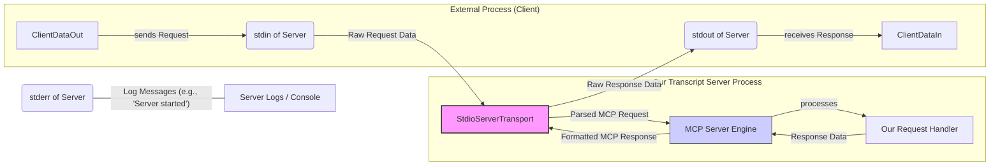

# Chapter 6: Stdio Transport (`StdioServerTransport`)

In the [previous chapter](05_mcp_server___server__class__.md), we learned about the MCP `Server` class, the engine that understands and processes the Model Context Protocol. We saw that this engine needs a way to communicate with the outside world, which is achieved by connecting it to a "Transport Layer" using the `server.connect(transport)` method.

Now, let's look at the specific transport mechanism used in our `mcp-server-youtube-transcript` project: `StdioServerTransport`.

## What is a Transport Layer?

Think of the MCP `Server` engine as a multi-lingual dispatcher who understands MCP. The Transport Layer is like the specific communication system the dispatcher uses – it could be a telephone line, a walkie-talkie, or a network cable. The dispatcher (MCP `Server`) knows the language (MCP), while the transport just handles sending and receiving the raw signals.

## `StdioServerTransport`: Communicating via Standard Streams

`StdioServerTransport` is a specific type of transport provided by the MCP SDK. The "Stdio" part stands for **Standard Input/Output**. These are fundamental communication channels available to almost any command-line program:

1.  **Standard Input (stdin):** A channel typically used to send data *into* a program. By default, this is often connected to your keyboard when you run a program in the terminal.
2.  **Standard Output (stdout):** A channel typically used for a program to send its main output data *out*. By default, this is often connected to your terminal display.
3.  **Standard Error (stderr):** A separate channel typically used for error messages and diagnostic logs. This allows the program to report problems without interfering with the primary output data on stdout.

The `StdioServerTransport` uses these standard channels in a specific way for MCP communication:

*   **Requests:** It listens for incoming MCP request messages on **standard input (stdin)**.
*   **Responses:** It sends outgoing MCP response and error messages via **standard output (stdout)**.

Imagine a dedicated pair of pipes connected to our server: one pipe (`stdin`) carries requests *in*, and another pipe (`stdout`) carries responses *out*.


*Diagram: Flow of data using Stdio Transport. stdin brings requests in, stdout sends responses out. stderr is often used for logs.*

## Setting Up the Stdio Transport

In our `TranscriptServer`, we create and connect the `StdioServerTransport` within the `start` method:

```typescript
// src/index.ts (within TranscriptServer.start method)

  /**
   * Starts the server
   */
  async start(): Promise<void> {
    // 1. Create an instance of the Stdio transport layer
    const transport = new StdioServerTransport();

    // 2. Connect the MCP Server engine to this transport
    //    This tells the server to listen on stdin and send on stdout.
    await this.server.connect(transport);

    // Note: Log messages are sent to standard error (stderr)
    // This prevents logs from interfering with MCP data on stdout.
    console.error("Transcript server started. Waiting for requests...");
  }
```

**Explanation:**

1.  **`const transport = new StdioServerTransport();`**: A new instance of the standard input/output transport is created. This object knows how to read from the process's `stdin` and write to its `stdout`.
2.  **`await this.server.connect(transport);`**: As discussed in the previous chapter, this crucial line links the MCP `Server` engine (which understands the protocol) to the `transport` (which handles the raw data transfer via stdin/stdout). From this point on, the server is actively listening for MCP messages on `stdin`.
3.  **`console.error(...)`**: Notice that informational messages like "Server started" are printed using `console.error`. This sends the message to **standard error (stderr)**, *not* standard output (stdout). This is a common practice for stdio-based tools: keep `stdout` clean for the structured data exchange (MCP responses, in our case) and use `stderr` for logs, warnings, and errors intended for human operators or logging systems.

## Why Use Stdio Transport?

This transport mechanism is particularly useful when a program (like our transcript server) is designed to be run as a **child process** by another application.

For example:

*   An AI model or agent might invoke our server as a tool. The agent can easily start the server process, write an MCP `CallToolRequest` to the server's `stdin`, and read the MCP `CallToolResponse` (containing the transcript) from the server's `stdout`.
*   A developer tool or workflow script could integrate the transcript server similarly, piping data in and out using standard process redirection.

Using stdin/stdout provides a simple, universal, and language-agnostic way for processes to communicate locally without needing network sockets or more complex setup. The MCP `Server` handles the protocol details, and `StdioServerTransport` provides the basic communication plumbing.

## Summary

The `StdioServerTransport` is the chosen communication channel for our `mcp-server-youtube-transcript`.

*   It implements the **Transport Layer** concept required by the MCP `Server` engine.
*   It uses **Standard Input (stdin)** to receive incoming MCP requests.
*   It uses **Standard Output (stdout)** to send outgoing MCP responses.
*   It's instantiated and connected to the MCP `Server` in the `TranscriptServer.start` method.
*   This approach is well-suited for command-line tools or services designed to be invoked as child processes, allowing simple data piping between applications.
*   Using `console.error` for logging keeps the primary `stdout` channel clear for MCP data exchange.

We've now covered the main components and the communication mechanism. The final piece of the puzzle is how errors are handled consistently within the MCP framework.

**Next:** [Chapter 7: MCP Error Handling (`McpError`, `onerror`)](07_mcp_error_handling___mcperror____onerror___.md)

---

Generated by [AI Codebase Knowledge Builder](https://github.com/The-Pocket/Tutorial-Codebase-Knowledge)