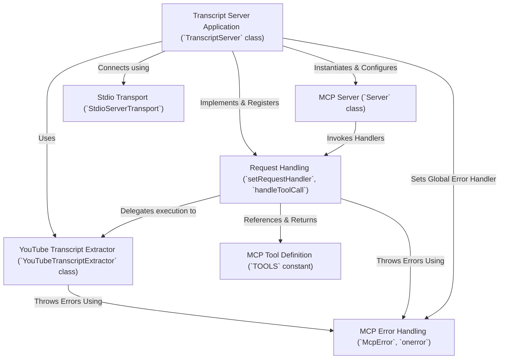

# Tutorial: mcp-server-youtube-transcript

This project implements a **server tool** that adheres to the *Model Context Protocol (MCP)*. Its primary function is to expose a single capability: **extracting transcripts** from YouTube videos, given a URL or Video ID. The server communicates using **standard input/output** (*stdio*), making it suitable for integration as a child process within larger systems, potentially interacting with AI models that understand MCP. It defines its `get_transcript` tool formally, handles requests to execute this tool by calling an external library, and reports results or errors back in the standardized *MCP format*.

**Source Repository:** [https://github.com/kimtaeyoon83/mcp-server-youtube-transcript](https://github.com/kimtaeyoon83/mcp-server-youtube-transcript)

## Chapters

1. [Transcript Server Application (`TranscriptServer` class)
](01_transcript_server_application___transcriptserver__class__.md)
2. [MCP Tool Definition (`TOOLS` constant)
](02_mcp_tool_definition___tools__constant__.md)
3. [Request Handling (`setRequestHandler`, `handleToolCall`)
](03_request_handling___setrequesthandler____handletoolcall___.md)
4. [YouTube Transcript Extractor (`YouTubeTranscriptExtractor` class)
](04_youtube_transcript_extractor___youtubetranscriptextractor__class__.md)
5. [MCP Server (`Server` class)
](05_mcp_server___server__class__.md)
6. [Stdio Transport (`StdioServerTransport`)
](06_stdio_transport___stdioservertransport___.md)
7. [MCP Error Handling (`McpError`, `onerror`)
](07_mcp_error_handling___mcperror____onerror___.md)

---

Generated by [AI Codebase Knowledge Builder](https://github.com/The-Pocket/Tutorial-Codebase-Knowledge)