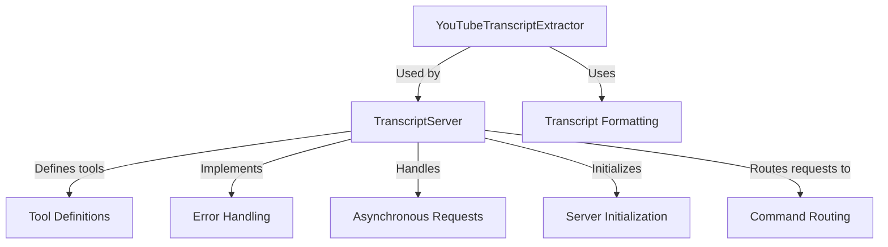

# Tutorial: mcp-server-youtube-transcript

The `mcp-server-youtube-transcript` project is designed to **extract and format transcripts** from YouTube videos. It acts as a server that **listens for requests**, retrieves spoken text from videos using a **YouTubeTranscriptExtractor**, and formats the results for easy reading. This system leverages **asynchronous requests** for efficient operation, ensuring that it can handle multiple user requests without delay. 

**Source Repository:** [https://github.com/kimtaeyoon83/mcp-server-youtube-transcript](https://github.com/kimtaeyoon83/mcp-server-youtube-transcript)

## Chapters

1. [Tool Definitions
](01_tool_definitions_.md)
2. [YouTubeTranscriptExtractor
](02_youtubetranscriptextractor_.md)
3. [TranscriptServer
](03_transcriptserver_.md)
4. [Server Initialization
](04_server_initialization_.md)
5. [Asynchronous Requests
](05_asynchronous_requests_.md)
6. [Error Handling
](06_error_handling_.md)
7. [Transcript Formatting
](07_transcript_formatting_.md)
8. [Command Routing
](08_command_routing_.md)

---

Generated by [AI Codebase Knowledge Builder](https://github.com/The-Pocket/Tutorial-Codebase-Knowledge)