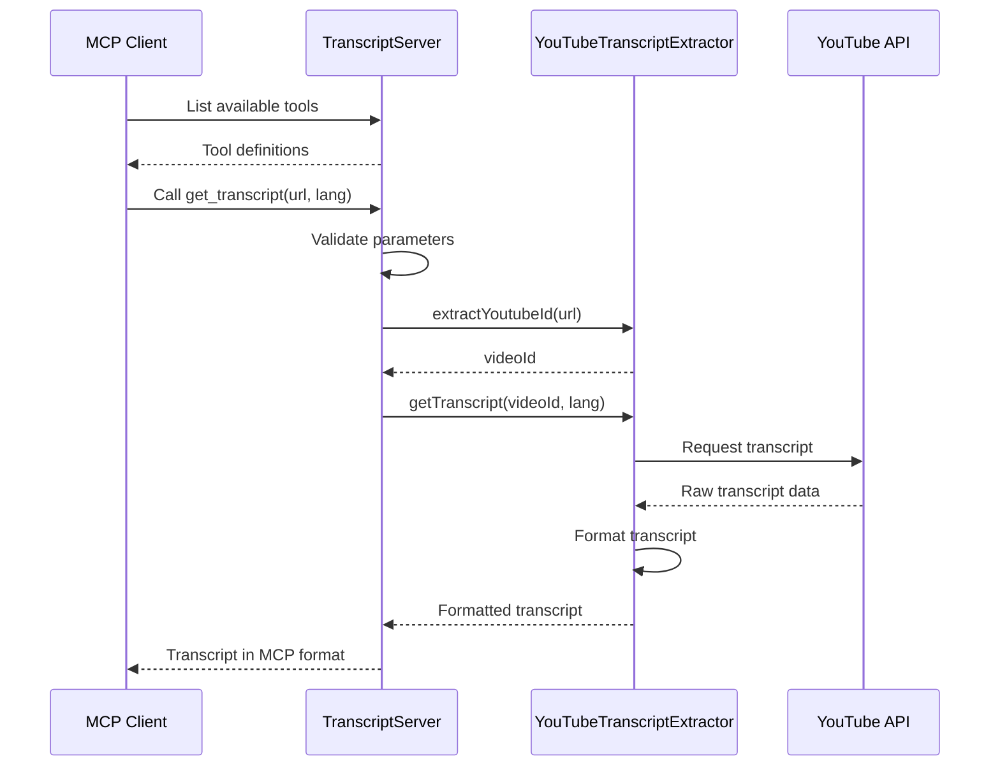

# Chapter 2: TranscriptServer

## Introduction

The `TranscriptServer` class is the central orchestrator of our YouTube transcript extraction service, handling all Model Context Protocol (MCP) communication between clients and our transcript extraction functionality. It's responsible for initializing the server, setting up request handlers, processing tool calls, and managing the server lifecycle.

In this chapter, we'll explore the architecture and implementation of the `TranscriptServer` class, understanding how it bridges the gap between the MCP protocol and our core functionality.

## Understanding the TranscriptServer Class

The `TranscriptServer` class acts as a mediator between:
1. **MCP clients**: AI models or applications that want to extract YouTube transcripts
2. **The YouTubeTranscriptExtractor**: Our specialized class that handles the actual transcript extraction

Here's the class structure:

```typescript
class TranscriptServer {
  private extractor: YouTubeTranscriptExtractor;
  private server: Server;

  constructor() {
    this.extractor = new YouTubeTranscriptExtractor();
    this.server = new Server(
      {
        name: "mcp-servers-youtube-transcript",
        version: "0.1.0",
      },
      {
        capabilities: {
          tools: {},
        },
      }
    );

    this.setupHandlers();
    this.setupErrorHandling();
  }
  
  // Additional methods...
}
```

The class contains two main private properties:
- `extractor`: An instance of `YouTubeTranscriptExtractor` that provides the actual transcript extraction functionality
- `server`: An instance of the MCP SDK's `Server` class that handles the protocol-specific communication

## Server Initialization

During initialization, the `TranscriptServer` constructor:

1. Creates a new instance of `YouTubeTranscriptExtractor`
2. Creates a new MCP `Server` with server metadata and capabilities
3. Sets up request handlers and error handling

Let's examine the server initialization:

```typescript
this.server = new Server(
  {
    name: "mcp-servers-youtube-transcript",
    version: "0.1.0",
  },
  {
    capabilities: {
      tools: {},
    },
  }
);
```

This code initializes the MCP server with:
- A name that identifies our server to clients
- A version number for tracking compatibility
- Capabilities configuration that specifies what features our server supports

## Setting Up Request Handlers

The `setupHandlers` method defines how the server responds to different types of MCP requests:

```typescript
private setupHandlers(): void {
  // List available tools
  this.server.setRequestHandler(ListToolsRequestSchema, async () => ({
    tools: TOOLS
  }));

  // Handle tool calls
  this.server.setRequestHandler(CallToolRequestSchema, async (request) => 
    this.handleToolCall(request.params.name, request.params.arguments ?? {})
  );
}
```

This method sets up two crucial request handlers:

1. **ListTools Handler**: Responds to clients requesting what tools are available by returning our tool definitions (from [Chapter 1](01_mcp_tool_definition_.md))
2. **CallTool Handler**: Delegates incoming tool call requests to our `handleToolCall` method

## Tool Call Processing

The heart of the `TranscriptServer` is the `handleToolCall` method, which processes incoming tool requests:

```typescript
private async handleToolCall(name: string, args: any): Promise<{ toolResult: CallToolResult }> {
  switch (name) {
    case "get_transcript": {
      const { url: input, lang = "en" } = args;
      
      if (!input || typeof input !== 'string') {
        throw new McpError(
          ErrorCode.InvalidParams,
          'URL parameter is required and must be a string'
        );
      }

      // Parameter validation and transcript extraction...
    }

    default:
      throw new McpError(
        ErrorCode.MethodNotFound,
        `Unknown tool: ${name}`
      );
  }
}
```

This method:
1. Takes the requested tool name and arguments
2. Uses a switch statement to route the request to the appropriate handler (currently only `get_transcript` is supported)
3. Validates input parameters
4. Delegates to the `YouTubeTranscriptExtractor` for processing
5. Returns the results in the MCP-compliant format

Let's look closer at the transcript extraction logic:

```typescript
try {
  const videoId = this.extractor.extractYoutubeId(input);
  console.error(`Processing transcript for video: ${videoId}`);
  
  const transcript = await this.extractor.getTranscript(videoId, lang);
  console.error(`Successfully extracted transcript (${transcript.length} chars)`);
  
  return {
    toolResult: {
      content: [{
        type: "text",
        text: transcript,
        metadata: {
          videoId,
          language: lang,
          timestamp: new Date().toISOString(),
          charCount: transcript.length
        }
      }],
      isError: false
    }
  };
} catch (error) {
  // Error handling...
}
```

This code:
1. Extracts the YouTube video ID from the provided URL or ID
2. Requests the transcript from the `YouTubeTranscriptExtractor`
3. Formats the response according to the MCP tool results format
4. Handles errors appropriately

## Error Handling

The `TranscriptServer` implements robust error handling in multiple layers:

```typescript
private setupErrorHandling(): void {
  this.server.onerror = (error) => {
    console.error("[MCP Error]", error);
  };

  process.on('SIGINT', async () => {
    await this.stop();
    process.exit(0);
  });
}
```

This method:
1. Sets up a global error handler for the MCP server
2. Configures process signal handling for clean shutdown

Additionally, the `handleToolCall` method includes detailed error handling:

```typescript
catch (error) {
  console.error('Transcript extraction failed:', error);
  
  if (error instanceof McpError) {
    throw error;
  }
  
  throw new McpError(
    ErrorCode.InternalError,
    `Failed to process transcript: ${(error as Error).message}`
  );
}
```

This ensures that all errors are properly wrapped in MCP-compliant error objects with appropriate error codes.

## Server Lifecycle Management

The `TranscriptServer` class manages the server's lifecycle through the `start` and `stop` methods:

```typescript
async start(): Promise<void> {
  const transport = new StdioServerTransport();
  await this.server.connect(transport);
}

async stop(): Promise<void> {
  try {
    await this.server.close();
  } catch (error) {
    console.error('Error while stopping server:', error);
  }
}
```

The `start` method:
1. Creates a new `StdioServerTransport` (communication over standard input/output)
2. Connects the server to this transport

The `stop` method:
1. Properly closes the server connection
2. Handles any errors that might occur during shutdown

## Communication Flow Diagram

Here's a visual representation of how the `TranscriptServer` facilitates communication:



This diagram shows how the `TranscriptServer` mediates between the client and the actual transcript extraction logic.

## Main Application Flow

The entire application is bootstrapped with a simple `main` function:

```typescript
async function main() {
  const server = new TranscriptServer();
  
  try {
    await server.start();
  } catch (error) {
    console.error("Server failed to start:", error);
    process.exit(1);
  }
}

main().catch((error) => {
  console.error("Fatal server error:", error);
  process.exit(1);
});
```

This function:
1. Creates a new `TranscriptServer` instance
2. Starts the server
3. Handles any fatal errors that might occur during startup or execution

## Summary

The `TranscriptServer` class is the central coordinator of our YouTube transcript extraction service, handling:

1. Server initialization and configuration
2. Registration of tool definitions
3. Processing of incoming requests
4. Validation of input parameters
5. Delegation to the specialized `YouTubeTranscriptExtractor`
6. Formatting responses according to the MCP specification
7. Comprehensive error handling
8. Server lifecycle management

By serving as a bridge between the MCP protocol and our extraction functionality, `TranscriptServer` abstracts away the complexities of protocol communication, allowing the rest of our code to focus on its core responsibility: extracting transcripts from YouTube videos.

In the next chapter, we'll dive into the [YouTubeTranscriptExtractor](03_youtubetranscriptextractor_.md) class, which contains the specialized logic for extracting, parsing, and formatting YouTube transcripts.

---

Generated by [AI Codebase Knowledge Builder](https://github.com/The-Pocket/Tutorial-Codebase-Knowledge)