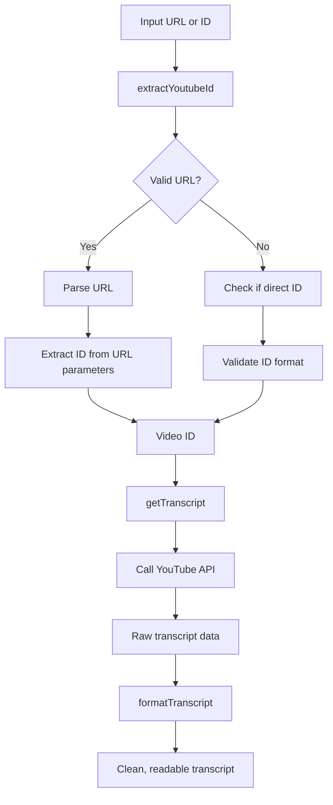

# Chapter 3: YouTubeTranscriptExtractor

## Introduction

The `YouTubeTranscriptExtractor` class is the specialized component that performs the core functionality of our MCP tool: extracting and processing transcripts from YouTube videos. This class handles the technical details of identifying YouTube videos, retrieving their transcripts, and formatting the results into human-readable text.

In this chapter, we'll explore the inner workings of the `YouTubeTranscriptExtractor` class, understanding how it processes different URL formats, interacts with YouTube's transcript service, and delivers clean transcript output.

## YouTubeTranscriptExtractor Overview

The `YouTubeTranscriptExtractor` class is purpose-built to handle three critical tasks:

1. **Extracting valid YouTube video IDs** from a variety of inputs, including full URLs and direct video IDs
2. **Retrieving raw transcript data** from YouTube's caption service
3. **Formatting the transcript** into clean, readable text

Here's the basic structure of the class:

```typescript
class YouTubeTranscriptExtractor {
  extractYoutubeId(input: string): string {
    // Extract YouTube video ID from URL or direct ID
  }

  async getTranscript(videoId: string, lang: string): Promise<string> {
    // Fetch transcript from YouTube
  }

  private formatTranscript(transcript: TranscriptLine[]): string {
    // Format the raw transcript data
  }
}
```

Let's explore each of these methods in detail.

## Extracting YouTube Video IDs

One of the key tasks of the `YouTubeTranscriptExtractor` is parsing input strings to extract valid YouTube video IDs. YouTube videos can be referenced in multiple formats:

- Full URLs: `https://www.youtube.com/watch?v=dQw4w9WgXcQ`
- Short URLs: `https://youtu.be/dQw4w9WgXcQ`
- Direct video IDs: `dQw4w9WgXcQ`

The `extractYoutubeId` method handles all these formats:

```typescript
extractYoutubeId(input: string): string {
  if (!input) {
    throw new McpError(
      ErrorCode.InvalidParams,
      'YouTube URL or ID is required'
    );
  }

  // Handle URL formats
  try {
    const url = new URL(input);
    if (url.hostname === 'youtu.be') {
      return url.pathname.slice(1);
    } else if (url.hostname.includes('youtube.com')) {
      const videoId = url.searchParams.get('v');
      if (!videoId) {
        throw new McpError(
          ErrorCode.InvalidParams,
          `Invalid YouTube URL: ${input}`
        );
      }
      return videoId;
    }
  } catch (error) {
    // Not a URL, check if it's a direct video ID
    if (!/^[a-zA-Z0-9_-]{11}$/.test(input)) {
      throw new McpError(
        ErrorCode.InvalidParams,
        `Invalid YouTube video ID: ${input}`
      );
    }
    return input;
  }

  throw new McpError(
    ErrorCode.InvalidParams,
    `Could not extract video ID from: ${input}`
  );
}
```

Let's break down how this method works:

1. **Input validation**: It first checks if the input is non-empty
2. **URL parsing**: It attempts to parse the input as a URL using the built-in `URL` class
3. **Short URL handling**: For `youtu.be` URLs, it extracts the ID from the pathname
4. **Full URL handling**: For `youtube.com` URLs, it extracts the ID from the `v` query parameter
5. **Direct ID handling**: If the input isn't a valid URL, it checks if it matches the YouTube ID pattern (11 characters consisting of alphanumeric characters, underscores, and hyphens)
6. **Error handling**: At each step, it throws appropriate MCP errors with descriptive messages

This method is robust to different input formats, making the tool flexible and user-friendly.

## Retrieving Transcript Data

The `getTranscript` method is responsible for fetching the actual transcript data from YouTube's caption service:

```typescript
async getTranscript(videoId: string, lang: string): Promise<string> {
  try {
    const transcript = await getSubtitles({
      videoID: videoId,
      lang: lang,
    });

    return this.formatTranscript(transcript);
  } catch (error) {
    console.error('Failed to fetch transcript:', error);
    throw new McpError(
      ErrorCode.InternalError,
      `Failed to retrieve transcript: ${(error as Error).message}`
    );
  }
}
```

This method:

1. Takes a validated YouTube video ID and language code as inputs
2. Uses the `youtube-captions-scraper` package's `getSubtitles` function to request the transcript
3. Passes the raw transcript data to the `formatTranscript` method
4. Handles any errors that might occur during the process, wrapping them in MCP-compliant error objects

The `getSubtitles` function from the external package does the heavy lifting of interacting with YouTube's API to retrieve the caption data. This approach allows us to focus on the application logic without worrying about the intricacies of YouTube's API.

### Understanding the TranscriptLine Interface

Before diving into the formatting logic, let's understand the structure of the raw transcript data:

```typescript
interface TranscriptLine {
  text: string;  // The actual text content
  start: number; // Start time in seconds
  dur: number;   // Duration in seconds
}
```

Each line in the transcript includes:
- The text content of that segment
- When the segment starts (in seconds from the beginning of the video)
- How long the segment lasts (in seconds)

This time-based segmentation is useful for video captions but needs to be formatted for readability when presented as a continuous transcript.

## Formatting Transcript Data

The `formatTranscript` method transforms the raw caption data into a clean, readable transcript:

```typescript
private formatTranscript(transcript: TranscriptLine[]): string {
  return transcript
    .map(line => line.text.trim())
    .filter(text => text.length > 0)
    .join(' ');
}
```

This method uses a functional programming approach to process the transcript:

1. **Map**: It extracts just the text content from each transcript line and trims whitespace
2. **Filter**: It removes any empty lines
3. **Join**: It combines all the text segments with spaces between them

The result is a clean, continuous text transcript with no timing information or empty segments.

## Transcript Extraction Process Visualization

Let's visualize the complete transcript extraction process:



This flowchart shows how an input URL or ID is processed through the various methods of the `YouTubeTranscriptExtractor` class to produce the final transcript.

## Error Handling in YouTubeTranscriptExtractor

The `YouTubeTranscriptExtractor` class includes robust error handling at multiple levels:

1. **Input validation errors**: The `extractYoutubeId` method throws specific errors for invalid inputs
2. **API errors**: The `getTranscript` method catches and wraps errors from the YouTube API
3. **Descriptive error messages**: All errors include clear descriptions of what went wrong

This error handling ensures that failures are communicated clearly to the [TranscriptServer](02_transcriptserver_.md), which can then forward them to clients in the proper MCP format.

## Working with YouTube URL Formats

YouTube videos can be referenced in several formats. Let's see how the extractor handles each:

### Full YouTube URLs

```
https://www.youtube.com/watch?v=dQw4w9WgXcQ
```

For full URLs, the extractor:
1. Parses the URL using the `URL` constructor
2. Checks if the hostname contains `youtube.com`
3. Extracts the `v` query parameter

### YouTube Short URLs

```
https://youtu.be/dQw4w9WgXcQ
```

For short URLs, the extractor:
1. Parses the URL using the `URL` constructor
2. Checks if the hostname is exactly `youtu.be`
3. Extracts the path component (removing the leading slash)

### Direct Video IDs

```
dQw4w9WgXcQ
```

For direct IDs, the extractor:
1. Attempts to parse as a URL and fails
2. Checks if the string matches the YouTube ID pattern (11 characters of `[a-zA-Z0-9_-]`)
3. Returns the ID directly if it's valid

## Language Support

The `getTranscript` method accepts a language code parameter that allows users to specify which language version of the transcript they want. YouTube uses ISO 639-1 language codes (like `en` for English, `ko` for Korean, etc.) to identify different language tracks.

This functionality enables our tool to retrieve transcripts in various languages, making it more versatile and globally usable.

## Integration with TranscriptServer

The `YouTubeTranscriptExtractor` class is instantiated in the [TranscriptServer](02_transcriptserver_.md) and used to process incoming tool call requests:

```typescript
// In TranscriptServer
constructor() {
  this.extractor = new YouTubeTranscriptExtractor();
  // ...other initialization...
}

private async handleToolCall(name: string, args: any): Promise<{ toolResult: CallToolResult }> {
  // ...
  const videoId = this.extractor.extractYoutubeId(input);
  const transcript = await this.extractor.getTranscript(videoId, lang);
  // ...
}
```

The `TranscriptServer` delegates the technical details of transcript extraction to the `YouTubeTranscriptExtractor`, focusing instead on protocol-level communication and request handling.

## Summary

The `YouTubeTranscriptExtractor` class is the technical heart of our MCP tool, handling the complexities of:

1. **URL and ID parsing**: It can extract valid YouTube video IDs from various input formats
2. **API interaction**: It communicates with YouTube's caption service to retrieve transcript data
3. **Transcript formatting**: It transforms raw caption data into readable text

By encapsulating these responsibilities in a dedicated class, we maintain a clean separation of concerns within our application. The `TranscriptServer` handles communication protocol details, while the `YouTubeTranscriptExtractor` focuses exclusively on the core functionality of transcript extraction.

This design makes our code more maintainable, testable, and extensible. For example, we could easily enhance the `formatTranscript` method to produce different output formats (like timestamped transcripts or JSON) without affecting the rest of the application.

In the next chapter, we'll examine the [Tool Results Format](04_tool_results_format_.md) to understand how our extracted transcripts are structured and returned to clients according to the MCP specification.

---

Generated by [AI Codebase Knowledge Builder](https://github.com/The-Pocket/Tutorial-Codebase-Knowledge)