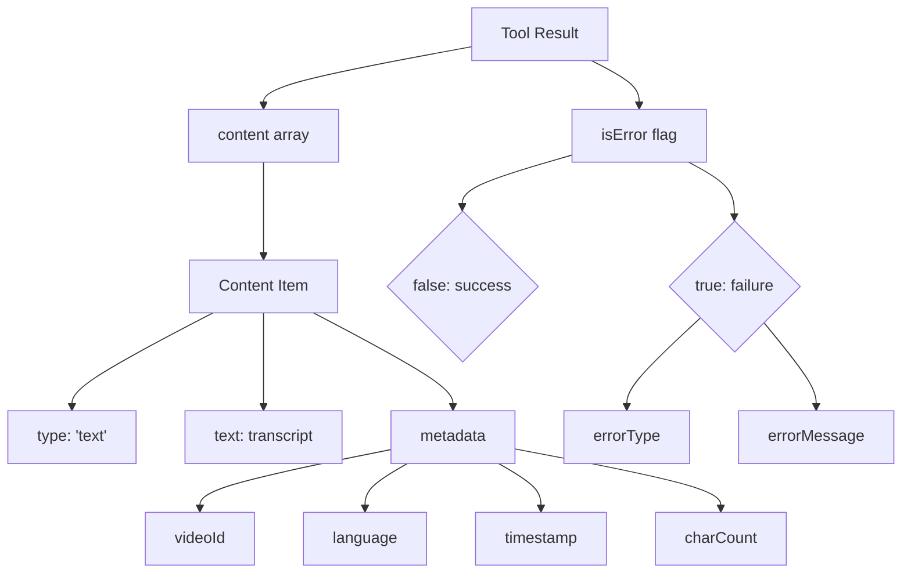

# Chapter 4: Tool Results Format

## Introduction

When a client calls our YouTube transcript extraction tool, they don't just need the raw transcript—they need it delivered in a structured, predictable format that includes relevant metadata and error information. The Tool Results Format defines how our server packages and returns extracted transcripts to clients.

In this chapter, we'll explore the structure of the MCP Tool Results Format, how it's implemented in our project, and why a consistent response format is crucial for client applications and AI models that consume our service.

## Understanding the Tool Results Format

The Tool Results Format is a standardized structure for returning the results of tool execution. In the Model Context Protocol (MCP), tool results follow a specific schema that includes both the content and metadata about the processing.

Here's a simplified view of the Tool Results Format structure:

```typescript
interface CallToolResult {
  content: ToolResultContent[];
  isError: boolean;
  errorType?: string;
  errorMessage?: string;
}
```

Let's examine each component:

### Content Array

The `content` array is the primary carrier of tool results. It can contain different types of content, each with its own structure:

```typescript
type ToolResultContent = {
  type: string;
  [key: string]: any;
  metadata?: Record<string, any>;
};
```

Each content object must have a `type` field identifying what kind of content it contains, and it may have additional fields specific to that content type.

### Error Flags

The `isError` boolean indicates whether the tool execution was successful. If it's `true`, the `errorType` and `errorMessage` fields provide additional details about what went wrong.

## Text Content in Our Transcript Tool

For our YouTube transcript extraction tool, we use a specific content type: `text`. Here's how we structure our response:

```typescript
return {
  toolResult: {
    content: [{
      type: "text",
      text: transcript,
      metadata: {
        videoId,
        language: lang,
        timestamp: new Date().toISOString(),
        charCount: transcript.length
      }
    }],
    isError: false
  }
};
```

This response contains:

1. A single content item of type `text`
2. The actual transcript in the `text` field
3. Useful metadata about the transcript
4. An `isError` flag set to `false` indicating successful processing

### Metadata Enrichment

Our tool enriches the response with metadata that helps clients understand the context of the transcript:

```typescript
metadata: {
  videoId,          // The YouTube video ID
  language: lang,   // The language code of the transcript
  timestamp: new Date().toISOString(),  // When the transcript was extracted
  charCount: transcript.length          // Length of the transcript
}
```

This metadata provides valuable context without cluttering the main content. Clients can use this information to:
- Associate the transcript with the correct video
- Identify which language version they received
- Track when the transcript was fetched
- Gauge the length of the content

## Error Responses

When transcript extraction fails, we need to communicate this clearly to the client. The Tool Results Format includes standardized fields for error reporting:

```typescript
// Example of an error response structure
{
  toolResult: {
    content: [], 
    isError: true,
    errorType: "TRANSCRIPT_NOT_AVAILABLE",
    errorMessage: "No transcript available for this video in the requested language"
  }
}
```

However, in our implementation, we handle errors slightly differently. Instead of returning an error result structure, we throw MCP errors that get processed by the server framework:

```typescript
catch (error) {
  console.error('Transcript extraction failed:', error);
  
  if (error instanceof McpError) {
    throw error;
  }
  
  throw new McpError(
    ErrorCode.InternalError,
    `Failed to process transcript: ${(error as Error).message}`
  );
}
```

This approach leverages the MCP server's built-in error handling, which automatically formats errors according to the protocol specification.

## Content Types and Flexibility

The Tool Results Format allows for different content types, making it flexible for various tool outputs. While our transcript tool uses the `text` type, the MCP specification supports other types like:

- `image`: For image data
- `audio`: For audio content
- `json`: For structured data
- `binary`: For raw binary data

This flexibility allows tools to return the most appropriate content format for their specific functionality.

## Response Structure Visualization

Here's a visual representation of our tool's response structure:



This diagram shows the hierarchical structure of a tool result, including both the success path (with content) and the failure path (with error details).

## Implementation in Our Project

Let's look at how we construct the Tool Results Format in our `handleToolCall` method:

```typescript
private async handleToolCall(name: string, args: any): Promise<{ toolResult: CallToolResult }> {
  switch (name) {
    case "get_transcript": {
      // ... parameter validation and processing ...
      
      try {
        const videoId = this.extractor.extractYoutubeId(input);
        console.error(`Processing transcript for video: ${videoId}`);
        
        const transcript = await this.extractor.getTranscript(videoId, lang);
        console.error(`Successfully extracted transcript (${transcript.length} chars)`);
        
        return {
          toolResult: {
            content: [{
              type: "text",
              text: transcript,
              metadata: {
                videoId,
                language: lang,
                timestamp: new Date().toISOString(),
                charCount: transcript.length
              }
            }],
            isError: false
          }
        };
      } catch (error) {
        // Error handling...
      }
    }
    // ... other tool cases ...
  }
}
```

This method:
1. Processes the transcript extraction request
2. Constructs a properly formatted response with the transcript and metadata
3. Sets `isError` to `false` to indicate success
4. Returns the formatted result to the MCP server for delivery to the client

## Client-Side Handling of Tool Results

Clients that interact with our service need to understand how to parse and use the Tool Results Format. Here's an example of how a client might process our response:

```javascript
// Client-side code example
async function getVideoTranscript(videoUrl, language = 'en') {
  const response = await callMcpTool('get_transcript', {
    url: videoUrl,
    lang: language
  });
  
  // Check for errors
  if (response.toolResult.isError) {
    throw new Error(
      `Transcript extraction failed: ${response.toolResult.errorMessage}`
    );
  }
  
  // Process content
  const contentItem = response.toolResult.content[0];
  if (contentItem.type === 'text') {
    // Access the transcript text
    const transcript = contentItem.text;
    
    // Access metadata if needed
    const metadata = contentItem.metadata;
    console.log(`Transcript for video ${metadata.videoId} in ${metadata.language}`);
    console.log(`Extracted at ${metadata.timestamp}, length: ${metadata.charCount} chars`);
    
    return transcript;
  }
  
  throw new Error('Unexpected content type in response');
}
```

This client code demonstrates:
1. Calling our MCP tool with the necessary parameters
2. Checking for errors in the response
3. Extracting the transcript from the content array
4. Using the metadata for additional context

## Benefits of Standardized Tool Results

The Tool Results Format provides several important benefits:

### 1. Consistency

Clients can rely on a consistent structure for all tool responses, making integration simpler and more reliable.

### 2. Rich Context

The format allows tools to provide additional context beyond the primary result through the metadata fields.

### 3. Error Handling

The standardized error reporting helps clients understand what went wrong and how to recover.

### 4. Content Flexibility

The content array can include multiple items of different types, allowing for complex responses when needed.

### 5. Protocol Compatibility

By following the MCP specification, our tool works seamlessly with all compliant clients, including AI models that understand the protocol.

## Comparison with Other Response Formats

To appreciate the benefits of the Tool Results Format, let's compare it with some alternatives:

### Simple String Response

```javascript
// Simple string response
return { transcript: "This is the video transcript..." };
```

**Limitations:**
- No metadata about the transcript
- No standardized error reporting
- No content type flexibility

### Custom JSON Structure

```javascript
// Custom JSON structure
return {
  success: true,
  transcript: "This is the video transcript...",
  video_id: "dQw4w9WgXcQ",
  language: "en"
};
```

**Limitations:**
- Non-standard structure requires custom client handling
- Not compatible with MCP client libraries
- No content type flexibility

The MCP Tool Results Format provides a more comprehensive, standard approach that avoids these limitations.

## Summary

The Tool Results Format is a crucial part of our YouTube transcript extraction service, providing a structured, consistent way to return results to clients. By following this format, we:

1. Return transcripts with rich contextual metadata
2. Signal success or failure clearly
3. Package content in a standardized, protocol-compliant way
4. Enable clients to reliably parse and use our tool's output

This format ensures that our tool integrates seamlessly with the Model Context Protocol ecosystem, making it accessible to AI models and applications that speak the MCP language.

In the next chapter, we'll explore the [Request Handlers](05_request_handlers_.md) that process incoming client requests and map them to our tool's functionality. We'll see how these handlers connect the MCP communication layer to our core transcript extraction logic.

---

Generated by [AI Codebase Knowledge Builder](https://github.com/The-Pocket/Tutorial-Codebase-Knowledge)