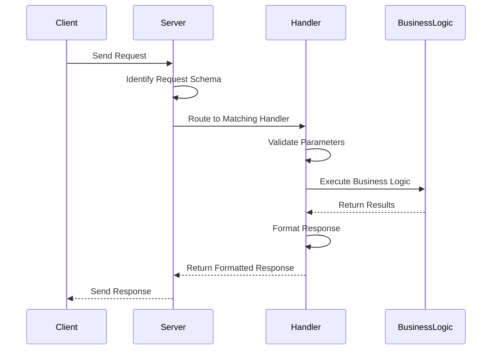
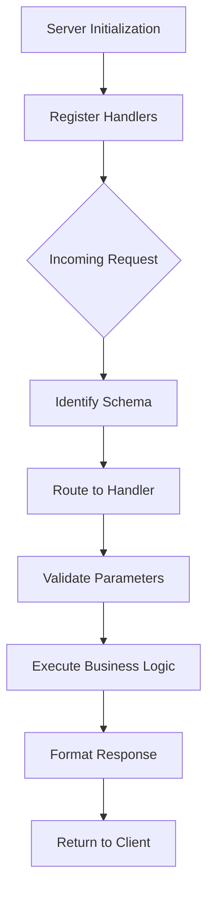

# Chapter 5: Request Handlers

## Introduction

Request handlers are the critical bridge between incoming client requests and the business logic of our application. In the Model Context Protocol (MCP) framework, these handlers process specific types of requests according to predefined schemas, execute the appropriate business logic, and return properly formatted responses.

In this chapter, we'll explore how request handlers work in our `mcp-server-youtube-transcript` project, how they're registered with the server, and how they process different types of client requests.

## What Are Request Handlers?

Request handlers are specialized functions that:

1. Are registered for specific request schemas
2. Process incoming requests matching those schemas
3. Execute business logic based on the request parameters
4. Return properly formatted responses according to the protocol

In MCP, request handlers follow a consistent pattern that allows the server framework to route requests to the appropriate function based on the request type.

## Request Handler Registration

In our application, request handlers are registered in the `TranscriptServer` class during initialization. The `setupHandlers` method handles this registration:

```typescript
private setupHandlers(): void {
  // List available tools
  this.server.setRequestHandler(ListToolsRequestSchema, async () => ({
    tools: TOOLS
  }));

  // Handle tool calls
  this.server.setRequestHandler(CallToolRequestSchema, async (request) => 
    this.handleToolCall(request.params.name, request.params.arguments ?? {})
  );
}
```

Let's break down what's happening here:

1. We're using the `setRequestHandler` method of the MCP server to register handlers
2. The first parameter is a request schema that defines what type of request this handler can process
3. The second parameter is an async function that will be called when a matching request arrives

The MCP server framework uses these registrations to route incoming requests to the appropriate handler based on their schema.

## Request Schemas

Request schemas are predefined structures that identify different types of requests in the MCP protocol. Our application uses two primary schemas:

### 1. ListToolsRequestSchema

This schema represents a request for the server to list all available tools. Clients use this to discover what capabilities our server offers.

```typescript
// Example of a ListTools request
{
  "jsonrpc": "2.0",
  "method": "list_tools",
  "id": 1
}
```

When the server receives a request matching this schema, it calls our registered handler which returns the array of tool definitions:

```typescript
this.server.setRequestHandler(ListToolsRequestSchema, async () => ({
  tools: TOOLS
}));
```

This handler is straightforward - it just returns our predefined `TOOLS` array without any additional processing.

### 2. CallToolRequestSchema

This schema represents a request to execute a specific tool with provided arguments. This is where the main functionality of our service is invoked.

```typescript
// Example of a CallTool request
{
  "jsonrpc": "2.0",
  "method": "call_tool",
  "id": 2,
  "params": {
    "name": "get_transcript",
    "arguments": {
      "url": "https://www.youtube.com/watch?v=dQw4w9WgXcQ",
      "lang": "en"
    }
  }
}
```

Our handler for this schema delegates to a more complex method:

```typescript
this.server.setRequestHandler(CallToolRequestSchema, async (request) => 
  this.handleToolCall(request.params.name, request.params.arguments ?? {})
);
```

This handler extracts the tool name and arguments from the request and passes them to our `handleToolCall` method.

## The handleToolCall Method

The `handleToolCall` method is the heart of our application's request processing logic:

```typescript
private async handleToolCall(name: string, args: any): Promise<{ toolResult: CallToolResult }> {
  switch (name) {
    case "get_transcript": {
      const { url: input, lang = "en" } = args;
      
      if (!input || typeof input !== 'string') {
        throw new McpError(
          ErrorCode.InvalidParams,
          'URL parameter is required and must be a string'
        );
      }

      // Parameter validation continues...
      
      try {
        const videoId = this.extractor.extractYoutubeId(input);
        console.error(`Processing transcript for video: ${videoId}`);
        
        const transcript = await this.extractor.getTranscript(videoId, lang);
        console.error(`Successfully extracted transcript (${transcript.length} chars)`);
        
        return {
          toolResult: {
            content: [{
              type: "text",
              text: transcript,
              metadata: {
                videoId,
                language: lang,
                timestamp: new Date().toISOString(),
                charCount: transcript.length
              }
            }],
            isError: false
          }
        };
      } catch (error) {
        // Error handling...
      }
    }

    default:
      throw new McpError(
        ErrorCode.MethodNotFound,
        `Unknown tool: ${name}`
      );
  }
}
```

This method:

1. Takes the tool name and arguments as parameters
2. Uses a switch statement to route to the appropriate tool implementation
3. For the `get_transcript` tool, it:
   - Validates input parameters
   - Extracts the YouTube video ID
   - Retrieves the transcript
   - Formats the response according to the [Tool Results Format](04_tool_results_format_.md)
4. For unknown tools, it throws an appropriate error

## Parameter Validation

Request handlers are responsible for validating input parameters before processing. Our `handleToolCall` method includes thorough validation:

```typescript
const { url: input, lang = "en" } = args;

if (!input || typeof input !== 'string') {
  throw new McpError(
    ErrorCode.InvalidParams,
    'URL parameter is required and must be a string'
  );
}

if (lang && typeof lang !== 'string') {
  throw new McpError(
    ErrorCode.InvalidParams,
    'Language code must be a string'
  );
}
```

This validation ensures that:
1. The required `url` parameter is present and is a string
2. If provided, the `lang` parameter is a string

By validating parameters early, we can fail fast with clear error messages before attempting potentially expensive operations.

## Request Handler Flow Diagram

The following diagram illustrates the flow of a request through our handler system:



This sequence shows how requests flow through our system, with the handler playing the crucial role of connecting the protocol layer to our business logic.

## Error Handling in Request Handlers

Proper error handling is a critical responsibility of request handlers. Our implementation includes comprehensive error handling:

```typescript
try {
  // Business logic execution...
} catch (error) {
  console.error('Transcript extraction failed:', error);
  
  if (error instanceof McpError) {
    throw error;
  }
  
  throw new McpError(
    ErrorCode.InternalError,
    `Failed to process transcript: ${(error as Error).message}`
  );
}
```

This error handling approach:

1. Logs errors for debugging and monitoring
2. Passes through MCP errors directly
3. Wraps other errors in appropriate MCP error types
4. Provides clear error messages for clients

By wrapping errors in MCP-specific error types, we ensure that clients receive standardized error information, even when the underlying cause varies.

## Request Handler Architecture

The architecture of our request handlers follows a clear pattern:



This architecture provides several benefits:

1. **Separation of concerns**: The protocol details are handled by the server framework, while our handlers focus on business logic
2. **Schema-based routing**: Requests are automatically routed to the appropriate handler based on their schema
3. **Standardized pattern**: All handlers follow a consistent pattern, making the code predictable and maintainable

## Creating Additional Request Handlers

If we wanted to extend our application with new functionality, we would follow the same pattern to add new request handlers. For example, if we wanted to add a tool to retrieve video metadata, we might:

1. Define a new tool in the `TOOLS` array
2. Add a new case to the `handleToolCall` method:

```typescript
case "get_video_metadata": {
  const { url: input } = args;
  
  // Validate parameters
  if (!input || typeof input !== 'string') {
    throw new McpError(
      ErrorCode.InvalidParams,
      'URL parameter is required and must be a string'
    );
  }
  
  try {
    const videoId = this.extractor.extractYoutubeId(input);
    const metadata = await this.metadataService.getMetadata(videoId);
    
    return {
      toolResult: {
        content: [{
          type: "json",
          json: metadata,
          metadata: {
            videoId,
            timestamp: new Date().toISOString()
          }
        }],
        isError: false
      }
    };
  } catch (error) {
    // Error handling...
  }
}
```

This consistent pattern makes it easy to extend our application with new capabilities while maintaining the same architecture.

## Handling Different Request Types

Our current implementation handles two types of requests, but the MCP protocol supports others as well. If we wanted to support additional request types, we would:

1. Import the appropriate request schemas
2. Register handlers for those schemas
3. Implement the corresponding business logic

For example, to support the `ping` request type:

```typescript
import { PingRequestSchema } from "@modelcontextprotocol/sdk/types.js";

// In setupHandlers method
this.server.setRequestHandler(PingRequestSchema, async () => ({
  pong: true
}));
```

This extensibility allows our application to evolve as the protocol and our requirements change.

## Integration with Server Transport

Request handlers work in conjunction with the [Server Transport](06_server_transport_.md) layer, which is responsible for the low-level communication between clients and our server. When a request arrives via the transport layer, the server framework:

1. Parses the request
2. Identifies the matching schema
3. Calls the appropriate handler
4. Takes the handler's response and sends it back through the transport

This separation of concerns allows us to focus on business logic in our handlers without worrying about the details of the communication protocol.

## Summary

Request handlers are the vital components that connect client requests to our application's business logic. In our YouTube transcript extraction service, these handlers:

1. Process requests to list available tools
2. Execute the transcript extraction tool when requested
3. Validate input parameters
4. Format responses according to the MCP specification
5. Handle errors in a protocol-compliant way

By following the standardized patterns of the MCP framework, our request handlers provide a clean, maintainable interface between the protocol layer and our core functionality.

In the next chapter, we'll explore the [Server Transport](06_server_transport_.md) layer, which handles the low-level communication between clients and our server, including serialization, deserialization, and transport-specific concerns.

---

Generated by [AI Codebase Knowledge Builder](https://github.com/The-Pocket/Tutorial-Codebase-Knowledge)