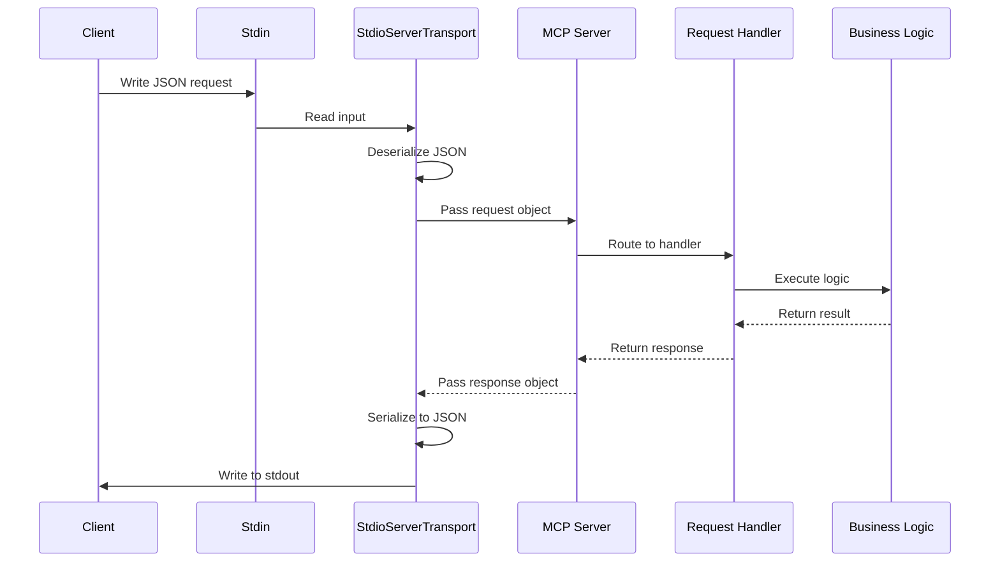
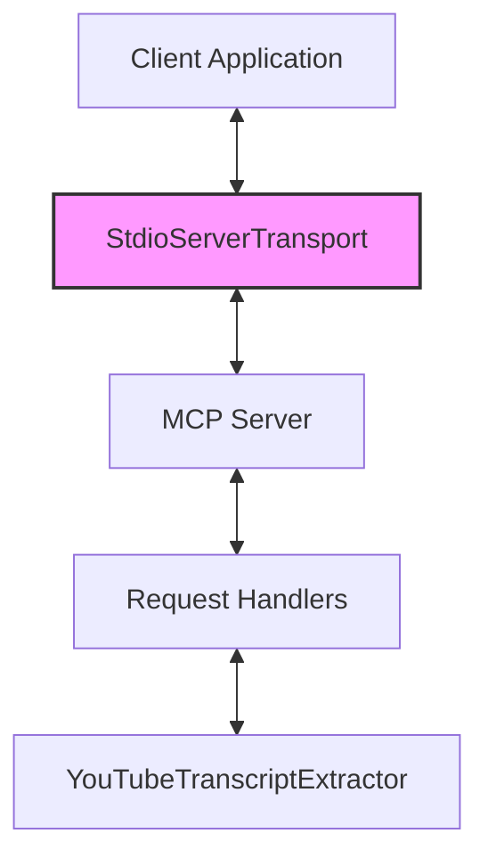

# Chapter 6: Server Transport

## Introduction

Server Transport is a fundamental component in the Model Context Protocol (MCP) architecture that enables communication between clients and the server. It's the layer responsible for the physical exchange of messages, handling serialization, deserialization, and the actual transmission of data across the communication boundary.

In this chapter, we'll explore how the Server Transport works in our YouTube transcript extraction tool, focusing on the `StdioServerTransport` implementation which allows our MCP server to communicate through standard input and output streams. Understanding this component is crucial for anyone wanting to integrate the tool into different environments or extend its communication capabilities.

## What is Server Transport?

In the context of the MCP framework, Server Transport is an abstraction that represents the communication channel between the MCP server and its clients. It's responsible for:

1. Receiving incoming messages from clients
2. Sending responses back to clients
3. Handling serialization and deserialization of messages
4. Managing the low-level details of the communication protocol

Think of Server Transport as the "postal service" of our application - it's responsible for delivering messages between the client and server regardless of how those messages physically travel.

## The Transport Abstraction

At its core, the transport layer in MCP is an abstraction that allows the server to communicate without needing to know the specific details of how messages are transmitted. This abstraction enables our YouTube transcript extractor to work across various communication methods without changing its core logic.

The MCP SDK provides several transport implementations, but in our project, we focus on `StdioServerTransport`, which uses standard input/output streams for communication.

## Using StdioServerTransport

In our `TranscriptServer` class, we create and connect to a `StdioServerTransport` in the `start` method:

```typescript
async start(): Promise<void> {
  const transport = new StdioServerTransport();
  await this.server.connect(transport);
}
```

This simple code does two important things:

1. Creates a new transport instance that uses standard input/output streams
2. Connects our MCP server to this transport

From this point on, the server will receive requests from stdin and send responses to stdout, enabling it to be used as a subprocess by clients.

## How StdioServerTransport Works

The `StdioServerTransport` provides a simple yet effective way for applications to communicate with our MCP server. Let's explore how it works under the hood:

### Message Reception

When a client sends a request, the `StdioServerTransport`:

1. Reads the raw message from the standard input stream (stdin)
2. Deserializes the JSON message into a JavaScript object
3. Passes the deserialized message to the MCP server for processing

### Message Transmission

After the server processes a request and generates a response, the `StdioServerTransport`:

1. Serializes the response object into a JSON string
2. Writes the serialized response to the standard output stream (stdout)
3. Ensures the message is properly terminated for the client to parse

## Communication Flow with StdioServerTransport

Let's visualize the complete flow of communication when using `StdioServerTransport`:



This diagram illustrates how messages flow through the system, with the transport layer bridging the gap between the external client and our internal server components.

## Benefits of StdioServerTransport

Using standard input/output for communication offers several advantages:

### 1. Universality

Nearly all programming languages and environments support standard I/O, making our tool widely compatible with different client implementations.

### 2. Process Isolation

Running our MCP server as a separate process with stdio communication provides natural isolation between the client and server, improving stability and security.

### 3. Simplicity

The stdio approach requires minimal setup compared to network-based transports, with no need to manage ports, sockets, or network configurations.

### 4. Debugging

It's easy to manually test the server by providing input directly in a terminal and observing the outputs.

## Connecting the Server to Transport

In our application, connecting the server to the transport happens in the `start` method of the `TranscriptServer` class:

```typescript
async start(): Promise<void> {
  const transport = new StdioServerTransport();
  await this.server.connect(transport);
}
```

The `connect` method establishes the bidirectional communication channel between our server and the transport. Once connected, the server will:

1. Start listening for incoming messages from the transport
2. Send outgoing messages through the transport
3. Maintain this connection until explicitly closed

## Disconnecting from Transport

Proper cleanup is important for any well-behaved application. Our server handles disconnection from the transport in the `stop` method:

```typescript
async stop(): Promise<void> {
  try {
    await this.server.close();
  } catch (error) {
    console.error('Error while stopping server:', error);
  }
}
```

The `close` method:
1. Gracefully shuts down the connection to the transport
2. Ensures all pending messages are processed
3. Releases any resources held by the server

In our implementation, we also set up a signal handler to properly stop the server when the process receives a termination signal:

```typescript
process.on('SIGINT', async () => {
  await this.stop();
  process.exit(0);
});
```

This ensures that the server disconnects cleanly even when terminated by an external signal.

## Message Format and Serialization

When working with `StdioServerTransport`, messages are serialized as JSON strings. Each message follows the JSON-RPC 2.0 format, which includes:

- A method field specifying the operation
- An id field for request-response matching
- A params field containing operation-specific parameters
- For responses, a result or error field depending on the outcome

Here's an example of a serialized request message to get a transcript:

```json
{
  "jsonrpc": "2.0",
  "id": 1,
  "method": "call_tool",
  "params": {
    "name": "get_transcript",
    "arguments": {
      "url": "https://www.youtube.com/watch?v=dQw4w9WgXcQ",
      "lang": "en"
    }
  }
}
```

And here's a corresponding response:

```json
{
  "jsonrpc": "2.0",
  "id": 1,
  "result": {
    "toolResult": {
      "content": [
        {
          "type": "text",
          "text": "Never gonna give you up, never gonna let you down...",
          "metadata": {
            "videoId": "dQw4w9WgXcQ",
            "language": "en",
            "timestamp": "2023-06-20T15:30:45.123Z",
            "charCount": 42
          }
        }
      ],
      "isError": false
    }
  }
}
```

The transport layer handles all the details of serializing and deserializing these messages, so our application code can work with native JavaScript objects.

## Error Handling in Transport

Transport-level errors require special attention since they can disrupt the entire communication channel. Our implementation includes error handling at the transport level:

```typescript
private setupErrorHandling(): void {
  this.server.onerror = (error) => {
    console.error("[MCP Error]", error);
  };
  
  // Other error handlers...
}
```

By setting an `onerror` handler on the server, we can catch and log any errors that occur in the transport layer, helping with debugging and monitoring.

## Using Our MCP Server as a Subprocess

The `StdioServerTransport` design allows our MCP server to be easily used as a subprocess by other applications. A client application can:

1. Spawn our server as a child process
2. Write requests to the child's stdin
3. Read responses from the child's stdout
4. Terminate the process when done

Here's a simplified example of how a Node.js client might interact with our server:

```javascript
const { spawn } = require('child_process');
const path = require('path');

// Spawn the server process
const serverProcess = spawn('node', [path.join(__dirname, 'mcp-server-youtube-transcript')]);

// Send a request
const request = {
  jsonrpc: "2.0",
  id: 1,
  method: "call_tool",
  params: {
    name: "get_transcript",
    arguments: {
      url: "https://www.youtube.com/watch?v=dQw4w9WgXcQ",
      lang: "en"
    }
  }
};

serverProcess.stdin.write(JSON.stringify(request) + '\n');

// Process the response
let responseData = '';
serverProcess.stdout.on('data', (data) => {
  responseData += data.toString();
  
  try {
    const response = JSON.parse(responseData);
    console.log('Received transcript:', response.result.toolResult.content[0].text);
    
    // Close the server when done
    serverProcess.kill();
  } catch (error) {
    // Incomplete JSON, wait for more data
  }
});

// Handle errors
serverProcess.stderr.on('data', (data) => {
  console.error('Server error:', data.toString());
});
```

This pattern enables clients in any programming language to utilize our transcript extraction tool as long as they can spawn child processes and communicate via standard I/O.

## Alternative Transport Options

While our implementation uses `StdioServerTransport`, the MCP framework supports other transport mechanisms as well. Understanding these alternatives can help you choose the right approach for different scenarios:

### HTTP Transport

For web-based scenarios, an HTTP transport could allow clients to communicate with our server over standard web protocols:

```typescript
// Example of using an HTTP transport (not implemented in our project)
async start(port: number): Promise<void> {
  const transport = new HttpServerTransport({ port });
  await this.server.connect(transport);
}
```

### WebSocket Transport

For real-time applications that need bidirectional communication:

```typescript
// Example of using a WebSocket transport (not implemented in our project)
async start(port: number): Promise<void> {
  const transport = new WebSocketServerTransport({ port });
  await this.server.connect(transport);
}
```

### Custom Transports

The MCP framework also allows for custom transport implementations for specialized needs:

```typescript
// Example of a custom transport (conceptual)
class MyCustomTransport implements Transport {
  // Implementation of required methods
}
```

Our choice of `StdioServerTransport` is ideal for a command-line tool that will be used as a subprocess, but these alternatives show the flexibility of the MCP architecture.

## Transport in the Larger Architecture

To understand how the transport layer fits into the overall architecture of our application, let's look at a simplified diagram:



This diagram highlights that the transport layer is the gateway between external clients and our internal server components. It's a critical piece of the architecture that enables the rest of the system to function.

## Summary

The Server Transport layer is a crucial component in our MCP architecture that enables clients to communicate with our YouTube transcript extraction service. In our implementation, we use `StdioServerTransport` to facilitate communication through standard input and output streams, allowing our server to be easily used as a subprocess by client applications.

Key points to remember about Server Transport:

1. It acts as the communication channel between clients and the MCP server
2. The `StdioServerTransport` uses standard I/O for simple, universal communication
3. It handles message serialization, deserialization, and transmission
4. The transport abstraction allows for different communication methods without changing core logic
5. Proper connection and disconnection handling ensures clean operation

By understanding the Server Transport layer, you now have insight into how messages flow between clients and our server, completing your knowledge of the communication path from client requests to transcript extraction and back.

In the next chapter, we'll explore [Error Handling](07_error_handling_.md) in our MCP server, understanding how errors are detected, reported, and managed throughout the application to provide a robust and reliable service.

---

Generated by [AI Codebase Knowledge Builder](https://github.com/The-Pocket/Tutorial-Codebase-Knowledge)